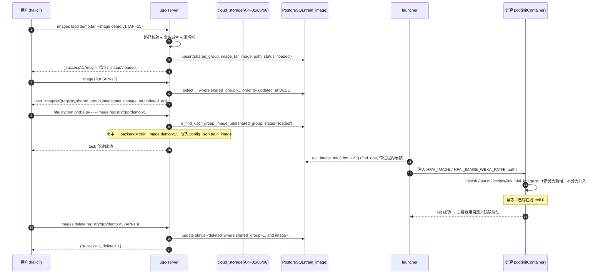

# hai-cli images 服务端程序设计

> **本分支说明（`feature/hai-cli-images-rustfs-design`，基线 `feature/hai-cli-env-server-design` @ `33a5b26`）**
>
> - **本次实现的镜像上传主入口 = `hai-cli images push <本地 tar>`**：复用 `workspace`/`env` 既有的 RustFS/S3 流水线
>   （API-01 签发 STS → 客户端直传对象存储 → API-05 stage2 落盘到 `image_path` → API-06 轮询状态），
>   落盘成功后自动登记（API-15）。手工把 tar 放到共享盘再 `images load` 仅作为**兼容/运维旁路**保留。
> - **来源**：控制面（API-15~API-18）与运行面（`marsv2/scripts/link_hfai_image.sh`、`init_manager.py` 注入、`storage` 挂载种子）
>   的设计沿用分支 `feature/hai-cli-images-server-design` 上**已实现并在 103 实测通过**的结论，证据见
>   [images-server-test-report.md](images-server-test-report.md)（被测 tag `f2cb559`）。
> - **状态（2026-10-02 更新）**：**S9（P0 资产并入与入口切换）已完成**，并在 103 上重跑通过
>   （preflight `PASS=30 FAIL=0`、L1 `33 passed`、L2 `PASS=44 FAIL=0`、L3 `PASS=26 FAIL=0`、workspace/env 回归全绿 —— 见
>   [images-server-test-report.md](images-server-test-report.md) §9.1）；**S8（上传通道）已实现并端到端验证通过**
>   （`e2e_images_push.sh` `PASS=33 WARN=1 FAIL=0`：push → 共享盘 md5 一致 → `user_sync_status=finished` →
>   `train_image=loaded` → 任务产出镜像内探针 → 幂等 → 开关一致性/一级回滚可逆 —— 见 §9.2、E2E-09/E2E-10）。
> - **标签约定**：文中 `P0` / `P1` 只用于标注**来源与阶段**（P0 = 控制面 + 运行面，P1 = 上传通道），**不代表可选项**。
> - **资产状态**：P0 资产（控制面/运行面代码、迁移 `035`、`tests/images/test_image_domain.py`、`docs/haiplatform/scripts/`
>   下的 images 脚本）已并入本分支（S9-1）；上传通道新增 `db_schemas/036.file_type_enum_add_image.sql`、
>   `tests/images/test_image_push*.py`、`docs/haiplatform/scripts/e2e_images_push.sh`（S8），**全部已落地**。

> **文档定位**：三件套之三（分析 → 需求 → **设计**）。本文把 [images-server-requirements.md](images-server-requirements.md)
> 的 FR/NFR/SEC/OPS/CMP/HC 落成可实施的模块、接口、数据与脚本设计；所有需求 ID 与本文章节、用例 ID、
> Checklist ID（[images-server-checklist.md](images-server-checklist.md)）可相互追溯。
>
> **前置阅读**：[hai-cli-images-analysis.md](hai-cli-images-analysis.md)（尤其 **§4.6 运行面** 与 **§4.7 上传入口** —— 本设计的最大依据）、
> [images-server-requirements.md](images-server-requirements.md)（§3 需求 · §4 接口 · §5 状态与数据）、
> [images-server-test-report.md](images-server-test-report.md)（旧分支 103 实测证据，tag `f2cb559`）。
>
> **写作约定**：只描述**本仓库可实现**的部分；凡依赖部署私有 `custom.py` 或外部环境（内网 registry、节点初始化）
> 的地方**显式标注**。行号引用**大多沿用旧分支设计**（基线 `e03c42c`）；本分支**新复核过的现状证据**集中在 §5.6
> 给出实测行号（`conf/utils.py` / `cloud_storage/utils.py` / `sync_to_cluster.py` / `db_schemas/010` / `context.py`），
> 需要精确到行时以本分支 grep 结果为准。
>
> **本分支文档集状态**：本文档集位于 `docs/haiplatform/images/`，同目录下已有
> [hai-cli-images-analysis.md](hai-cli-images-analysis.md) /
> [images-server-requirements.md](images-server-requirements.md) / [images-server-test-cases.md](images-server-test-cases.md) /
> [images-server-test-report.md](images-server-test-report.md) / [images-server-task-list.md](images-server-task-list.md) /
> [images-server-decisions.md](images-server-decisions.md) / [images-server-checklist.md](images-server-checklist.md)，
> 正文中对它们的引用均为**相对链接**（与它们对本文的引用互指）。
> `docs/haiplatform/scripts/` 下的 images 脚本与 `tests/images/` **已并入本分支**（S9-1 并入 P0 资产 + S8 新增上传通道资产）；正文中的行内 `code` 指的就是这些已落地文件。
>
> **设计基调一句话**：**不新造加载协议也不新造传输层 —— 把「控制面」补齐、把「运行面」缺失的那一段补上，
> 再把「tar 怎么上共享盘」补成一条命令（`images push`）** ——
> 运行期本来就有「launcher 查表注入 `HFAI_IMAGE_WEKA_PATH` + 每个计算 pod 用 initContainer link 共享盘镜像」
> 的机制（`launcher.py:144-147`、`init_manager.py:347-360`），它缺的不是架构，而是**一个不存在的脚本**（I16）
> 与**没有任何代码能写出被它读取的那一行 `train_image`**（I4）。

---

## 1. 结论与设计概要

**一句话**：**本分支 = ① 并入 P0 资产（S9）② 实现上传主入口（S8）**；
控制面（API-15~API-18）与运行面沿用旧分支**已实现并在 103 实测通过**的结论，本次不重做设计。

**本分支交付 = 两件事**（按依赖排序）：

1. **并入 P0 资产 + 入口切换（S9，1.0 人日）**：把旧分支 `feature/hai-cli-images-server-design`
   （@`5f844b4`，平台镜像 tag `f2cb559`）上**已实现并 103 实测通过**的控制面 / 运行面**代码、迁移、脚本与测试**
   并入本分支，并在**并入基线上重跑 L1/L2/L3 + preflight**；同时完成入口切换：文档与 CLI 帮助文本把
   **`images push` 标为主入口**、把 **`images load` 标为兼容/运维旁路**（详见 §14 的 S9）。
2. **上传主入口（S8，2.0 人日，FR-16~FR-20）**：**`hai-cli images push <本地 tar>`** ——
   **API-01 签发 STS → 客户端直传 RustFS/S3 → API-05 stage2 落盘到 `image_path`（共享盘）→ API-06 轮询状态
   → 落盘成功后自动登记（API-15）→ 任务侧校验 → 节点 initContainer 导入**。
   复用 `workspace`/`env` 既有上传流水线（分片 / 断点续传 / 状态机 / 幂等键全在既有代码里），
   **只加 `file_type=image` 分支**与一个**建议冻结为新增**的预检接口 API-19（Q-11）。

**旧分支已完成、本分支并入的 P0 四件事**（按依赖排序，内容沿用旧分支已验证结论，**本次不重做**）：

1. **控制面写入**（FR-03/FR-05，新增 API-15/API-18）：填 `api/resource/image/default.py` 里**已存在的 4 个具名桩**
   （`hfai_image_load` / `hfai_image_update_status` / `hfai_image_list` / `hfai_image_delete`），并注册为
   `/ugc/user/train_image/{load,update_status,delete}`；全仓**首个** `train_image` 写入路径落在这里。
2. **控制面读取**（FR-02/FR-11，修订 API-17）：`user_images` 由硬编码 `[]` 改为查 `TrainImageTable`
   （复用**已存在但零调用方**的 `TrainImageSelector.a_find_user_group_images`），并**按 `updated_at DESC`** 返回、
   出口归一化 numpy 标量。
3. **运行面补齐**（FR-08/FR-09，**旧分支真正的增量**）：新增 `marsv2/scripts/link_hfai_image.sh`
   （含契约与幂等语义）+ 在 `one/hai-up.sh` 的 `storage` 种子登记 + 基础镜像地址与 `/data_local` 前置可配置。
4. **客户端闭环**（FR-01/FR-12，修 C-3）：在 `IUserImage` 与客户端/服务端 `UserImage` 上补
   `async_load` / `async_delete`，并把失败提示从「裸异常栈」改为「打印服务端 `msg`」。

**规模（口径与 [images-server-task-list.md](images-server-task-list.md) §3.9 / §3.10 / §7.2 完全一致）**：

| 项 | 人日 | 状态 |
| --- | --- | --- |
| **P0**（控制面 + 运行面，旧分支 S0–S7） | ≈ **13.0**（关键路径 ≈ 9.5） | 旧分支**已实现并 103 实测通过**（tag `f2cb559`，证据见 [images-server-test-report.md](images-server-test-report.md)） |
| **S8 上传通道** | **2.0** | **已完成并在 103 上验证通过**（`e2e_images_push.sh` `PASS=33 WARN=1 FAIL=0`，见 test-report §9.2） |
| **S9（P0 资产并入 + 入口切换 + 在并入基线上重跑 P0 测试）** | **1.0** | **本分支必须交付** |
| **本分支新增合计（S8 + S9）** | **3.0** | ① 并入 P0 资产 ② 实现上传主入口 |
| **特性总计（P0 + S8 + S9）** | **16.0** | |

对比：`env` 特性 ≈ 6.5 人日；本特性更大的原因是它**多了一条运行期链路**
（`env` 只需补上传入口，而 `images` 必须让 pod 能真正用上镜像）。

**不做什么**：不新造传输层（上传同样复用 `cloud_storage` 与 `workspace`/`env` 的既有上传通道，
只加 `file_type=image` 分支）、不新增服务宿主、不改任务校验逻辑（K1–K5 一条都不改）、
不让节点侧接触对象存储凭据（HC-14）、不改 `train_environment` 语义、不引入自动迁移框架（复用 `db_schemas` 重放）。

> **过时表述已作废**：旧文档中「外部用户走既有上传通道先行上传」「上传是 P1 可选、未开工」这类说法**不再成立** ——
> **上传通道就是本分支要交付的主入口**（S8），`workspace`/`env` 的既有流水线是**被复用的底座**，不是「用户自己去用」的旁路。
> 手工放盘 + `images load` 只在**兼容/运维旁路**保留（CMP-01 不破坏旧客户端）。

---

## 2. 总体架构

### 2.1 入口层（本分支的核心变化）

| 入口 | 命令 | 链路 | 定位 |
| --- | --- | --- | --- |
| **主入口** | `hai-cli images push <本地 tar>` | 客户端 → RustFS/S3 → 共享盘 `image_path` → 自动登记（API-15） | **本分支必须交付**（S8，§4.6 / §6.4） |
| 兼容/运维旁路 | 手工把 tar 放到共享盘 + `hai-cli images load <tar>` | 共享盘 → 登记（API-15） | **保留**（旧客户端与运维场景，CMP-01）；不作为推荐路径 |

### 2.2 四段链路

| 段 | 位置 | 组件 | 本分支 |
| --- | --- | --- | --- |
| **① 上传面（新）** | 客户端 ↔ RustFS/S3 ↔ 共享盘 | API-01 签发 STS → 客户端直传 → API-05 stage2 落盘 → API-06 轮询 | **实现**（S8） |
| **② 控制面** | ugc-server + PostgreSQL | API-15 登记 / API-16 状态回报 / API-17 列表 / API-18 删除 | **并入**（S9；旧分支已实测） |
| **③ 提交面** | ugc-server 任务提交 | K1–K5：3 段 URL / 逐字节一致 / `status='loaded'` / 组隔离 / 报错指引 | **零改动**（§7.1） |
| **④ 运行面** | launcher + 计算 pod | launcher 注入 `HFAI_IMAGE` / `HFAI_IMAGE_WEKA_PATH` → initContainer `link_hfai_image.sh` → `ctr images import` | **并入**（S9；旧分支已实测） |

### 2.3 全链路示意

```
┌──────────────────────────────────────────────────────────────────┐
│ 入口层                                                            │
│  主入口（本分支交付）: hai-cli images push <本地 tar>              │
│     客户端 ──STS(API-01)──► RustFS/S3 ──stage2(API-05)──► image_path│
│                              （API-06 轮询终态 FINISHED）          │
│  兼容/运维旁路（保留）: 手工把 tar 放到共享盘 + images load <tar>  │
└─────────────┬────────────────────────────────────────────────────┘
              │ ① POST /ugc/user/train_image/load   (API-15)
              ▼
┌──────────────────────────────────────────────────────────────────┐
│ ugc-server (one/supervisord.conf: ugc_server :8083)              │
│                                                                  │
│  api/resource/image/default.py    ← 填充 4 个既有具名桩           │
│        │                                                         │
│        ▼                                                         │
│  ┌───────────────────────── 领域层(新增) ──────────────────────┐  │
│  │ server_model/user_impl/user_image/                          │  │
│  │   register_image()  路径校验·命名派生·状态机·幂等 upsert      │  │
│  │   report_image_status()  状态回报(API-16)                    │  │
│  │   delete_image()    组校验·软删                              │  │
│  │   list_user_images()  查询·DESC·归一化                       │  │
│  └───────────────────────────────┬─────────────────────────────┘  │
│                                  │ MarsDB().a_execute  (HC-01)    │
│                                  ▼                               │
│                       PostgreSQL  public.train_image              │
│                                                                  │
│  cloud_storage 侧（上传面，本分支改动，§5.6）                       │
│   API-01 get_sts_token ──► get_base_path(IMAGE).cloud_base_path   │
│   API-05 sync_to_cluster ──► 白名单加 IMAGE + 开关同源             │
│   API-06 sync_to_cluster/status ──► 复用（无需改动）               │
└──────┬───────────────────────────────────────────────┬───────────┘
       │ ② 数据面(按后端策略)                            │ ③ 任务提交期校验
       ▼                                               ▼
┌──────────────────────────┐              ┌─────────────────────────────┐
│ 后端 register(P0 默认)    │              │ check_environment_get_err    │
│  · 只做校验与登记          │              │  · 3 段 URL                   │
│  · status=loaded          │              │  · status='loaded' 白名单     │
│  · path=tar 在共享盘的路径  │              │  (K1..K5 一条都不改)          │
│  · 真正 import 推迟到 pod  │              └─────────────────────────────┘
│   启动时由 link 完成       │
│                          │
│ 后端 task(P1 阶段能力)     │
│  · 起平台任务预导入         │
│  · 经 API-16 回报 loaded   │
└──────────────────────────┘
       │ ④ 任务运行期
       ▼
┌──────────────────────────────────────────────────────────────────┐
│ launcher.py:144-147   查 train_image → 注入 HFAI_IMAGE /          │
│                       HFAI_IMAGE_WEKA_PATH(=path) 到 manager      │
│        │                                                         │
│        ▼                                                         │
│ 计算 pod initContainer「load-image」                              │
│   image: <可配置的基础镜像>(默认改为节点已有的 busybox)              │
│   args : /marsv2/scripts/link_hfai_image.sh   ← ★本次要新增的文件  │
│   mounts: /data_local(宿主) + node_schema.mounts                  │
└──────────────────────────────────────────────────────────────────┘
```

**分层纪律（必须遵守，与 workspace/env 一致）**：

- 接入层（`api/resource/image/default.py`）**只做参数解析、鉴权、错误码映射**，不写业务；
- 领域层（`server_model/user_impl/user_image/`）**不 import fastapi**，可被单测直接调用（NFR-04）；
- **禁止**在领域层做路由副作用；路由注册只发生在 `api/register/implement.py` 的 `ugc` 区块；
- **禁止**服务器 pod 直接操作节点容器运行时（HC-10：平台 pod 未挂载任何运行时 socket）；
- **上传面只到共享盘为止**：对象存储是 stage1 的中转，`image_path` 才是运行面可见的落点（HC-14，§7.5）。

---

## 3. 概念与路径单点（本设计的基础）

### 3.1 三个概念必须先分清（I18）

| 名称 | 定义 | 谁产生 | 谁消费 |
| --- | --- | --- | --- |
| `image_tar` | **用户提供的 tar 包**在共享盘上的路径 | 用户放上去 / **`images push` 落盘**（本分支主入口） | API-15 入参；`train_image.image_tar` |
| `image` | **镜像名 `name:tag`**，自身**不含 `/`** | API-15 入参或由 tar basename 派生 | 与 `registry`/`shared_group` 拼成 3 段 URL（HC-02/HC-05） |
| `path` | **镜像资产在共享盘上的位置**（DDL 注释「镜像在 weka 上的路径」） | 加载成功时确定 | 运行期 `HFAI_IMAGE_WEKA_PATH` → `link_hfai_image.sh` |

> **实现修正 I18（必须遵守）**：`image_tar` 与 `path` **不是同一个字段的同义反复**。
> P0 `register` 后端下两者**取值相同**（都指向共享盘上的 tar），但**代码上必须分别赋值**——
> 一旦切到 `materialize`/`registry` 后端，`path` 会指向**另外的位置**（解包后的镜像目录 / registry 引用）。
> 直接把 `image_tar` 写进 `path` 会让后端切换时静默出错。
> **上传通道不改变这条结论**：`images push` 只是把 tar 送到共享盘，`image_tar` 与 `path` 的赋值纪律一模一样。

### 3.2 目标约定

```
image_root      = CONF.cloud.storage.service.image_path          # 共享盘上镜像资产的根（新增）
image_tar       = {image_root}/<任意子路径>/xxx.tar               # 用户放上去的 tar / push 落盘后的 tar
shared_group    = user.shared_group                              # 服务端解析，绝不采信客户端
registry        = CONF.image.registry  (默认 registry.high-flyer.cn，CMP-04)
image           = name:tag                                       # 不含 /
image_url       = f'{registry}/{shared_group}/{image}'           # 恰好 3 段（K1/HC-02）
path            = image_tar                                      # P0 register 后端；见 §3.1 修正
```

### 3.3 现状不一致（必须修）

| 来源 | 现状 | 本设计 |
| --- | --- | --- |
| `conf/utils.py:23-35` `FileType` | 只有 `DATASET/WORKSPACE/ENV/DOC/PYPI/WEBSITE`，**无 `IMAGE`**（本分支 grep 复核） | 新增 `FileType.IMAGE`（供 `get_base_path` 与权限/隐私校验复用） |
| `cloud_storage/utils.py:445` `get_base_path` | **无镜像分支**（`WORKSPACE` 在 `:464`、`ENV` 在 `:470`） | 新增 `elif file_type == FileType.IMAGE:` 分支（对齐 ENV 分支写法，§5.6 改动 1） |
| `one/one_etc/core.toml [cloud.storage.service]` | **无 `image_path`** | 新增 `image_path = '/nfs_shared/image'`（103 由 `override.toml` 覆盖为 `/nfs-shared/hai-platform/image`） |
| `[image]` 配置节 | **不存在** | 新增 `[image]`：`enabled` / `enabled_groups` / `enabled_users` / `registry` / `loader_backend` / `load_helper_image`（+ 上传开关，§9.1） |
| PG enum `file_type`（`db_schemas/010.table_user_downloaded_files.sql:8`） | `('workspace','dataset','env','doc','pypi','website')`，**无 `image`** | 迁移 `036` 幂等加值（§5.6 改动 3） |

### 3.4 单点与自检

- 所有路径推导集中在 `conf/utils.py` 的 `get_image_root()` 单点（对齐 env 的 `get_env_root()`）；
- 启动自检 `image_self_check()`：校验 `image_root` 存在且可写、`registry` 已配置、`loader_backend` 取值合法、
  `load_helper_image` 非空；**失败只告警不阻断**（对齐 `env_registry_self_check` 的做法）；
- 路径校验**唯一入口**：`cloud_storage/utils.py:check_is_subpath`（禁止自造，SEC-01）。
- **上传面共用同一单点**：`get_base_path(..., FileType.IMAGE)` 同时给出 `cloud_base_path`（S3 key 前缀）
  与 `cluster_base_path`（共享盘落点），两者**同源**——这是 §3.5 硬约束 ① 的实现方式（HC-13）。

### 3.5 上传通道的三个路径概念（本分支）

| 名称 | 定义 | 谁产生 | 谁消费 |
| --- | --- | --- | --- |
| `local_path` | 用户本机的 tar 路径（`docker save -o` 的产物） | 用户 | 客户端 `images push` 读它；**不在**共享盘上 |
| `cloud_base_path` | 对象存储（RustFS/S3）上的 **key 前缀** | `get_base_path(..., FileType.IMAGE)` | STS 授权前缀（签发凭证）、stage1 上传目标 |
| `cluster_base_path` | 共享盘上的**落点目录** | 同上 | stage2 写盘目标；落盘后的文件路径即 API-15 的 `image_tar` |

**对象/落点布局**（Q-9/Q-10，需求 §8 的两套候选）——**本设计采用「目录 + tar」**：

- ✅ **采用（目录 + tar，Q-9/Q-10 推荐冻结项）**：`cloud = {group}/shared/images/{user}/{name}`、
  `cluster = {image_path}/{name}`；上传相对路径为 `<file>.tar`，落盘即 `{image_path}/{name}/<file>.tar`，
  随后 `images load {image_path}/{name}/<file>.tar`。
  理由见 §13 ADR-I12：与现有 `get_base_path` 的 IMAGE 分支一致（`{image_root}/{name}` 目录语义）、
  同名多版本/审计更自然、S3 前缀与 env 的 `{group}/shared/hfai_envs/...` 对齐。
- ❌ 未采用（单文件候选）：`cloud = {group}/shared/images/{user}`、`cluster = {image_path}`，
  相对路径 `<name>.tar`（需要改 IMAGE 分支的目录语义）。

> **两条硬约束（都是实测踩过的坑，均已加粗强调）**：
> ① **落点必须在 `image_path` 之下**（HC-13）：否则出现「上传成功但 `load` 报 `PATH_ESCAPE`」的割裂体验；
> ② **tar 必须 `no_zip=true`**：`submit_to_cluster` 对 `*.zip` 会落到 `{cluster_base_path}/.hfai/` 再解压
>   （见 `cloud_storage/service/sync_to_cluster.py:121-124`），不关掉 zip 的话共享盘上是 `xxx.tar.zip`，
>   `ctr images import` 拿到的不是 tar。

---

## 4. 接口契约

### 4.0 统一约定

| 项 | 约定 |
| --- | --- |
| 宿主 | `ugc-server`（HC-07），注册于 `api/register/implement.py:67-94` 的 `ugc` 区块 |
| 鉴权 | `Depends(get_ugc_user)`（`api/depends/implement.py:110-142`） |
| 入参承载 | 兼容两种：query string（旧客户端习惯）与 `text/plain` body 内 JSON（对齐 workspace/env） |
| 成功体 | `{'success': 1, ...}`，业务字段**追加** |
| 失败体 | `{'success': 0, 'code': '<CODE>', 'msg': '<中文可读>'} ` |
| 枚举入 SQL | 一律 `.value`；参数只传 tuple（HC-01） |
| 类型出口 | numpy 标量 → 原生类型；`datetime` → ISO 字符串（FR-11） |

### 4.1 API-15 `POST /ugc/user/train_image/load`（加载登记）

```http
POST /ugc/user/train_image/load?token=<token>&image_tar=/nfs-shared/hai-platform/image/demo.tar&image=demo:v1
Content-Type: text/plain

{"image_tar": "/nfs-shared/hai-platform/image/demo.tar", "image": "demo:v1"}
```

| 项 | 内容 |
| --- | --- |
| 处理 | ① 灰度开关；② 归一化 `image_tar` 为绝对路径并 `check_is_subpath(image_root, ...)`；③ 校验文件存在且非目录、大小 > 0；④ 派生/校验 `image`（缺省 = `basename(tar)` 去掉 `.tar` 后缀；白名单正则；**不含 `/`**；**不得自动补 tag**，见下方「实现修正 I6b」）；⑤ 计算 `shared_group = user.shared_group`；⑥ **按 `image_tar` 幂等 upsert** 到 `train_image`；⑦ 选后端决定终态（`register` → 直接 `loaded`；`task`/`registry` → `processing` + 建任务写 `task_id`） |
| 成功 | `{'success':1,'msg':'镜像已登记，状态：loaded','image':'registry.high-flyer.cn/hfai/demo:v1','image_tar':'/nfs-shared/.../demo.tar','status':'loaded','task_id':0}` |
| 失败 | `FEATURE_DISABLED` · `INVALID_PARAM`（缺参/名字非法） · `PATH_ESCAPE`（越界） · `IMAGE_TAR_NOT_FOUND` · `IMAGE_NAME_CONFLICT`（同名不同 tar，见 Q-3） · `UNAUTHORIZED` |
| 幂等 | 已存在且 `status in (processing, loading, loaded)` → **原样返回当前行**（不重置、不新建）；`failed`/`deleted` → 允许重试，重置为 `processing`（`deleted` 需显式 `--force`，见 Q-3） |
| 兼容 | 只传 `image_tar` 可用（CMP-01）；响应的 `msg` 字段是旧客户端唯一消费的字段（`print(result['msg'])`），**必须始终存在** |
| 入口关系 | `images push` 落盘成功后**自动调用本接口**（主入口）；手工放盘后 `images load` 也调它（兼容旁路）——**两条入口共用同一条登记语义**，没有第二套写库路径 |

> **实现修正 I6（必须遵守）**：旧客户端 `images load` **只发 tar 路径**，服务端无从得知镜像名。
> 因此 `image` 的派生规则**必须服务端可独立完成**（由 tar basename 派生），不能要求客户端必传。
> 新客户端**可选**传 `--image` 覆盖派生值（设计 §6.1）。`images push` 同样遵守这条派生规则（§6.4）。

> **实现修正 I6b（必须遵守，否则任务校验必然失败）**：**不得给 `image` 自动补 `:latest` 之类的 tag**。
> 原因是任务侧校验（K2/HC-02）做的是**逐字节**比较：它把 `registry + '/' + shared_group + '/' + image`
> 与用户传给 `-i` 的字符串直接比对（`api/operation/default.py:20-21`）。若服务端把 `demo` 补成 `demo:latest`，
> 用户在 `-i` 里写 `registry/<group>/demo`（不带 tag）就会**永远匹配不上**，恒定报「不存在镜像…」。
> 因此：`image` **原样保存**（tar basename 派生，或用户 `--image` 显式给定），
> 并在 `images list` 的输出里把它作为**用户应当原样传给 `-i` 的第三段**展示。
> 是否带 tag 由**用户**决定、服务端不做归一化 —— 这是一类「看起来更友好、实际会破坏契约」的典型陷阱。

> **实现修正 I11/Q-1**：`register` 后端**不访问任何 registry**，因此 103（无内网 registry）可端到端验证（AC-09）。

### 4.2 API-16 `POST /ugc/user/train_image/update_status`（状态回报）

```http
POST /ugc/user/train_image/update_status?token=<token>
Content-Type: text/plain

{"image_tar": "/nfs-shared/.../demo.tar", "status": "loaded", "path": "/nfs-shared/.../demo", "task_id": 12345}
```

| 项 | 内容 |
| --- | --- |
| 处理 | ① 定位行（`image_tar` + `shared_group=user.shared_group`）；② **校验 `task_id` 与该行登记值一致**（SEC-04，防伪造）；③ 校验迁移合法（§7.3）；④ 更新 `status`（+ `path`/`message`）；⑤ 通知缓存刷新（§7.4） |
| 成功 | `{'success':1,'msg':'状态已更新','status':'loaded'}` |
| 失败 | `INVALID_PARAM` · `FORBIDDEN`（`task_id` 不匹配或跨组） · `IMAGE_NOT_FOUND` · `ILLEGAL_TRANSITION` · `UNAUTHORIZED` |
| 幂等 | 同状态重复回报 → 无副作用 `success:1`；`loaded` 不被 `failed` 覆盖（除非 `force=1` 且为管理员） |
| 说明 | 该接口**只服务 `task`/`registry` 后端**；`register` 后端不需要调用（同步置 `loaded`）；**上传通道同样不调用它**（上传的终态由 API-06 判定，§7.5） |

### 4.3 API-17 `POST /ugc/user/train_image/list`（**修订版**）

| 项 | 内容 |
| --- | --- |
| 路由 | 已存在（`api/register/implement.py:71`），**不改路由、不改 `mars_images`** |
| 改动点 | `server_model/user_impl/user_image/default.py:16` 的 `'user_images': []` → `await self.async_get_user_images()` |
| 新增领域方法 | `async_get_user_images()` → `TrainImageSelector.a_find_user_group_images(self.user.shared_group)`（**激活零调用方的既有方法**，FR-02） |
| 排序 | `TrainImageSelector.a_find_user_group_images` 的 `.sort_values('updated_at')` 改为 **`ascending=False`**（FR-11，修 I7） |
| 归一化 | 在 selector 出口把 `task_id` 转 `int`、时间列转 ISO 字符串（修 I8；对照既有规避 `user_image/implement.py:17` 的 `int(...)`） |
| 输出 | 每行含 `registry/shared_group/image/status/image_tar/updated_at`（+ `path/task_id/created_at/message`） |

> **实现修正 I7（必须遵守）**：客户端 `hfai_image.py:60-66` 用「**首次见到**的状态作为基准」并注释「以最新的为准」。
> 服务端只有按 **`updated_at DESC`** 返回，首次见到才是最新。**排序即契约**，必须有用例断言（TC-C0x）。

> **实现修正 I8（必须遵守）**：`df.to_dict('records')` 会把 `task_id` 变成 `np.int64`，FastAPI 的
> `jsonable_encoder` **无法编码** → 接口 500。**必须**在 selector/handler 出口归一化。

### 4.4 API-18 `POST /ugc/user/train_image/delete`（删除）

```http
POST /ugc/user/train_image/delete?token=<token>&image=registry.high-flyer.cn/hfai/demo:v1
```

| 项 | 内容 |
| --- | --- |
| 处理 | ① 灰度开关；② 断言 `image` **恰好 3 段**（`len(split('/'))==3`）；③ 解析出 `registry/shared_group/name:tag`，**校验 `shared_group == user.shared_group`**（SEC-02/SEC-05）；④ `update train_image set status='deleted' where shared_group=%s and image=%s and status<>'deleted'` |
| 成功 | `{'success':1,'msg':'已删除 N 个镜像记录','deleted':N}` |
| 失败 | `FEATURE_DISABLED` · `INVALID_PARAM`（非 3 段） · `FORBIDDEN`（跨组） · `IMAGE_NOT_FOUND` · `UNAUTHORIZED` |
| 幂等 | 重复删除 → `deleted:0` 且 `success:1` |
| 不回收 | 镜像名与 registry tag **不回收**（与 docstring 一致）；被删除的行因 `status<>'loaded'` **自动退出任务可用白名单**（HC-03 的自然结果，无需额外处理）；**上传的 tar 与对象存储对象同样不回收**（P2，§7.5） |

### 4.5 错误码表（新增部分）

| code | HTTP | 触发 | 客户端表现 |
| --- | --- | --- | --- |
| `FEATURE_DISABLED` | 200 | `[image].enabled=false` 或不在灰度名单（上传面另受 `upload_enabled` 约束，§9.5） | 打印「镜像功能未开放」 |
| `INVALID_PARAM` | 200 | 缺参 / 名字非法 / 非 3 段 | 打印 `msg` |
| `PATH_ESCAPE` | 200 | 路径越出 `image_root` | 打印 `msg` |
| `IMAGE_TAR_NOT_FOUND` | 200 | 共享盘上不存在 | 打印 `msg` |
| `IMAGE_TAR_TOO_LARGE` | 200 | 超过 `max_tar_bytes`（OPS-07） | 打印 `msg` |
| `IMAGE_NAME_CONFLICT` | 200 | 同名不同 tar（Q-3 若选「拒绝」） | 打印 `msg` |
| `ILLEGAL_TRANSITION` | 200 | 非法状态迁移 | 打印 `msg` |
| `FORBIDDEN` | 200 | 跨组 / `task_id` 不匹配 | 打印 `msg` |
| `UNAUTHORIZED` | 403 | token 缺失/过期 | 既有统一处理 |

### 4.6 上传通道（本分支）：复用 API-01 / API-05 / API-06 + **新增 API-19**

> **设计立场**：不新造传输层、不新造接口族。上传与 `workspace`/`env` 共用同一条流水线，
> 差别只有 `file_type='image'`、`no_zip=true`、以及落点必须落在 `image_path` 之下。
> 本分支把这条通道从「P1 阶段设想」升为**必须交付的主入口**（§2.1）。

#### 4.6.1 复用的三个既有接口（`file_type=image`）

| 步骤 | 接口 | 请求（关键字段） | 响应（关键字段） | image 专属约定 |
| --- | --- | --- | --- | --- |
| ① 取凭证 | **API-01** `POST /ugc/get_sts_token` | `name`（镜像条目名，单段）、`file_type=image`、`ttl_seconds` | provider 的 STS 结构；授权前缀 = `cloud_base_path` | 前缀必须是**本用户 + 本类型 + 本 name**（SEC-08）；`enabled=false` 或 `upload_enabled=false` → `FEATURE_DISABLED` |
| ② 直传 | （**不经服务端**）客户端用 STS 直传对象存储 | key = `os.path.join(cloud_base_path, '<file>.tar')` | — | 分片/断点续传复用既有 provider 实现（NFR-07） |
| ③ 提交落盘 | **API-05** `POST /ugc/sync_to_cluster` | `name`、`file_type=image`、`no_zip=true`、`files=[相对路径]` | `index`、`dst_path`、`accepted`、`skipped`、`msg` | `dst_path` 必须等于 `cluster_base_path`，且 `check_is_subpath(image_path, dst_path)` |
| ④ 轮询 | **API-06** `GET /ugc/sync_to_cluster/status` | `index` | 阶段/进度/终态 | 终态 `FINISHED` / `STAGE2_FAILED`(+`msg`) |
| ⑤ 登记 | **API-15** `POST /ugc/user/train_image/load` | `image_tar`（= ③ 落盘后的**绝对路径**）、`image?`、`force?` | `image`（三段 URL）、`status`、`task_id` | 只有 ③ 的终态为 FINISHED 才允许执行（FR-20） |

#### 4.6.2 API-19 `POST /ugc/user/train_image/push_precheck`（**新增**，Q-11 建议冻结为新增）

```http
POST /ugc/user/train_image/push_precheck?token=<token>
Content-Type: text/plain

{"file": "demo.tar", "image": "demo:v1"}      # image 可省略：由文件名派生
```

| 项 | 内容 |
| --- | --- |
| 处理 | ① 灰度开关；② 校验 `file` 为单段合法文件名（不得含 `/`、`..`）；③ 派生/校验 `image`（复用 §4.1 的 I6b：**不补 tag**）；④ 计算 `name`（默认 = `image`）与 `cloud_base_path` / `cluster_base_path`；⑤ 探测：共享盘是否已有该 tar（`os.path.isfile`）、`train_image` 是否已有 `status='loaded'` 行；⑥ 计算 `index` 提示（与 API-05 相同算法） |
| 成功 | `{'success':1,'name':...,'image':...,'image_tar':...,'cloud_path':...,'cluster_path':...,'exists':bool,'registered':bool,'msg':...}` |
| 失败 | `FEATURE_DISABLED` / `INVALID_PARAM` / `PATH_ESCAPE` / `UNAUTHORIZED` |
| 用途 | 客户端据此**跳过重复上传**（`exists=true` 且 md5 未知时可由 `--force` 覆盖）、提前展示落点、并在 `registered=true` 时直接提示「已登记，可直接提交任务」 |
| 幂等 | 只读接口，无副作用 |
| 冻结口径 | **Q-11 建议冻结为「新增」**（§15）：没有它客户端只能「先传再登记」，且无法在上传前告知「已在集群且已 `loaded`」。它是**体验增强**，不是正确性前提——实现顺序上可以**最后落地**（0.3 人日，落在 S8-5） |

> **不做**「服务端代传」（用户 → 服务端 → S3）：会把 GB 级流量打进 ugc-server，
> 与既有体系（客户端直传）背道而驰；也**不做**「让节点直接从 S3 拉」（违反 HC-14，§7.5）。

---

## 5. 服务端模块设计

### 5.1 文件清单

| 动作 | 文件 | 内容 |
| --- | --- | --- |
| 修改 | `api/resource/image/default.py` | **替换 4 个桩**为接入层实现（保持函数名，ADR-I1） |
| 修改 | `api/register/implement.py` | `ugc` 区块内注册 3 条新路由（`load`/`update_status`/`delete`） |
| 修改 | `server_model/user_impl/user_image/default.py` | `UserImageExtras.async_get` 的 `user_images` 改为真实查询；补 `async_load`/`async_delete` 服务端语义 |
| 修改 | `server_model/user_impl/user_image/implement.py` | 新增 4 个领域方法（§5.2） |
| 修改 | `server_model/selector/train_image_selector.py` | `a_find_user_group_images` 改 DESC + 出口归一化；新增 `a_list_by_group_image` |
| 修改 | `base_model/base_user_modules/default.py` | `IUserImage` 增加 `async_load`/`async_delete` 声明（FR-01） |
| 修改 | `conf/utils.py` | 新增 `FileType.IMAGE`、`get_image_root()`、命名正则 `IMAGE_NAME_RE` |
| 修改 | `cloud_storage/utils.py` | `get_base_path` 新增 `FileType.IMAGE` 分支（**本分支 S8 必做**，§5.6 改动 1） |
| 修改 | `cloud_storage/service/sync_to_cluster.py` | `submit_to_cluster` 白名单加 IMAGE + 开关同源（**本分支 S8 必做**，§5.6 改动 2） |
| 修改 | `server_model/user_data/table_config.py` | `TrainImageTable.columns` 追加新列（`message`，可选 `user_name`） |
| **新增** | `image_metrics.py` | 4 个指标（§9.4）；**范式照抄 `cloud_storage/metrics.py`**（模块级 `Counter/Gauge/Histogram`，作为导入副作用注册） |
| **新增** | `db_schemas/035.table_train_image_alter.sql` | 幂等加列 + （Q-2）改唯一索引 |
| **新增** | `db_schemas/036.file_type_enum_add_image.sql` | `alter type file_type add value if not exists 'image'`（**本分支 S8 必做**，§5.6 改动 3） |
| **新增** | `marsv2/scripts/link_hfai_image.sh` | **运行期 link 脚本**（§5.4，I16） |
| 修改 | `one/hai-up.sh` | `storage` 挂载种子增加 `marsv2-scripts-{task.id}:link_hfai_image.sh`（HC-08） |
| 修改 | `one/one_etc/core.toml` | 新增 `[image]` 与 `[cloud.storage.service].image_path` |
| 修改 | `experiment_manager/manager/init_manager.py` | initContainer 基础镜像改为**可配置**（Q-6/I17②） |
| 修改 | `client/model/user_impl/default.py` | 客户端 `UserImage` 补 `async_load`/`async_delete`（FR-01） |
| 修改 | `client/api/image_api.py` | 失败提示改为打印 `msg`（FR-12）；`load`/`delete` 保持 `retries=1` |
| 修改 | `client/commands/hfai_image.py` | `load` 增加可选 `--image/-i`；**新增 `push` 子命令**（本分支主入口，§6.4）；文案修正（FR-14 的「不误导」部分 + 入口切换） |

> **现状提示**：上表中标注「新增」的文件在基线 `33a5b26` 上**均不存在**（本分支实测：
> `marsv2/scripts/link_hfai_image.sh`、`image_metrics.py`、`db_schemas/035*`、`db_schemas/036*` 全部缺失），
> 它们曾是 S9/S8 的交付物，**现已全部落地**；其余「修改」类文件在基线 `33a5b26` 上均存在（多为待填充的桩）。

### 5.2 领域层核心签名

```python
# server_model/user_impl/user_image/implement.py  （新增部分）
class UserImage(UserImageExtras, IUserImage):

    async def async_get_user_images(self) -> list[dict]:
        """ 列表：本组全部状态行，updated_at DESC，字段已归一化（FR-02/FR-11）。 """

    async def async_load(self, image_tar: str, image: str | None = None) -> dict:
        """
        加载登记（API-15 的业务主体）。

        :param image_tar: 共享盘上的 tar 路径；必须落在 get_image_root() 之下
        :param image: 可选镜像名 name:tag；缺省由 basename(image_tar) 派生
        :return: {'image': ..., 'image_tar': ..., 'status': ..., 'task_id': ..., 'backend': ...}
        :raises WorkspaceError: 带 code（INVALID_PARAM / PATH_ESCAPE / IMAGE_TAR_NOT_FOUND / ...）
        """

    async def async_report_image_status(self, image_tar: str, status: str,
                                       path: str | None = None, message: str = '',
                                       task_id: int | None = None) -> dict:
        """ 状态回报（API-16）；校验 task_id 归属与迁移合法性（FR-10）。 """

    async def async_delete(self, image: str) -> dict:
        """ 删除（API-18）；3 段解析 + 组校验 + 软删，返回 {'deleted': N}（FR-05）。 """


# server_model/selector/train_image_selector.py
@classmethod
async def a_find_user_group_images(cls, shared_group: str) -> list[dict]:
    """ updated_at DESC + 出口归一化（int/ISO 字符串）；修 I7/I8。 """

@classmethod
async def a_delete_by_group_image(cls, shared_group: str, image: str) -> int:
    """ 组内按镜像名软删，返回影响行数。 """
```

**实现要点**：

1. **写入必须遵守 HC-01**（三条 SQL 硬约束）。范例（幂等 upsert）：

```sql
insert into "train_image"
    ("image_tar", "image", "path", "shared_group", "registry", "status", "task_id", "user_name")
values (%s, %s, %s, %s, %s, %s, %s, %s)
on conflict ("image_tar") do update set
    "image"       = excluded."image",
    "registry"    = excluded."registry",
    "path"        = excluded."path",
    "status"      = excluded."status",
    "task_id"     = excluded."task_id",
    "message"     = '',
    "updated_at"  = current_timestamp
where "train_image"."status" in ('failed', 'deleted')      -- 仅可重试态才覆盖（幂等关键）
```

> `updated_at` 由 DDL 既有触发器维护（`db_schemas/017.table_train_image.sql:27-35`）；`where` 子句保证
> 「已 `loaded` 的行不会被重复 `load` 覆盖」——这正是 FR-06 幂等的落点，也是 `images push`
> 「重复 push 不产生重复行」的实现方式（FR-18：复用同一落点 + 同一幂等 upsert）。
> **注意 Q-2**：若把唯一索引改为 `(shared_group, image_tar)`，`on conflict` 目标必须同步改。

2. **状态是服务端单点**：所有状态字面量集中为模块级常量（`PROCESSING/LOADING/LOADED/FAILED/DELETED`），
   禁止散落字符串（FR-04）。
3. **不 import fastapi**；错误统一抛 `cloud_storage.service.WorkspaceError(code=..., msg=...)`
   （该仓库把它定义为「领域层唯一的业务异常」，且 `api/app.py:234` 已注册全局处理器 —— 复用它而不是新造
   `ImageError`，见 ADR-I10）。
4. **组必须来自 `self.user.shared_group`**，任何方法都不接受调用方传 group（SEC-02）。
5. **上传面不新增领域方法**：`images push` 的落盘由既有 `cloud_storage` 服务负责，领域层只在**落盘成功后**
   通过同一条 `async_load` 写库——上传通道**不引入第二条写 `train_image` 的路径**（§7.5）。

### 5.3 数据面执行（loader 后端）

| 后端 | 行为 | 状态终态 | `path` | 103 可验证 |
| --- | --- | --- | --- | --- |
| **`register`（P0 默认）** | 只校验 + 登记；**真正 import 推迟到 pod 启动时由 link 完成** | 直接 `loaded` | = `image_tar` | ✅ **不需要 registry** |
| `task`（P1 阶段能力，本分支不交付） | 起一个平台任务在节点上预导入/预校验，经 API-16 回报 | `processing` → `loaded`/`failed` | 任务回报 | ✅（任务可用本地 tar） |
| `registry`（可选，生产） | 预导入后 `push` 到 `[image].registry` | `processing` → `loaded`/`failed` | 可空 | ❌ 103 无 registry（I11） |

> **设计选择理由（ADR-I2）**：运行期**本来就**在 pod 启动时做 link（`init_manager.py:347-360`），
> 因此 P0 无需在 load 阶段重复导入一遍。`register` 后端让「控制面」与「数据面」解耦：
> `load` 只负责「登记成一条可被任务校验通过、且运行期能 link 的记录」。
> 这既满足 AC-09（无 registry 也能端到端验证），也把风险集中到**唯一的新增物 `link_hfai_image.sh`** 上。
> **上传通道与这条选择天然一致**：push 只负责「把 tar 送到共享盘」，导入节点的活仍然只由
> `link_hfai_image.sh` 干一次（ADR-I14）。

### 5.4 运行期脚本 `marsv2/scripts/link_hfai_image.sh`（**旧分支的关键新增物，本分支并入**）

**契约**（I16 的根因是「引用了不存在的脚本」，因此必须先把契约钉死）：

| 项 | 约定 |
| --- | --- |
| 调用者 | `init_manager.py:358`，作为计算 pod 的 **initContainer** 执行：`command=['/bin/sh'] args=['/marsv2/scripts/link_hfai_image.sh']` |
| 入参（env） | `HFAI_IMAGE`（3 段镜像 URL）、`HFAI_IMAGE_WEKA_PATH`（= `train_image.path`） |
| 可用挂载 | 宿主 `/data_local` → `/data_local`；`node_schema.mounts`（见下「运行时访问」） |
| 退出码 | `0` = 镜像已可用（**含「已存在，无需动作」**）；非 0 = 失败，**pod 卡 Init 并暴露日志** |
| 幂等 | 必须幂等：重复执行不得报错、不得重复导入（**这是 initContainer 重试的前提**） |
| 日志 | 打印动作与结果（`echo`），失败必须打印可诊断原因（目标路径、命令输出） |
| 安全 | **只读取 env**，不接受任何用户可控的命令行参数；路径必须做前缀断言（SEC-03/SEC-07） |
| 与上传的关系 | 脚本**不知道也不关心** tar 是 `images push` 传上来的还是手工放的——它只认 `HFAI_IMAGE_WEKA_PATH`（ADR-I14） |

**参考实现骨架**（按运行时访问方式二选一；`/data_local` 缺失必须**显式报错**而不是静默跳过）：

```bash
#!/bin/sh
# marsv2/scripts/link_hfai_image.sh
# 把 train_image.path 指向的镜像资产「链接/导入」到本节点容器运行时。
# 幂等：已存在即成功退出。
set -eu

: "${HFAI_IMAGE:?HFAI_IMAGE 未设置}"
: "${HFAI_IMAGE_WEKA_PATH:?HFAI_IMAGE_WEKA_PATH 未设置}"

log() { echo "[link_hfai_image] $*"; }

[ -e "${HFAI_IMAGE_WEKA_PATH}" ] || { log "FAILED: 镜像资产不存在: ${HFAI_IMAGE_WEKA_PATH}"; exit 1; }

# ① 快速幂等短路：运行时已存在该镜像则直接成功
if command -v ctr >/dev/null 2>&1; then
    if ctr -n k8s.io images ls -q 2>/dev/null | grep -qx "${HFAI_IMAGE}"; then
        log "已存在，跳过: ${HFAI_IMAGE}"; exit 0
    fi
    log "导入: ${HFAI_IMAGE_WEKA_PATH} -> ${HFAI_IMAGE}"
    ctr -n k8s.io images import "${HFAI_IMAGE_WEKA_PATH}" || { log "FAILED: ctr images import"; exit 1; }
    ctr -n k8s.io images tag "${HFAI_IMAGE}" "${HFAI_IMAGE}" 2>/dev/null || true
    log "OK: ${HFAI_IMAGE}"; exit 0
fi

if command -v docker >/dev/null 2>&1; then
    log "导入(docker): ${HFAI_IMAGE_WEKA_PATH}"
    docker load -i "${HFAI_IMAGE_WEKA_PATH}" || { log "FAILED: docker load"; exit 1; }
    log "OK: ${HFAI_IMAGE}"; exit 0
fi

log "FAILED: 容器运行时不可用（既无 ctr 也无 docker）"
log "提示：需要把运行时 socket 作为 mount_point 挂入，或改用带 ctr 的基础镜像"
exit 1
```

> **⚠️ 运行时访问是唯一未定型点（Q-7）**：脚本要 `ctr`/`docker` 就必须能访问节点运行时。
> 本仓库中 initContainer 的挂载来自 `node_schema.mounts`（即 `storage` 表），
> 因此**要么**把运行时 socket 登记为 mount_point，**要么**把基础镜像换成自带 `ctr` 并直接访问
> `/data_local` 的镜像。**两种都必须在设计冻结前定案**（见 §15 R-2），本设计只要求：
> 脚本存在、契约如上、幂等、失败可见（AC-08）。

**落地方式（照抄仓库既有约定，HC-08）**：

1. 文件放 `marsv2/scripts/link_hfai_image.sh`（与 `marsv2/scripts/validate_image.sh` 同级，可直接对照）；
2. 在 `one/hai-up.sh` 的 `storage` 种子列表（`:288-301`）增加一行：
   `('marsv2-scripts-{task.id}:link_hfai_image.sh', '/marsv2/scripts/link_hfai_image.sh', '{public}', '{}'::varchar[], 'configmap', true, 'add', true),`
3. `chmod +x`（若走 configmap 挂载，注意 configmap 不保留执行位 → 由 `sh <script>` 调用，**当前调用方式已是 `/bin/sh` + args，天然规避**）。

### 5.5 接入层与路由注册

```python
# api/resource/image/default.py（替换 4 个桩；保持函数名，ADR-I1）
'''
hai-cli images（用户自定义镜像）服务端接入层 —— 设计 docs/haiplatform/images/images-server-design.md §4 / §5.5。

  API-15 POST /ugc/user/train_image/load           加载登记
  API-16 POST /ugc/user/train_image/update_status   状态回报（执行方）
  API-17 POST /ugc/user/train_image/list            列表（路由已存在，走 query/optimized/resource.py）
  API-18 POST /ugc/user/train_image/delete          删除
  API-19 POST /ugc/user/train_image/push_precheck   上传预检（本分支新增，§4.6.2）

说明（ADR-I1 / ADR-I7 / HC-07）：这些函数放在 default.py（而不是 implement.py）里，
部署私有的 api/resource/image/custom.py 可以同名覆盖。
业务逻辑全部在 server_model/user_impl/user_image/（领域层，HC-07）。
'''
from __future__ import annotations

import time

from fastapi import Depends, Request

from logm import logger
from api.depends import get_ugc_user
from cloud_storage.service import parse_json_body, WorkspaceError   # 复用领域层唯一业务异常（ADR-I10）
from image_metrics import image_load_total, image_load_duration_seconds   # §9.4，范式同 cloud_storage/metrics.py


def _params(request: Request):
    ''' 兼容 query string 与 text/plain 内 JSON（§4.0 统一约定）。 '''
    merged = dict(request.query_params)
    merged.update(parse_json_body(request) or {})
    return merged


async def hfai_image_load(request: Request, user=Depends(get_ugc_user)):
    '''
    加载登记（FR-03 / FR-06 / FR-07 / SEC-01 / SEC-02）。
    主入口调用方是 `images push` 落盘成功后的自动登记；兼容旁路是手工放盘后的 `images load`。

    出参：{'success': 1, 'msg': '镜像已登记，状态：loaded', 'image': ..., 'image_tar': ...,
           'status': ..., 'task_id': ...}
    '''
    params = _params(request)
    started = time.time()
    try:
        result = await user.image.async_load(
            image_tar=params.get('image_tar'), image=params.get('image'))
    except WorkspaceError as e:
        image_load_total.labels(result='fail', code=e.code).inc()
        logger.warning(f'[IMAGE] load 失败 user={user.user_name} '
                       f'image_tar={params.get("image_tar")} code={e.code} '
                       f'elapsed_ms={int((time.time() - started) * 1000)} msg={e.msg}')
        raise                                   # api/app.py:234 已注册 WorkspaceError 全局处理器 → {'success':0,'code','msg'}
    image_load_total.labels(result='ok', code='').inc()
    image_load_duration_seconds.labels(backend=result['backend']).observe(time.time() - started)
    logger.info(f'[IMAGE] load 成功 user={user.user_name} image_tar={result["image_tar"]} '
                f'image={result["image"]} status={result["status"]} task_id={result["task_id"]}')
    return {'success': 1, 'msg': f'镜像已登记，状态：{result["status"]}', **result}


async def hfai_image_update_status(request: Request, user=Depends(get_ugc_user)):
    ''' 状态回报（FR-10 / SEC-04）；仅 task/registry 后端使用。 '''
    params = _params(request)
    result = await user.image.async_report_image_status(
        image_tar=params.get('image_tar'), status=params.get('status'),
        path=params.get('path'), message=params.get('message') or '',
        task_id=params.get('task_id'))
    return {'success': 1, 'msg': '状态已更新', **result}


async def hfai_image_list(request: Request, user=Depends(get_ugc_user)):
    ''' 保留桩名；列表主路径仍是既有 API-17（本函数为 P2 独立列表端点预留）。 '''
    return {'success': 1, 'data': await user.image.async_get_user_images()}


async def hfai_image_delete(request: Request, user=Depends(get_ugc_user)):
    ''' 删除（FR-05 / SEC-02 / SEC-05）；组校验在领域层，接入层不做业务判断。 '''
    params = _params(request)
    result = await user.image.async_delete(image=params.get('image'))
    logger.info(f'[IMAGE] delete user={user.user_name} image={params.get("image")} '
                f'deleted={result["deleted"]}')
    return {'success': 1, 'msg': f'已删除 {result["deleted"]} 个镜像记录', **result}


async def hfai_image_push_precheck(request: Request, user=Depends(get_ugc_user)):
    '''
    上传预检（API-19，本分支新增；Q-11 建议冻结为新增）。
    只做「派生 + 探测 + 计算落点」，不写库、不落盘（§4.6.2）。
    '''
    params = _params(request)
    result = await user.image.async_precheck_push(
        file=params.get('file'), image=params.get('image'))
    return {'success': 1, **result}
```

> **鉴权依赖的写法（易错点）**：`get_ugc_user` 是**普通 async 函数**（`api/depends/implement.py:110`），
> 必须写 `Depends(get_ugc_user)`，**不写 `()`**。对照既有实现 `api/resource/storage/default.py:51`
> （`user=Depends(get_ugc_user)`）。写成 `Depends(get_ugc_user())` 会让 FastAPI 把 `user` 对象当依赖调用而报错。

> **Body 兼容**：`parse_json_body` 来自 `cloud_storage.service`（env 接入层已用它解析 `text/plain` 内 JSON）。
> 与 query string 合并后，**旧客户端（query）与新客户端（body）都能用**（CMP-01）。

```python
# api/register/implement.py —— 在 if 'ugc' in REG_SERVERS: 区块内追加（紧随 :71 的 list 之后）
app.post('/ugc/user/train_image/load')(ares_image.hfai_image_load)
app.post('/ugc/user/train_image/update_status')(ares_image.hfai_image_update_status)
app.post('/ugc/user/train_image/delete')(ares_image.hfai_image_delete)
app.post('/ugc/user/train_image/push_precheck')(ares_image.hfai_image_push_precheck)   # 本分支新增（API-19）
```

> **不要**把 `api.resource.image` 的导入写成隐式副作用；必须在 `api/register/implement.py:7-20` 的
> 模块导入区显式 `from api.resource import image as ares_image`（当前该模块**根本没被 import**，
> 这正是 4 个桩不可达的原因，也是 ADR-I1 要修的东西）。

### 5.6 上传通道的服务端改动（**本分支必须完成**）

> 定位：**加分支，不改语义**。四处改动彼此独立，缺一处就会得到「半通」的失败面（HC-11）。
> 下表 1–3 **必须完成**（缺任一条，`images push` 都跑不通）；第 4 条（API-19）**建议冻结为新增**但可最后落地。

| # | 文件 / 位置 | 现状 | 改动 | 不改会怎样 |
| --- | --- | --- | --- | --- |
| 1 | `cloud_storage/utils.py:445` `get_base_path` 的 IMAGE 分支 | **无 IMAGE 分支**：`FileType` 无 `IMAGE` → 落入 `else: raise ClientException('非法文件类型')`（`:511-512`），IMAGE 类型直接失败（P0 只登记，不需要云路径） | 追加 `elif file_type == FileType.IMAGE:`，给出真正的 key 前缀与落点：`cloud = {group}/shared/images/{username}/{name}`、`cluster = {image_root}/{name}`，并 `check_is_subpath(image_root, cluster_base_path)`（对齐 `:470` 的 ENV 分支写法） | `os.path.join('', fname)` = 裸文件名 → key 错位、STS 作用域退化成整桶；落点不受 `image_path` 约束 → `load` 报 `PATH_ESCAPE` |
| 2 | `cloud_storage/service/sync_to_cluster.py:55` `submit_to_cluster` 白名单 | 仅 `(FileType.WORKSPACE, FileType.ENV)` | 白名单加 `FileType.IMAGE`，并**在此处也调用 `check_image_enabled(user)`**（开关同源） | 400「不支持同步 image 类型」；且开关只挡控制面 → 一级回滚不成立（env **N4** 教训，HC-12） |
| 3 | `db_schemas/036.file_type_enum_add_image.sql`（**新增**） | `file_type` 是 PG **enum**，值为 `workspace/dataset/env/doc/pypi/website`（`db_schemas/010.table_user_downloaded_files.sql:8`） | `alter type file_type add value if not exists 'image'`（幂等） | `set_sync_status` 的 `CAST(%s AS file_type)` 报 `invalid input value for enum file_type: "image"` |
| 4 | 可选但**建议冻结为新增**：`api/resource/image/default.py` + `api/register/implement.py` | 无预检接口 | 新增 `hfai_image_push_precheck`（API-19）并注册路由（§4.6.2 / §5.5） | 客户端只能「先传再登记」，无法提前判重/展示落点（体验损失，非功能缺陷） |

**现状复核（基线 `feature/hai-cli-env-server-design` @ `33a5b26`，以下行号为本分支 grep 实测）**：

- ① `conf/utils.py:23-35` 的 `FileType` **没有 `IMAGE` 成员**（只有 `DATASET/WORKSPACE/ENV/DOC/PYPI/WEBSITE`）；
- ② `cloud_storage/utils.py:445` 的 `get_base_path` **没有 IMAGE 分支**（`WORKSPACE` 在 `:464`、`ENV` 在 `:470`、
  `DATASET` 在 `:478`；未命中任何分支会落到 `:511-512` 的 `else: raise ClientException('非法文件类型')`），
  IMAGE 分支应对齐 `ENV` 追加；
- ③ `cloud_storage/service/sync_to_cluster.py:55` 的白名单**仅** `(FileType.WORKSPACE, FileType.ENV)`；
- ④ `db_schemas/010.table_user_downloaded_files.sql:8` 的 PG enum `file_type` 值为
  `('workspace','dataset','env','doc','pypi','website')`，**无 `image`**；
- ⑤ `db_schemas/` 现有最大编号为 `034`，`035.table_train_image_alter.sql` 与 `036.file_type_enum_add_image.sql`
  **在基线 `33a5b26` 上均不存在**（已由 S9-1 并入）；
- ⑥ **开关同源**：基线已有 `cloud_storage/service/context.py:113` 的 `check_feature_enabled(user)` 与
  `:171` 的 `check_env_push_enabled(user)`，但**没有** `check_image_enabled` —— 本设计沿用 env 的「同源开关」范式
  （HC-12），实现时优先复用 `check_feature_enabled`，对外统一以 `check_image_enabled` 命名（新 helper 或薄封装）。

**无需改动**（已核对）：

- `cloud_storage/service/sts.py::issue_sts_token`（`:26`）：授权前缀自动取 `get_base_path` 的 `cloud_base_path`
  （改动 1 生效即正确）；
- `cloud_storage/utils.py::get_bucket_name`（`:284-303`）：`IMAGE` 走 `private_bucket` 分支（`:303`，无需新增 case）；
- `user_sync_status` 表结构（`db_schemas/011.table_user_sync_status.sql`）与主键：**复用**，不新建表（CMP-09）；
- `cloud_storage/service/sync_to_cluster.py` 的分片/断点续传/幂等键
  （`index = hashkey(user.token, name, file_type, *files)`，`:71`）与 stage2 进程池：**复用**；
- 运行面（`init_manager.py` / `link_hfai_image.sh`）：**完全不改** —— 上传只改变「tar 是怎么到共享盘的」，
  到盘之后链路与 P0 一模一样（§7.5）。

---

## 6. 客户端设计

### 6.1 补齐接口与实现（FR-01，修 C-3）

```python
# base_model/base_user_modules/default.py —— 接口层（当前只有 async_get）
class IUserImage(IUserModule):
    async def async_get(self):
        raise NotImplementedError

    async def async_load(self, image_tar, image=None):      # 新增
        raise NotImplementedError

    async def async_delete(self, image):                    # 新增
        raise NotImplementedError
```

```python
# client/model/user_impl/default.py —— 客户端实现（补两个 URL 调用）
class UserImage(IUserImage):
    async def async_get(self):
        url = f'{mars_url()}/ugc/user/train_image/list?token={self.user.token}'
        return await async_requests(RequestMethod.POST, url, retries=3, timeout=60)

    async def async_load(self, image_tar, image=None):
        # 变更型调用：retries 保持默认 1（幂等由服务端 image_tar upsert 保证，但不要主动重试，FR-06）
        url = f'{mars_url()}/ugc/user/train_image/load?token={self.user.token}'
        payload = {'image_tar': image_tar}
        if image:
            payload['image'] = image
        return await async_requests(RequestMethod.POST, url, json=payload)

    async def async_delete(self, image):
        url = f'{mars_url()}/ugc/user/train_image/delete?token={self.user.token}'
        return await async_requests(RequestMethod.POST, url, json={'image': image})
```

```python
# client/commands/hfai_image.py —— load 增加可选 --image（CMP-01：不传仍可用）
@images.command(cls=WorkspaceHandleHfaiCommandArgs, name='load')
@click.argument('image_tar', required=True, metavar='image_tar')
@click.option('-i', '--image', 'image', required=False, default=None,
              help='镜像名 name:tag；缺省由 tar 文件名派生')
async def load_image(image_tar, image=None):
    if os.path.exists(image_tar):
        await load_image_tar(os.path.abspath(image_tar), image=image)
    else:
        print('不存在这个镜像包')
```

> **入口文案（S9 的入口切换）**：`images load` 的帮助文本必须写明它是
> **兼容/运维旁路**（手工把 tar 放到共享盘后用），主入口是 `images push`；两者**不冲突**，只是推荐顺序不同。
> **短选项冲突检查**：`images load` 原先无任何短选项，新增 `-i` 与组内其他子命令无冲突；
> 但需确认顶层 `-i/--image`（`hfai_python.py:266`）**不在同一命令**上（确实不在，安全）。

### 6.2 修复失败路径（FR-12，修 I10）

现状：`async_requests` 默认 `assert_success=[1]`，`success=0` 时**抛异常**，
`print(result['msg'])` 永不执行 → 用户看到 Python 栈（§9-3/§9-4 实测）。

| 问题 | 修法 |
| --- | --- |
| I10 失败提示是裸异常栈 | `image_api.load_image_tar` / `delete_image_by_name` 传 `allow_unsuccess=True`，失败时 `print('\033[1;35m ERROR: \033[0m', result['msg'])` 并 **`raise SystemExit(1)`**（保持退出码语义，不打印栈） |
| 成功但无 `msg` | 服务端**必须**始终返回 `msg`（§4.1 已约定）；客户端 `result.get('msg', '操作完成')` 兜底 |
| `images list` 对缺 `result` 静默成功（§8 分析） | `fetch_images` 增加一致性检查：`success=1` 但缺 `result`/`result` 非 dict → 打印告警并按空列表处理（不崩） |
| `-a/--all` 语义 | 保留客户端过滤（HC-04），但修正帮助文本：明确「隐藏 status 含 `deleted` 的记录」 |

### 6.3 `images list` 的其他修正（不改变输出列）

| 项 | 处理 |
| --- | --- |
| I7 去重方向 | **服务端修**（DESC），客户端代码**不动**（降低回归面） |
| unguarded 索引导致 `KeyError`（分析 §3.3 注） | 客户端改为 `.get()` 兜底（防御性，非本特性 P0） |
| `(default)` 标记由 quota 排序合成 | 保留现状（不在本特性范围，记录为已知偏差） |

### 6.4 `images push`（**本分支主入口实现**，FR-16~FR-18）

**复用点**：`plugins/haiworkspace/haiworkspace/client/workspace_api.py::push()`（签名见 `:108-110`，已含
`file_type: str = FileType.WORKSPACE`、`no_zip: bool = False` 等参数）已支持 `file_type`，
并为 `ENV` 做过「不走 `workspace.yml`、显式传 `local_path/remote_path/name`」的适配（`:125-131`）——
`images` 照抄这条适配即可，**不重写上传实现**（分片、断点续传、`index` 轮询、`no_zip` 全在既有代码里）。
注意基线实现里该函数对非 `WORKSPACE/ENV` 会走到 `else` 分支打印「不支持的file_type」（`:132-134`），
**必须为 IMAGE 增加同形态分支**（传 `local_path=<本地 tar>`、`remote_path=<cluster_base_path>`、
`name=<name>`、`exclude_list=[]`）。

```python
# client/commands/hfai_image.py（新增子命令 —— 本分支主入口）
@images.command(cls=WorkspaceHandleHfaiCommandArgs, name='push')
@click.argument('image_tar', required=True, metavar='image_tar')
@click.option('-i', '--image', 'image', default=None, help='镜像名 name:tag；缺省由文件名派生')
@click.option('--force', is_flag=True, default=False, help='忽略「已在集群」判定，强制重传')
@click.option('--no-load', 'no_load', is_flag=True, default=False, help='只上传不登记')
async def push_image(image_tar, image=None, force=False, no_load=False):
    '''把本地 tar 上传到集群共享盘（RustFS/S3 → stage2），并登记为可用镜像'''
    # ⓪ 本地文件校验：不存在直接报「不存在这个镜像包」，**不发任何请求**
    # ① 预检（API-19，可选）：拿 name/cluster_path/cloud_path/exists/registered
    # ② 若 exists 且非 --force：跳过上传，直接进入 ④
    # ③ 复用 workspace_api.push(file_type=FileType.IMAGE, no_zip=True,
    #        local_path=<tar>, remote_path=<cluster_path>, name=<name>)
    #    轮询 API-06 直到 FINISHED / STAGE2_FAILED
    # ④ 非 --no-load 时调用 /ugc/user/train_image/load（绝对路径 = 落盘后的 tar）
```

**行为约定**：

| 项 | 约定 |
| --- | --- |
| 本地校验 | 与 `load` 一致：**本地文件不存在直接报「不存在这个镜像包」，不发请求**（否则会把无意义的 stage1/stage2 请求打到服务端） |
| `no_zip` | **恒为 True**（tar 不得再被 zip 包裹，§3.5 硬约束 ②/ADR-I13） |
| 落点 | `cluster_base_path` 由服务端 `get_base_path(IMAGE)` 给出，**必须在 `image_path` 之下**（§3.5 硬约束 ①/HC-13） |
| 进度与失败 | 复用既有「stage1/stage2 + 轮询」输出；失败时打印 `index` / key / 阶段，便于按 §7.5 排障（FR-20） |
| 幂等 | 已 FINISHED 的同一 `index` 直接跳过上传；`--force` 才重传；重复 push 不产生重复 `train_image` 行（FR-18） |
| **登记失败** | **必须**显式区分「**上传失败**」与「**登记失败**」（提示可重试 `load`），**不得静默成功**（FR-20）；两种失败的退出码都必须非 0 |
| 兼容 | 不传 `--image` 时由文件名派生（与 API-15 的缺省派生同源，且**不补 tag**，I6b） |
| `--no-load` | 只上传不登记；用于「先把 tar 送上去，稍后再 load」或由外部系统登记的场景 |
| 文档与帮助文本 | `push` 标为**主入口**、`load` 标为**兼容/运维旁路**（S9 入口切换的一部分） |

> **失败区分是硬要求**：上传成功但登记失败时，共享盘上**确实已有 tar**，用户重试 `load` 即可成功；
> 若客户端把这种情况报成「上传失败」，用户会重复上传 GB 级文件（且 stage1/stage2 幂等只保证不重复落盘，
> 不保证不重复传输）。因此输出必须写明「tar 已落盘在 `<path>`，登记失败：`<msg>`，可直接重试 `images load <path>`」。

---

## 7. 任务侧与运行面

### 7.1 任务侧不变式（FR-15：K1–K5 一条都不改）

| # | 契约 | 本设计的保证方式 |
| --- | --- | --- |
| K1 | 3 段 URL | API-15 强制 `image` 不含 `/`，`registry` 由配置提供 → 拼接必为 3 段 |
| K2 | 逐字节拼接一致 | `registry`/`shared_group`/`image` 三列独立存储，**不存拼接结果**；拼接表达式不动（HC-02） |
| K3 | `status='loaded'` 才可用 | 状态常量集中定义，`loaded` 字面量不可改（HC-03） |
| K4 | 按提交者 `shared_group` 隔离 | 所有写入用 `user.shared_group`；`a_find_user_group_image_urls` 签名与用法不变（HC-09） |
| K5 | 报错指引 `images list` | API-17 修好后该指引**才成立**（这是本次修复的直接收益） |

> **上传通道对 K1–K5 的影响：零**。`images push` 的产物只是一条同样的 `train_image` 行
> （`status='loaded'`、`path` = 共享盘 tar 绝对路径），任务侧看不到「tar 是 push 来的还是手工放的」。

### 7.2 数据流（`image_tar` → `path` → 运行期）

| 阶段 | `image_tar` | `path` | `status` | `task_id` |
| --- | --- | --- | --- | --- |
| API-15（register 后端） | 用户给定 / push 落盘路径 | = `image_tar` | `loaded` | `0` |
| API-15（task/registry 后端） | 用户给定 / push 落盘路径 | 暂空 | `processing` | `<新任务 id>` |
| API-16 `loaded` | 不变 | 执行方回报 | `loaded` | 不变 |
| API-16 `failed` | 不变 | 可空 | `failed`（+`message`） | 不变 |
| launcher 运行期 | 不读 | → `HFAI_IMAGE_WEKA_PATH` | 必须 `loaded` | 不读 |
| API-18 | 不变 | 不变 | `deleted` | 不变 |

### 7.3 状态机与映射

| 当前 | 事件 | 目标 | 允许 | 备注 |
| --- | --- | --- | --- | --- |
| （无行） | `load` | `processing` | ✅ | task/registry 后端 |
| （无行） | `load` | `loaded` | ✅ | register 后端（同步） |
| `processing` | 执行方领取 | `loading` | ✅ | 可选态，`task` 后端用 |
| `processing`/`loading` | 回报成功 | `loaded` | ✅ | 必须带 `path` |
| `processing`/`loading` | 回报失败 | `failed` | ✅ | `message` 记录原因 |
| `failed` | 重新 `load` | `processing`/`loaded` | ✅ | 幂等 upsert 的 `where` 分支 |
| `loaded` | 重新 `load` | — | ❌（保持 `loaded`，返回现状） | FR-06；也是「重复 push 幂等」的落点 |
| `loaded` | `delete` | `deleted` | ✅ | |
| `deleted` | `load`（不带 `force`） | — | ❌ | 需显式 `--force`（Q-3） |
| `deleted` | 回报 `loaded` | — | ❌ | `ILLEGAL_TRANSITION` |

> **P2（FR-14，本期只登记）**：`delete` 之后的**空间回收**（registry tag 删除、共享盘 tar 清理、节点镜像 GC）
> 与孤儿行审计。本期只做两件事：① 修正 `delete` 的帮助文本，明确「**不回收存储**」（含**不删除 push 上来的 tar
> 与对象存储对象**）；② 在 `images list -a` 的输出里让 `deleted` 行可见（既有行为）。

### 7.4 缓存与一致性（parliament 模式下的坑）

- 无 parliament 时 `AutoBaseTable → DBBaseTable`：`before_get_df_hook` **每次访问重查 DB**
  （`data_table.py:236-282`），写后即读一致，无需额外处理；
- **有 parliament 时** `RoamingBaseTable` 会缓存 `_df`，只在 patch/reload 时变化；
  而 `launcher.py:59-61` 的 `get_image_info` 又带 `@cached(Cache(maxsize=1024))`**进程内缓存**。
  因此：**API-15/16/18 写入后必须显式刷新**（`TrainImageTable.modify()` 或发同步点），
  且 **launcher 的缓存在镜像状态变化后必须失效**（否则「刚 `load`/刚 `push` 完就提交任务」会读到旧快照）。
- 落地：领域层写成功后调用统一的 `_refresh_train_image_cache()`；对 launcher 侧，
  由于 `get_image_info` 是 `cached`，**必须**在状态迁移到 `loaded` 时通过既有信号机制通知
  （P0 可先接受「重启 launcher 生效」，但**必须**记录为已知限制并在 Checklist 里显式勾验）。
- **上传通道不新增缓存面**：`images push` 的「上传完成」不产生任何跨进程状态，唯一的共享状态就是
  `user_sync_status`（既有）与 `train_image`（同上）——所以「push 完立刻提交任务」与「load 完立刻提交任务」
  遇到的是**同一个**缓存坑，处置方式一致。

### 7.5 上传通道与运行面的衔接（本分支）

**一句话**：上传只改变「tar 怎么到共享盘」，**到盘之后的一切与 P0 完全相同**（运行面零改动）。

```
local tar ──(STAGE1: 客户端直传)──► RustFS/S3 ──(STAGE2: sync_to_cluster 落盘)──► cluster_base_path/<file>.tar
                                                                                      │
                                                            ④ API-15 load（校验 + 登记，status=loaded）
                                                                                      │
                            任务提交期校验（K1–K5）→ launcher 注入 → initContainer link_hfai_image.sh（ctr import）
```

| 衔接点 | 约束 |
| --- | --- |
| 落盘 → 登记 | **只有 STAGE2 终态 FINISHED 才允许调 API-15**；禁止「先登记后落盘」（FR-20）——否则会造出 `status='loaded'` 但 tar 不存在的行，任务必卡 Init |
| 落盘路径 → `path` | `train_image.path` 始终等于**共享盘上的 tar 绝对路径**（register 后端下 `path == image_tar`，§3.1 的 I18 修正） |
| `delete` 的语义 | `images delete` **不删**共享盘 tar、也不删对象存储对象（P2 才做回收，FR-14）；重新上传同名/同 tar 时因为 `index` 与落点相同，表现为幂等覆盖 |
| 节点侧 | 仍只读 `HFAI_IMAGE_WEKA_PATH`，**不得**持有对象存储凭据（HC-14）；`init_manager.py`（`:347-360`）与 `link_hfai_image.sh` 在本阶段**不改一行** |
| 排障 | 按 `index` 串：客户端日志 → ugc-server `[WORKSPACE]` 日志（`submit_to_cluster`）→ 共享盘落点 → `user_sync_status` 行 → `train_image` 行 |

> **为什么不把 tar 直接喂给节点**：initContainer 里不该有对象存储凭据，`HFAI_IMAGE_WEKA_PATH` 的语义
> 就是共享盘路径；S3 只应到共享盘为止（HC-14 / 需求 §1.3）。

---

## 8. 兼容性设计

| 场景 | 行为 |
| --- | --- |
| 旧客户端 `load <tar>`（单参） | ✅ 服务端派生 `image`（CMP-01）；**降为兼容/运维旁路但完整保留** |
| 旧客户端 `delete <image>` | ✅ 签名不变（CMP-02） |
| 旧客户端解析 `list` 响应 | ✅ 字段只增不改名；`mars_images` 零改动（CMP-03/CMP-05） |
| 旧客户端收到 `success=0` | ⚠️ 仍抛异常（客户端未升级）；服务端保证**只在真失败时**返回 `success=0` |
| 手工放盘 + `load`（运维惯用路径） | ✅ 完全保留；上传通道不要求用户改变既有工作方式 |
| `workspace`/`env` push | ✅ 上传通道的新增分支（`file_type=image`）**不影响**既有两个类型的行为；回归用例必须覆盖（AC-18） |
| 私有 `custom.py` 覆盖 | ✅ 三层约定不变；新函数（含 API-19）同样可被 `custom.py` 同名覆盖（CMP-06） |
| `registry` 默认值 | ✅ 保留 `registry.high-flyer.cn`，但**新代码不依赖它可达**（CMP-04） |
| 灰度关闭 | `/ugc/user/train_image/{load,update_status,delete,push_precheck}` 返回 `FEATURE_DISABLED`（`success=0`），`list` 不受影响（OPS-01）；上传面另见 §9.5 |

---

## 9. 配置、灰度、回滚与可观测

### 9.1 配置

| 键 | 默认 | 说明 |
| --- | --- | --- |
| `[image].enabled` | `false`（初始） | 总开关（OPS-01） |
| `[image].enabled_groups` | `[]` | 灰度组白名单 |
| `[image].enabled_users` | `[]` | 灰度用户白名单 |
| `[image].registry` | `registry.high-flyer.cn` | 镜像 URL 第一段（CMP-04） |
| `[image].loader_backend` | `register` | `register` / `task` / `registry`（§5.3） |
| `[image].name_regex` | 见 `conf/utils.py` | 镜像名白名单（SEC-03） |
| `[image].load_helper_image` | `docker.io/library/busybox:latest` | initContainer 基础镜像（**Q-6/I17②**，103 用节点已有镜像） |
| `[image].data_local_path` | `/data_local` | link 脚本可见的宿主目录（**Q-5/I17①**） |
| `[cloud.storage.service].image_path` | `/nfs_shared/image` | 共享根（103 覆盖为 `/nfs-shared/hai-platform/image`） |
| `[image].upload_enabled`（**本分支**） | `true` | 上传通道开关；与 `enabled` **同时**生效（两者都开才允许上传，HC-12） |
| `[image].max_tar_bytes`（**本分支**） | `0`（不限制） | 单 tar 上限；超限快速失败 `IMAGE_TAR_TOO_LARGE`（OPS-07） |
| `[image].upload_require_precheck`（**本分支**） | `false` | 是否强制客户端先走 API-19 预检（用于灰度期收紧入口） |

### 9.2 灰度（OPS-01）

1. `enabled=false` 全量关闭（默认态，零行为变化）；
2. `enabled=true` + `enabled_groups=['hfai']` 内部组灰度；
3. 全量。每步之间观察 §9.4 指标。
4. **上传通道单独灰度**：`upload_enabled` 可以先用 `enabled=true, upload_enabled=false` 的形态放开控制面
   （兼容旁路可用），确认控制面稳定后再打开上传主入口。

### 9.3 回滚（OPS-02）

| 级别 | 动作 | 效果 |
| --- | --- | --- |
| 一级 | `[image].enabled=false` | `load/update_status/delete`（+ 上传面）快速失败并提示；**`list` 与内建镜像路径不受影响**；已 `loaded` 的行仍可被任务使用（不打断线上任务） |
| 二级 | `git revert` 服务端 + 重新部署 | 路由消失（客户端收到 404 → 打印 `msg`）；`train_image` 表保留数据（无破坏） |
| 三级 | 执行 `db_schemas` 的**逆迁移**（仅当加了列/索引且确需） | 见下方注意；上传通道的 `036` **不做逆迁移**（§9.5） |

> **注意**：仓库的迁移机制是 `init_postgresql.sh` **每次启动全量重放** `db_schemas/*.sql`（幂等脚本）。
> 因此**加列安全、删列危险**：删列必须在 `01X` 之前补一个 `drop column if exists` 的幂等文件，
> 且要确认重放顺序。建议**只加不删**，回滚停在二级。

### 9.4 可观测（NFR-03）

| 指标 | 类型 | 标签 |
| --- | --- | --- |
| `image_load_total` | counter | `status`（loaded/failed）、`code` |
| `image_load_duration_seconds` | histogram | `backend` |
| `image_list_rows` | gauge | `shared_group` |
| `image_link_failed_total` | counter | `node`（由脚本/manager 侧上报） |

日志字段：`user_name` / `shared_group` / `image_tar` / `image` / `task_id` / `status` / `from_status` / `cost_ms`；
上传面**额外**必须有 `index` / `stage` / `cloud_base_path` / `cluster_base_path`（复用 `[WORKSPACE]` 既有日志行）。
**必须**能用 `image_tar`（或 `index`）串起「push → stage1 → stage2 → load → 状态迁移 → 任务提交校验 → pod link」全过程（AC-11）。

### 9.5 上传通道的开关与回滚（本分支）

| 级别 | 动作 | 效果 |
| --- | --- | --- |
| 一级（推荐） | `[image].upload_enabled=false` | **API-01 / API-05 立刻 `FEATURE_DISABLED`**；已在途的 stage2 允许跑完（不打断已受理任务）；已 `loaded` 的镜像与任务侧链路不受影响 |
| 一级（更彻底） | `[image].enabled=false` | 控制面 + 上传通道**同时**关闭（`check_image_enabled` 是共同入口，HC-12；基线对应物为 `cloud_storage/service/context.py:171` 的 `check_env_push_enabled` 范式）：上传被拒、`load/update_status/delete` 被拒、`list` 与任务侧仍正常 |
| 二级 | `git revert` 服务端 + 重新部署 | 上传接口回到「不支持 image 类型」的 400；`train_image` 与共享盘数据保留 |
| 三级 | 逆迁移 `036` | **不做**：PG 不支持删除 enum 值（只能重建类型），且删值会破坏既有行；与 P0 的「只加不删」原则一致 |

> **回滚演练要求**：关闭上传后必须验证 ① API-01/API-05 均被拒；② 共享盘与对象存储**零新增写入**；
> ③ `images load`（手工放文件）与已 `loaded` 行的任务仍可用；④ `workspace`/`env` push 不受影响（AC-16/AC-18）。

---

## 10. 安全设计

| 面 | 措施 |
| --- | --- |
| 身份 | 所有新路由（含 API-19）`Depends(get_ugc_user)`；API-16 额外校验 `task_id` 归属（SEC-04） |
| 越权（组） | `shared_group` 只来自 `self.user.shared_group`；`delete` 解析 URL 后**强制比对**（SEC-02/SEC-05） |
| 越权（路径） | `check_is_subpath(get_image_root(), image_tar)`；`realpath` 解符号链接；拒绝非共享根路径（SEC-01） |
| 越权（对象存储） | STS 授权前缀**必须**收敛到「本用户 + 本类型 + 本 name」（SEC-08）；上传 key 由服务端 `cloud_base_path` 派生，不接受客户端指定前缀 |
| 注入 | 镜像名白名单正则；**任何**进入任务脚本/shell 的字段参数化；脚本只读 env（SEC-03/SEC-07）；`file` 参数不得含 `/`、`..` |
| 伪造回报 | API-16 必须匹配登记的 `task_id`；`loaded` 不可被普通用户覆盖（§7.3） |
| 权限最小化 | initContainer 只挂必要路径 + 只读；如确需运行时 socket，**限定专用命名空间/SA**（SEC-07） |
| 凭据边界 | 节点侧与 initContainer **零对象存储凭据**（HC-14）；凭据只在客户端（STS 短期）与 ugc-server 侧存在 |
| 日志 | 不打印 token；不打印 STS 凭据本体；路径按需截断（SEC-06） |
| 客户端 | 失败提示不回显原始响应中的敏感字段（沿用 `msg`） |

---

## 11. 测试要点映射

| 用例组 | 覆盖 | 对应验收 |
| --- | --- | --- |
| U（单元） | 命名派生/路径校验/状态机/组校验/归一化（**无 DB、无 k8s**，NFR-04） | AC-04 / AC-06 |
| A（接口契约） | API-15/16/17/18 成功/失败/幂等/错误码 | AC-02 / AC-03 / AC-05 |
| P（路径一致性） | `image_tar`/`path`/`image_url` 三方一致；`register` 后端下 `path == image_tar` | AC-01 / AC-06 |
| C（客户端） | `images list/load/delete` 真实 CLI 行为、`-a`、`msg` 打印、DESC 顺序 | AC-02 / AC-03 / AC-13 |
| DB（数据） | 迁移重放、唯一索引、触发器、`status` 字面量、enum 加值（`036`） | AC-12 |
| S（安全） | 越界/跨组/注入/伪造回报/STS 前缀收敛 | AC-06 / AC-07 |
| F（并发/幂等/故障） | 并发 `load` 同 tar、重复 `delete`、回报乱序 | AC-05 |
| O（兼容/配置/运维） | 旧客户端形态、灰度开关、`image_root` 覆盖 | AC-10 / AC-13 |
| **UP（上传通道）** | API-01/05/06 的 `file_type=image`、`no_zip`、落点在 `image_path` 下、幂等重传、失败可见与「上传/登记」失败区分 | AC-15 / AC-16 / AC-17 |
| T（任务侧/运行面） | 用自定义镜像跑任务成功产出、link 脚本幂等与失败可见 | **AC-01** / AC-08 / AC-09 |
| L（可观测） | 指标与日志串联（含 `index`/stage） | AC-11 |
| **E2E（并入 P0 资产后重跑）** | 在**并入基线上**重跑 L1/L2/L3 + preflight（S9 的验收口径） | M2 / M3 复验 |

> **T 组不可省**：本特性的价值锚点是 AC-01（**跑通一个真实任务**），
> 只测「接口 200」**不构成通过** —— 这正是分析 §5 判定 S6「逻辑可用但永不通过」的教训。
> **UP 组与 E2E-09/10 同理不可省**：上传通道的价值锚点是 AC-15（**push 一条命令后端到端可用**），
> 只测「STS 签发成功」不构成通过。

---

## 12. 端到端时序



**上传主入口（`images push`）的前半段另见图示（§4.6.1 / §6.4）**：客户端取 STS（API-01）→ 直传对象存储 →
提交落盘（API-05，`no_zip=true`）→ 轮询（API-06）→ 终态 FINISHED 后才进入上面时序图的 **API-15** 那一步。
**关键不变量**：「先落盘、后登记」——上面的 mermaid 从 API-15 开始，正是因为它是**落盘之后**的动作。

**一页简图（ASCII）**

```
images push ──► [API-01 STS] ──► RustFS/S3 ──► [API-05 stage2] ──► image_path/<name>/<file>.tar
                                                                          │
                                                                          ▼
images load（兼容旁路）─────────────────────────────────────────► [API-15]
                                                                          │
                                                                          ▼
                            train_image(status=loaded, path=tar 在共享盘的位置)
                                   │
                 ┌─────────────────┴──────────────────┐
                 ▼                                    ▼
    hfai python -i ...                     launcher 查表 → HFAI_IMAGE_WEKA_PATH
    [3 段 + status='loaded' 校验]                        │
                 │                                       ▼
                 └──────────► 任务创建 ──────────► 计算 pod initContainer
                                                     link_hfai_image.sh ★
                                                         │
                                                         ▼
                                              镜像可用 → 主容器启动
```

---

## 13. 架构决策记录（ADR）

| ID | 决策 | 备选 | 理由 |
| --- | --- | --- | --- |
| **ADR-I1** | 接口实现落在**既有的 4 个具名桩**上（`api/resource/image/default.py` 的 `hfai_image_load/update_status/list/delete`），并保持函数名。**4 个函数全部给出实现，但只注册 3 条新路由**（`load`/`update_status`/`delete`）；`hfai_image_list` 作为 P2 独立列表端点预留（列表主路径仍是既有 API-17，避免同一份数据两个 HTTP 入口） | ① 新建一套命名（如 `train_image_load`）；② 直接写在 `api/query/optimized/resource.py`；③ 为 `hfai_image_list` 也注册路由 | 4 个桩是原作者留下的**接口清单**（顺序与命名与 `task_id`/`status` 列完全对应）；沿用可让评审一一对照，也符合三层约定。不注册第 4 条是**有意收敛**：`images list` 的数据契约只需一个入口（API-17），多一个入口等于多一份回归面 |
| **ADR-I2** | 数据面 P0 用 **`register` 后端**：`load` 只做校验+登记，真正 import **推迟到 pod 启动时由 link 完成** | ① `registry` push（生产）；② `task` 预导入；③ 服务器内直接 import | 运行期**本来就有** link 机制（`init_manager.py:347-360`），P0 无需重复导入；且 103 **无内网 registry**（I11）→ 只有 `register` 能端到端验证（AC-09） |
| **ADR-I3** | 「加载执行主体」若启用 `task` 后端，则**复用平台任务**（`task_id` 列记录） | 新建专用 k8s Job | `train_image.task_id` 列与 `hfai_image_update_status` 桩**共同指向**「由任务执行并回报」的模型；复用任务可白拿调度/重试/日志 |
| **ADR-I4** | initContainer 基础镜像与 `/data_local` 路径**改为可配置**，并纳入部署自检 | 硬编码 `registry.high-flyer.cn/google_containers/busybox:latest` + `/data_local` | 103 实测两者都不满足（I17）：节点无 `/data_local`、busybox 引用不匹配、该 registry 不可达 |
| **ADR-I5** | `user_images` 排序改为 **`updated_at DESC`**，客户端代码**不动** | 改客户端为「后者覆盖前者」 | 客户端注释与意图都是「以最新的为准」，服务端改一行即可对齐；改客户端会扩大回归面（且客户端已在多版本分发） |
| **ADR-I6** | 状态词表由**服务端单点定义**（含 `deleted` 子串），并同时满足「任务侧精确 `loaded`」与「客户端子串 `deleted`」 | 各自约定 | HC-03/HC-04 是**既有消费方**的硬约束，服务端是唯一写入方，只能由它同时满足两者 |
| **ADR-I7** | 新能力落在 **`ugc-server`** 宿主内，不新增服务/端口 | 独立 image-server | 与 workspace/env 的分层纪律一致（HC-07）；`ugc` 已承载 15 条路由，增量 3~4 条可控 |
| **ADR-I8** | 删除权限是**组内共享**（可删他人镜像），但**禁止跨组**；`shared_group` 只由服务端解析 | ① 仅本人可删（需新增 `user_name` 列做主键约束）；② 组内共享且不校验跨组 | 与既有 docstring「用户也可以删除自己组内的其他用户的镜像」一致；但**必须**补跨组校验，否则 3 段 URL 可被伪造成跨组删除（I14） |
| **ADR-I9** | 本期**不做**镜像预校验白名单（如 `validate_image.sh` 那类依赖检查）的强制化 | 在 `load` 阶段跑依赖校验 | 依赖校验需要真实运行镜像，成本高；`validate_image.sh` 已在**任务运行期**兜底（`system_scope.sh:16`），不重复 |
| **ADR-I10** | 领域层错误**复用** `cloud_storage.service.WorkspaceError`，不新造 `ImageError` | 新建 `ImageError` 异常类 | 该类的 docstring 明确写着「领域层**唯一**的业务异常」，且 `api/app.py:234` 已注册全局处理器；复用可零成本获得 `{'success':0,'code','msg'}` 的统一响应（`errors.py:39-46`）。代价是类名带 `Workspace` 前缀，语义略宽——可接受 |
| **ADR-I11**（本分支） | 上传**复用** `workspace`/`env` 的既有流水线（API-01/05/06 + `haiworkspace.push`），只加 `file_type=image` 分支 | ① 新建 `images push` 专用上传接口族；② 服务端代传（用户→服务端→S3）；③ 让节点直接从 S3 拉 | 传输层已有分片/断点续传/幂等/崩溃恢复四套机制，重写等于重造轮子；②会把 GB 级流量打进 ugc-server；③违反 HC-14（节点不得持有对象存储凭据） |
| **ADR-I12**（本分支） | 落点布局取「**目录 + tar**」（`cluster = {image_path}/{name}`），S3 key 前缀取 `{group}/shared/images/{user}/{name}` | 单文件（`{image_path}/<name>.tar`） | 目录语义与现有 `get_base_path` 的 IMAGE 分支一致（`{image_root}/{name}`）；同名多版本/审计更自然；S3 前缀与 env 的 `{group}/shared/hfai_envs/...` 对齐 |
| **ADR-I13**（本分支） | 上传强制 **`no_zip=true`** | 沿用 workspace 默认的 zip 打包 | `submit_to_cluster` 对 `*.zip` 解压到 `.hfai/` 再解包，落盘会变成「zip 里套 tar」；而 `ctr images import` 要的是 tar 本身（§3.5 硬约束 ②） |
| **ADR-I14**（本分支） | 上传通道与 P0 的**节点侧完全解耦**：落盘成功后走同一个 API-15，运行面一行不改 | 上传时顺带把镜像导入节点 | 节点侧不该持有对象存储凭据（HC-14）；运行期导入已由 `link_hfai_image.sh` 负责，重复导入只会扩大攻击面与故障面 |

---

## 14. WBS 与里程碑

| 阶段 | 内容 | 依赖 | 估时 |
| --- | --- | --- | --- |
| **S0**（**旧分支已完成**） | 启动前置：确认 Q-1..Q-8 决策、冻结接口契约（§4）、`[image]` 配置项定稿 | —— | 0.5 |
| **S1**（**旧分支已完成**） | 服务端控制面：路径单点（`FileType.IMAGE`/`get_image_root`）+ 领域层 4 方法 + 4 接口接入 + 3 路由注册 | S0 | 3.0 |
| **S2**（**旧分支已完成**） | 客户端：`IUserImage`/客户端 `UserImage` 补方法 + `load -i` + 失败提示（修 C-3/I10） | S0 | 1.5 |
| **S3**（**旧分支已完成**） | 数据面 `register` 后端 + 迁移 `035` + `TrainImageSelector` 改造（DESC/归一化） | S1 | 1.0 |
| **S4**（**旧分支已完成**） | **运行面**：`link_hfai_image.sh` + `one/hai-up.sh` 挂载种子 + 基础镜像/`data_local` 可配置 + 部署自检 | S0 | 2.0 |
| **S5**（**旧分支已完成**） | 状态机/幂等/缓存刷新（含 launcher 缓存失效策略） | S1 | 1.0 |
| **S6**（**旧分支已完成**） | 测试：L1 单测 + L2 接口 + **L3 E2E（AC-01）** + workspace/env 回归 | S1–S5 | 2.5 |
| **S7**（**旧分支已完成**） | 灰度/回滚/可观测/文档收口 | S6 | 1.5 |
| **S8**（**本分支主体**） | 上传通道：`file_type=image` 分支（`get_base_path`/`sync_to_cluster`）+ 迁移 `036` + 客户端 `images push` + **新增 API-19（Q-11 建议冻结）** + 测试（UP 组 + E2E-09/10） | S7 | **2.0** |
| **S9**（**本分支新增**） | **P0 资产并入与入口切换**：并入旧分支代码/迁移/测试/脚本 → 在并入基线上**重跑 L1/L2/L3 + preflight** → 文档与帮助文本把 `push` 标为主入口、`load` 标为兼容旁路 | S7 | **1.0** |

**关键路径**：S0 → S1 → S4 → S6 → S7（≈ 9.5 人日）；**P0 总计 ≈ 13.0 人日**（旧分支**已完成**，103 实测通过）。
**本分支新增**：**S8 ≈ 2.0 人日** + **S9 ≈ 1.0 人日** = **≈ 3.0 人日**。
**特性总计 = 13.0 + 3.0 = 16.0 人日**（口径与 [images-server-task-list.md](images-server-task-list.md) §3.9 / §3.10 / §7.2 完全一致）。

> **S8 的 2.0 人日拆分（与任务列表 §3.9 的 S8-1~S8-6 逐条对齐）**：key/落点单点 0.3（S8-1）+
> 迁移 `036` 0.2（S8-2）+ `submit_to_cluster` 白名单与开关同源 0.4（S8-3）+ 客户端 `images push` 0.5（S8-4）+
> API-19 预检 0.3（S8-5）+ 测试与 103 实测 0.3（S8-6）= **2.0**。
> **S9 的 1.0 人日拆分（与任务列表 §3.10 的 S9-1~S9-3 逐条对齐）**：并入 P0 资产 0.5（S9-1，代码/迁移/脚本/测试）、
> 并入基线上重跑 L1/L2/L3 + preflight 0.3（S9-2）、入口切换与帮助文本 0.2（S9-3）= **1.0**。
> **S9 不能省**：并入的 P0 资产在**新基线** `33a5b26` 上必须重新验证（基线本身带了 `env` 家族的多处改动，
> 例如 `context.py` 的开关范式、`sync_to_cluster.py` 的 N4 修正），旧分支的测试结论**不能直接平移**。

| 里程碑 | 判定 |
| --- | --- |
| **M1 控制面闭环** | `images list` 能看到真实行；`load`/`delete` 不再抛 `AttributeError`；AC-02/AC-03/AC-05/AC-06/AC-07 通过（**并入后复验**） |
| **M2 运行面闭环** | 用自定义镜像跑通一个真实任务并产出可区分输出；link 脚本无 `not found`；**AC-01/AC-08/AC-09** 通过（**并入后复验**） |
| **M3 可上线** | 灰度开关可控、回滚一级可用、指标有数据、workspace/env 回归全绿（AC-10/AC-11/AC-12/AC-13） |
| **M4 上传主入口闭环（本分支新增）** | `images push <tar>` 一条命令后：共享盘出现 tar、`train_image` 出现 `loaded` 行、随后任务可用；AC-15/AC-16/AC-17 通过；`upload_enabled=false` 演练通过（AC-18） |

---

## 15. 风险与开放问题

| ID | 风险/问题 | 等级 | 处置 |
| --- | --- | --- | --- |
| **R-1** | `link_hfai_image.sh` 的**真实生产语义未知**（原实现不在仓库），自研版本可能与私有部署不一致 | **高** | 先在 103 用自研版本 + 明确契约跑通（AC-08）；生产替换时以契约为准（§5.4）；登记为 Q-7 |
| **R-2** | 脚本要访问节点容器运行时，但 initContainer **当前没有**运行时 socket 挂载 | **高** | 二选一定案：① 把 socket 登记为 `mount_point`；② 换成自带 `ctr` 的基础镜像 + 直接访问 `/data_local`。**设计冻结前必须定** |
| **R-3** | launcher 的 `get_image_info` 有**进程内缓存**（`@cached(maxsize=1024)`），刚 `load`（或刚 `push`）完提交任务可能读到旧快照 | 中 | 状态迁移到 `loaded` 时发同步信号；P0 兜底「重启 launcher 生效」并写入 Checklist |
| **R-4** | `image_tar` 唯一索引不含 `shared_group` → 跨组同 tar 冲突 | 中 | Q-2：改 `(shared_group, image_tar)`；迁移文件幂等 |
| **R-5** | `register` 后端把 `status` 直接置 `loaded`，**tar 实际可用性未经校验** | 中 | 明确 `loaded` 语义 = 「已登记且基础校验通过，运行期可 link」；把 tar 可读性/大小纳入校验；真正的可用性由 pod init 失败暴露（失败可见） |
| **R-6** | 大 tar 场景下 `load` 只读文件元数据、不复制 → 用户可能在 link 前删除 tar | 低 | `loaded` 后禁止删除共享盘文件（运维约束）；pod init 失败信息已足够定位 |
| **R-7** | 状态 `loading` 引入后，任务侧只认 `loaded` → 中间态对用户表现为「仍在加载」，可能困惑 | 低 | `images list` 显示真实状态；错误文案已提示「或镜像仍在加载」 |
| **R-8** | 客户端 `images list` 对响应做 unguarded 索引，服务端字段缺失即 `KeyError` | 低 | 客户端 `.get()` 兜底（§6.3）；接口契约测试覆盖 |
| **R-9**（本分支） | 大 tar（≥1 GB）上传中途失败/超时，用户看到的信息不足以定位（stage1 还是 stage2？） | 中 | 客户端输出必须以 `index` + stage 标注失败位置；服务端保留 `param_key(index)` 快照供续传（既有机制） |
| **R-10**（本分支） | 共享盘容量被镜像 tar 吃满（P2 才做回收，FR-14） | 中 | `max_tar_bytes` 上限（OPS-07）+ 共享盘容量纳入运维监控；`delete` 不回收空间必须在帮助文本里写清 |
| **R-11**（本分支） | `file_type` 枚举迁移（`036`）在旧库上重放失败或被跳过 | 中 | 迁移幂等（`add value if not exists`），并在 `init_postgresql.sh` 全量重放路径上验证两轮（对齐 P0 的 DB-04 做法） |
| **R-12**（本分支） | 「上传成功但 `load` 报 `PATH_ESCAPE`」的割裂（key/cluster 布局与 `image_path` 不同源） | 中 | HC-13 + preflight 脚本（`docs/haiplatform/scripts/` 下的 images 系列，已随 S9-1 并入）增加「`cluster_base_path` 落在 `image_path` 下」的断言 |
| **R-13**（本分支） | P0 资产**并入新基线**时出现语义漂移（基线 `33a5b26` 已含 env 家族改动） | 中 | S9 明确要求「在并入基线上重跑 L1/L2/L3 + preflight」，旧分支结论不得直接平移（§14 S9）——**已执行：S9-2 全部通过**（test-report §9.1） |
| **R-14**（本分支，**已发生**·环境限制） | STS 授权前缀**不被存储侧强制**：自建 RustFS 走 `cloud_storage/provider/s3.py:276-293` 的「P0 降级实现」，下发静态 AK/SK（`security_token` 为空），实测可用本用户凭证写入 `hfai/shared/images/other-user/...` → **SEC-08 的「越权写必须失败」在 103 环境不可满足** | 中（内网测试环境）/ 高（多租户生产） | 代码侧无法修：生产必须接 RustFS STS（AssumeRole + inline policy）或 bucket policy；在接入前，**对象存储桶必须视为平台内部可信域**（与 `workspace`/`env` 上传同一限制）。测试脚本对该项按 **WARN** 归类并显式打印（test-report §7.4/§9.2） |
| **R-15**（本分支，**已发生**） | `../x.tar` 这类越界相对路径会让 stage2 在**循环内**抛 `PATH_ESCAPE`，但 `user_sync_status` 已被置为 `stage2_running` 且无人收尾 → 同名同文件的后续请求会命中「上一次同步正在进行中」幂等短路（既有 `workspace` 行为，不是 images 新增） | 低 | 客户端对同一 tar 用**唯一** `index` 重试（E2E 脚本已改为每次用不同的越界文件名）；后续可考虑在 `submit_to_cluster` 的失败路径上补 `stage2_failed` 收尾 |

**开放问题**：Q-1..Q-8（P0 已全部冻结，见 [images-server-decisions.md](images-server-decisions.md)）。
**本分支上传通道新增 Q-9~Q-12 —— 已按推荐值冻结并实现（提交 `fc773e5`），103 端到端验证通过（PASS=33 WARN=1 FAIL=0）**：

| ID | 问题 | **推荐值（建议冻结）** | 影响 |
| --- | --- | --- | --- |
| **Q-9** | 上传对象是单文件还是**目录 + tar**？ | **目录 + tar**：`cluster = {image_path}/{name}/<file>.tar` | 落点与 `load` 入参形态；ADR-I12 |
| **Q-10** | S3 key 前缀布局？ | `{group}/shared/images/{user}/{name}`（与 env 的 `{group}/shared/hfai_envs/{user}/{name}` 对齐） | STS 授权前缀；SEC-08 |
| **Q-11** | 是否新增 API-19 预检？ | **新增**（`POST /ugc/user/train_image/push_precheck`） | FR-18 体验；S8 工作量 +0.5 |
| **Q-12** | push 成功后是否**自动登记**？ | **自动 load**（`--no-load` 可显式关闭） | FR-18 主路径；登记失败必须显式区分（§6.4） |

---

## 16. 附：相关代码索引

| 主题 | 位置 |
| --- | --- |
| 客户端命令 | `client/commands/hfai_image.py:13,18-31,33-77,79-90,92-99` |
| 客户端业务/模块/接口 | `client/api/image_api.py:6-35`；`client/model/user_impl/default.py:5-8`；`base_model/base_user_modules/default.py:20-22` |
| 传输层与失败语义 | `client/api/api_utils.py:48-119`（`assert_success` 在 `:106-108`） |
| 服务端现有路由/读路径 | `api/register/implement.py:67-94`（`:71`）；`api/query/optimized/resource.py:14-19`；`server_model/user_impl/user_image/default.py:13-17` |
| 服务端桩（本次填充） | `api/resource/image/default.py:3-16`；`api/resource/image/implement.py` |
| selector（本次改造） | `server_model/selector/train_image_selector.py:20-56` |
| 数据表/DDL | `server_model/user_data/table_config.py:81-86`；`db_schemas/017.table_train_image.sql` |
| 任务侧校验（不改） | `api/operation/default.py:9-25`；`api/operation/implement.py:282-295`；`api/task/service_task/implement.py:111-117` |
| **运行面（本次补脚本）** | `launcher.py:59-61,144-147`；`server_model/task_impl/single_task_impl.py:78-81,325`；`experiment_manager/manager/init_manager.py:347-360`；`marsv2/scripts/validate_image.sh`（可对照）；`one/hai-up.sh:288-301` |
| 路径与配置 | `conf/utils.py:23-35`（`FileType`，**待加 `IMAGE`**）；`cloud_storage/utils.py:445+`（`get_base_path`，**待加 IMAGE 分支**）；`one/one_etc/core.toml:110-116` |
| DB 访问硬约束 | `server_model/user_impl/aio_user_db/default.py:20-28` |
| 领域层错误与全局处理器 | `cloud_storage/service/errors.py:34-46`（`WorkspaceError`，唯一业务异常）；`api/app.py:234`（全局处理器） |
| 接入层范式（照抄对象） | `api/resource/storage/default.py:1-75`（env 的 API-11/13 实现：`Request` + `Depends(get_ugc_user)` + `parse_json_body` + metrics + logger） |
| 指标模块范式 | `cloud_storage/metrics.py:1-20` |
| 鉴权依赖 | `api/depends/implement.py:110-142`（`get_ugc_user`，**普通函数**，`Depends(get_ugc_user)` 不带括号） |
| 迁移机制 | `deploy/dbs/files/init_postgresql.sh`；`db_schemas/032.table_host_flags.sql`（alter 范例） |
| **上传通道（本分支）** | `cloud_storage/service/sts.py::issue_sts_token`（`:26`，STS 前缀 = `cloud_base_path`）· `cloud_storage/service/sync_to_cluster.py::submit_to_cluster`（`:40`，白名单在 `:55`、幂等键 `hashkey` 在 `:71`、stage2 落盘在 `:121-124`）· `cloud_storage/utils.py::get_base_path`（`:445`，IMAGE 分支待加）/ `get_bucket_name` · `cloud_storage/service/context.py`（开关范式：`check_feature_enabled` `:113`、`check_env_push_enabled` `:171`）· `plugins/haiworkspace/haiworkspace/client/workspace_api.py::push`（`:108-110` 签名，ENV 适配在 `:125-131`）· `db_schemas/010.table_user_downloaded_files.sql:8`（enum）· `db_schemas/011.table_user_sync_status.sql` · `db_schemas/035.table_train_image_alter.sql`（待新增）· `db_schemas/036.file_type_enum_add_image.sql`（待新增） |
| 既有测试范式 | `tests/env/test_env_registry.py`（L1 单测写法，可照抄 NFR-04）；`tests/env/test_client_push.py`（客户端 push 用例范式） |
