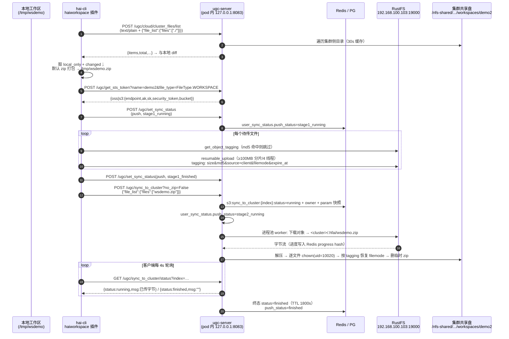
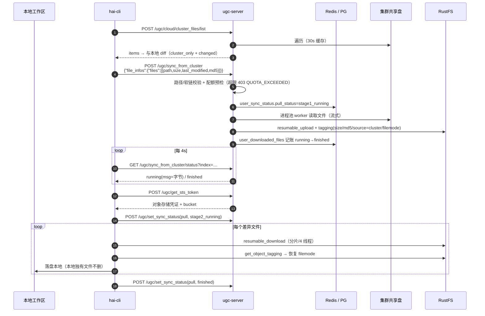
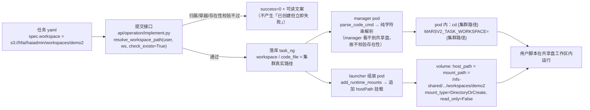

# hai-cli workspace 数据流程图（本地 ↔ RustFS ↔ K8s 共享盘）

> 记录对象：`hai-cli workspace` 的 push / pull 两条链路，以及任务侧如何把工作区挂进 pod。
> 依据：`plugins/haiworkspace/haiworkspace/client/workspace_util.py`、`cloud_storage/service/*`、
> `server_model/task_impl/*`；本文中的端点/路径/bucket 均为 **192.168.100.103 实测环境**的实际取值。

---

## 0. 三个存储位置（先建立坐标）

| 位置 | 实际路径 / 标识 | 谁读写 |
| --- | --- | --- |
| **本地工作区** | 开发机上的目录，例如 `/tmp/wsdemo`；同目录下 `.hfai/workspace.yml` 记录 `provider/local/remote/workspace` | 用户 + `hai-cli`（客户端插件） |
| **对象存储（RustFS）** | 端点 `http://192.168.100.103:19000`（S3 兼容），bucket `hai-platform-private`；对象 key `hfai/haiadmin/workspaces/<name>/<相对路径>` | 客户端**直连** + 服务端传输 worker |
| **K8s 共享盘** | `/nfs-shared/hai-platform/workspace/hfai/haiadmin/workspaces/<name>/<相对路径>`（NFS，主机 103 导出给 4 台 VM） | 服务端写入 + 任务 pod 挂载读写 |

**路径映射（唯一来源 `cloud_storage/utils.py:get_base_path`）**

```
集群路径 = {workspace_path}/{shared_group}/{user_name}/workspaces/{name}/{rel}
         = /nfs-shared/hai-platform/workspace/hfai/haiadmin/workspaces/demo2/{rel}

对象 key（前缀）= {shared_group}/{user_name}/workspaces/{name}/
         = hfai/haiadmin/workspaces/demo2/

  ⚠️ 具体对象名取决于是否 zip：
     • push 默认 zip（no_zip=false）：对象 = <前缀>/<本地工作区目录名>.zip     ← 一个包
     • push --no_zip            ：对象 = <前缀>/<相对路径>                    ← 逐文件
     • pull（服务端上传）        ：对象 = <前缀>/<相对路径>                    ← 逐文件
```

> **两者不是一一对应**：默认 zip 推送时，bucket 里只有**一个 zip 包**，散文件只存在于集群共享盘；
> 之后 `pull` 才会把散文件（含 `source=cluster` 的 tagging）写回 bucket。
> 例：本地 `/tmp/wsdemo2/hello.sh` → 对象 `…/demo2/wsdemo2.zip` → 集群 `…/demo2/hello.sh`。

---

## 1. push：本地 → RustFS → 集群共享盘



**ASCII 版（同样内容，便于在任意终端阅读）**

```
   本地 /tmp/wsdemo                                              RustFS (S3)                      集群共享盘
        │                                                             │                                │
        │ ① /ugc/cloud/cluster_files/list ──► ugc-server ──► 遍历 ────────────────────────────────────►│
        │◄── items/total（30s 缓存）                                                                   │
        │ ② 本地 diff（.hfignore / md5 / size）                                                        │
        │ ③ zip 打包 → /tmp/wsdemo.zip                                                                 │
        │ ④ /ugc/get_sts_token ──► ugc-server ──► 下发 endpoint/AK/SK/bucket                           │
        │ ⑤ /ugc/set_sync_status(push, stage1_running)                                                 │
        │ ⑥ ══直连══► resumable_upload（分片 100MB/4 线程）══► 对象 hfai/haiadmin/workspaces/demo2/…   │
        │             tagging: size/md5/source=client/filemode/expire_at                               │
        │ ⑦ /ugc/set_sync_status(push, stage1_finished)                                                │
        │ ⑧ /ugc/sync_to_cluster {"file_list":{"files":["wsdemo.zip"]}} ──► Redis index/status/param   │
        │                                                        │◄══ 进程池 worker 下载 ══            │
        │                                                        │      ↓ .hfai/wsdemo.zip             │
        │                                                        │      解压 + chown + filemode ──────►│
        │ ⑨ GET /ugc/sync_to_cluster/status ◄── running(msg=字节) / finished                           │
        │                                                        │      终态 TTL 1800s → PG finished   │
```

---

## 2. pull：集群共享盘 → RustFS → 本地



```
   集群共享盘                      ugc-server                     RustFS                      本地 /tmp/wsdemo
        │                                │                            │                              │
        │◄─ ① /ugc/cloud/cluster_files/list ─────────────────────────────────────────────────────────│
        │  ② 与本地 diff → cluster_only + changed                                                    │
        │  ③ /ugc/sync_from_cluster（file_infos 50/批）                                               │
        │  ──► 路径/软链校验 + 配额预检 ──► pull_status=stage1_running                                 │
        │  ──► 进程池 worker 读文件 ══直传══► 对象 + tagging(source=cluster) ──► 记账                   │
        │  ④ GET /ugc/sync_from_cluster/status ◄── running/finished ─────────────────────────────────│
        │  ⑤ /ugc/get_sts_token ──► 下发凭证                                                          │
        │  ⑥ /ugc/set_sync_status(pull, stage2_running)                                               │
        │                              ⑦ ◄══ 直连下载 ══ RustFS                                       │
        │                                 恢复 filemode → 落盘 ─────────────────────────────────────►│
        │  ⑧ /ugc/set_sync_status(pull, finished)                                                     │
```

---

## 3. 任务侧：`s3://` 工作区如何挂进 Pod



---

## 4. 关键机制（为什么这么设计）

| 机制 | 说明 |
| --- | --- |
| **客户端直连对象存储** | 本地↔bucket 的数据不过服务端，服务端只做「bucket↔共享盘」那一段；因此 `/ugc/get_sts_token` 下发的 endpoint 必须**同时对本地与服务端可达**（本环境用 `192.168.100.103:19000`） |
| **tagging 元数据** | `size` / `md5` / `source(client|cluster)` / `filemode` / `expire_at`。`md5` 用于断点续传去重（两端都会先读 tagging 命中就跳过），`filemode` 用于两端恢复权限（截图里工作区文件属主/权限就是靠它） |
| **zip 分发** | 默认 `no_zip=false`：客户端把本次待传文件打成一个 `<name>.zip` 上传；服务端下到 `<cluster>/.hfai/<name>.zip` → 解压 → 逐文件 `chown(uid)` → 删临时包；`.hfai/*.zip` 不进文件列表 |
| **进度与终态** | 过程态在 Redis：`s3:sync_to_cluster:{index}:status|progress|owner|param:{instance}`；终态 TTL **1800s**（必须 ≥ 客户端 `--sync_timeout`，否则客户端会看到 `NOT_FOUND_INDEX`）。`index = sha256(token+name+file_type+文件列表)`，与客户端兜底算法逐字节一致 |
| **状态双写** | Redis=过程态（`init→running→finished|failed`）；PG `user_sync_status`=长期态（push: `stage1_*`(客户端) + `stage2_*`(服务端)；pull 反之）。`hai-cli workspace list` 读的是 PG |
| **记账** | pull 方向每个文件写 `user_downloaded_files`（`status=finished` 才计入配额用量） |
| **多 worker 互斥** | ugc-server 有 2 个 uvicorn worker；崩溃恢复用「实例心跳 + pod 级 `SET NX` 锁」，只认领心跳已失效且快照过期的任务 |
| **路径安全** | 所有落盘/上传路径过 `check_is_subpath` + `realpath`（拒 `..`、绝对路径、指向工作区外的软链）；身份只来自 token，请求里的 `username/group` 一律忽略 |
| **列表缓存** | `cluster_files/list` 结果缓存 30s（Redis + 进程内 TTLCache）。所以 push 后立刻 pull 可能看到旧列表——等 30s 或换 subpath |

---

## 5. 本环境实际取值速查

| 项 | 值 |
| --- | --- |
| 平台镜像 | `registry.cn-hangzhou.aliyuncs.com/opendeepinfra/hai-platform:e03c42c` |
| ugc-server | pod 内 `127.0.0.1:8083`；haproxy `path_beg /ugc/` 转发；对外 `http://10.205.52.200/ugc/...` |
| RustFS | `http://192.168.100.103:19000`（容器 `rustfs`，数据卷 `/opt/rustfs/data`）；AK/SK 见 `override.toml` |
| bucket | `hai-platform-private`（workspace/env 类）；`hai-platform-public` |
| `workspace_path` | `/nfs-shared/hai-platform/workspace` |
| provider 名 | `s3`（服务端配置与 `workspace init -p` **必须一致**） |
| 用户/组 | `haiadmin` / `hfai`（uid `10020`） |
| 典型路径 | 本地 `/tmp/wsdemo2/hello.sh` →（zip）对象 `hfai/haiadmin/workspaces/demo2/wsdemo2.zip` → 集群 `/nfs-shared/hai-platform/workspace/hfai/haiadmin/workspaces/demo2/hello.sh`；`pull` 后对象才变为 `…/demo2/hello.sh`（`source=cluster`） |

### 5.1 实测样例（2026-10-01，bucket `hai-platform-private`）

```
hfai/haiadmin/workspaces/demo2/wsdemo2.zip            409B   ← push（zip 模式，客户端直传）
  tagging: filemode=0o664  md5=f345255e5fe20ccbb226c9dc23e9d105  size=409
           source=client  expire_at=2026-10-02 23:12:14

hfai/haiadmin/workspaces/demo/wsdemo.zip             4780B   ← push（zip 模式）
  tagging: filemode=0o664  md5=38bf6320538af7e6a7bc89be5c262fe1  size=4780
           source=client  expire_at=2026-10-02 23:12:06

hfai/haiadmin/workspaces/demo/ckpt/model.pt            16B   ← pull（服务端上传集群新增文件）
  tagging: filemode=0o644  md5=3d03b2647a49055fcf2db82423e461cf  size=16
           source=cluster
```

对应集群侧（截图里的样子）：

```
/nfs-shared/hai-platform/workspace/hfai/haiadmin/workspaces/demo2/hello.sh   ← zip 解压后的散文件
```

> 读法：`source=client` 表示这个对象是**客户端**传上来的（push 的产物，只有 zip 包）；
> `source=cluster` 表示是**服务端**从共享盘传上去的（pull 的产物，逐文件）。
> 两端的 `filemode` 都来自 tagging，落盘时会 `chmod` 回去。

---

## 6. 复现

```bash
# 本地：初始化（provider 必须是 s3）→ 推送 → 看差异
cd /tmp/wsdemo && echo 'echo hello' > hello.sh
hai-cli workspace init demo2 -p s3
hai-cli workspace push
hai-cli workspace diff
hai-cli workspace list

# 集群：确认落盘（截图中的操作）
sudo kubectl -n hai-platform exec hai-platform-0 -- \
  ls -la /nfs-shared/hai-platform/workspace/hfai/haiadmin/workspaces/demo2

# 对象存储：确认对象与 tagging
python3 - <<'EOF'
import boto3
from botocore.config import Config
c = boto3.client('s3', endpoint_url='http://192.168.100.103:19000',
                 aws_access_key_id='<AK>', aws_secret_access_key='<SK>', region_name='us-east-1',
                 config=Config(signature_version='s3v4', s3={'addressing_style': 'path'}))
print([o['Key'] for o in c.list_objects_v2(Bucket='hai-platform-private',
      Prefix='hfai/haiadmin/workspaces/demo2/').get('Contents', [])])
print(c.get_object_tagging(Bucket='hai-platform-private',
      Key='hfai/haiadmin/workspaces/demo2/hello.sh')['TagSet'])
EOF

# 取回：集群新增文件 → pull → download
hai-cli workspace pull
hai-cli workspace download <subpath>
```
