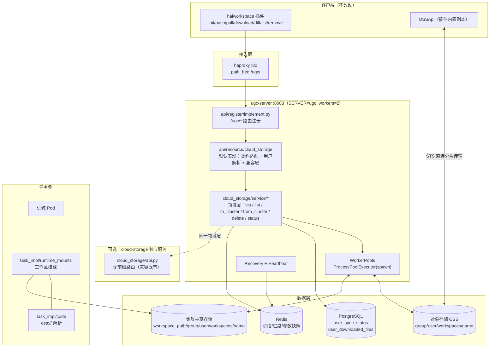
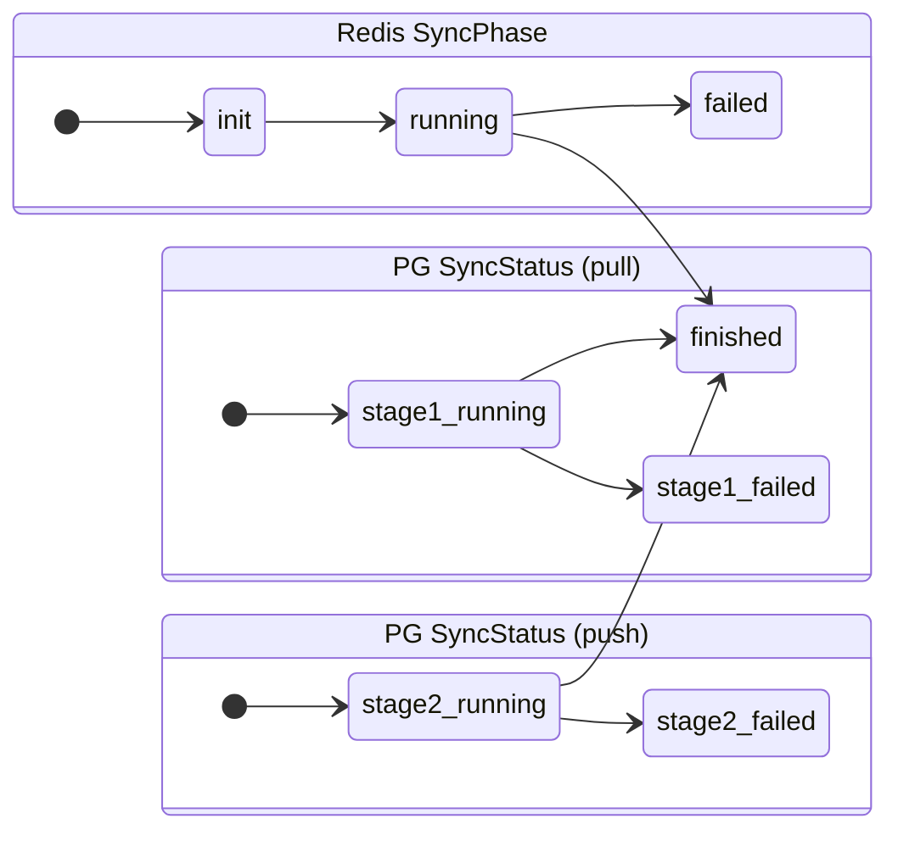
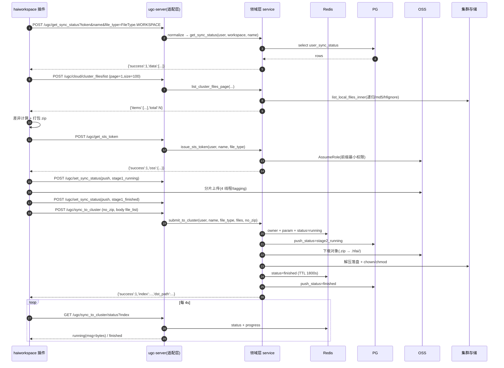

# HAI Platform · `hai-cli workspace` 服务端程序设计说明书

| 项目 | 内容 |
| --- | --- |
| 文档 | 服务端程序设计说明书（Design Specification） |
| 版本 | v1.0 |
| 需求基线 | [workspace-server-requirements.md](workspace-server-requirements.md)（需求 ID 与本文字节一一对应） |
| 配套 | [功能测试用例](workspace-server-test-cases.md) · [Checklist](workspace-server-checklist.md) |
| 代码基线 | `/Users/tongxiaojun/github/opendeepinfra/hai-platform` @ `1a90f87` |
| 决策记录 | 见 §15 ADR（本文所有关键取舍均登记） |

---

## 1. 设计目标与总体架构

### 1.1 目标拆解

| 目标 | 设计手段 |
| --- | --- |
| 客户端零改动可用 | **兼容层**（§6）：忽略 Content-Type 手工解析 Body、枚举串归一化、Body 外壳双形状 |
| 复用既有能力 | **领域层抽离**（§5）：`cloud_storage/` 从「路由 + 逻辑」重构为「service + 薄路由」 |
| 两种部署形态 | **双宿主**（§3）：`ugc-server` 进程内调用 / `cloud-storage` 独立服务 HTTP 调用，共用 service |
| 生产可用 | 状态机（§7）、幂等与恢复（§5.6）、限额（§9.4）、安全（§12.3）、灰度回滚（§13） |
| 任务可直接运行 | `oss://` 解析（§10.1）与工作区挂载（§10.2） |

### 1.2 总体架构



**分层原则**

| 层 | 职责 | 禁止 |
| --- | --- | --- |
| 接入层（`api/register`、`api/resource/cloud_storage/default.py`） | 路由、鉴权、参数归一化、契约适配、错误码转换 | 写业务逻辑、直接操作 OSS |
| 领域层（`cloud_storage/service/*`） | 路径推导、状态机、并发调度、传输编排、配额 | 感知 FastAPI/HTTP/查询串 |
| 适配层（`cloud_storage/provider/*`） | 对象存储读写 | 感知业务语义 |
| 持久层（`server_model/user_impl/**`） | SQL | 感知 HTTP |

---

## 2. 现状与复用资产

| 资产 | 位置 | 复用方式 |
| --- | --- | --- |
| 路径推导与安全校验 | `cloud_storage/utils.py:397-466`（`get_base_path` / `check_is_subpath`） | 原样复用，作为唯一路径来源 |
| 过程状态记录 | `cloud_storage/utils.py:152-233`（`StatusRecorder` / `status_key`） | 扩展 `a_set_nx`、`a_hincrby` |
| 并发工作池 | `cloud_storage/utils.py:49-79`（`WorkerPools`） | 扩展按实例隔离断点目录、`try/finally`、`shutdown_all` |
| 分页缓存 | `cloud_storage/utils.py:315-384`（`paginate`） | 原样复用 |
| 传输与 tagging | `cloud_storage/api.py:619-808` | **迁移**到 `service/`，签名不变 |
| STS 签发 | `cloud_storage/provider/oss.py:176-254` | 原样复用（补 bucket 选择修正，见 §12.4） |
| 双端共享工具 | `conf/utils.py` | 原样复用，禁止修改语义（`COMP-04`） |
| 表结构 | `db_schemas/010,011` | 原样复用，无需 DDL（`CON-9`） |
| 配置装配 | `conf/proj_conf/default.py:10-85` | 新增 `[cloud.storage]` 模板段 |
| 用户组件模式 | `server_model/user_impl/*/default.py` + `implement.py` | 新增 `user_downloaded_files` 组件；DB 方法进 `*Extras` 基类 |

---

## 3. 模块划分与文件清单

### 3.1 新增文件

| 文件 | 内容 | 需求 |
| --- | --- | --- |
| `cloud_storage/service/__init__.py` | 导出领域层 API | — |
| `cloud_storage/service/context.py` | `get_cloud_api()` / `get_provider()` / `get_status_recorder()` / `get_worker_pools()`：**惰性单例**，把 `cloud_storage/utils.py:30-46` 的模块级副作用改为函数级 | FR-19 |
| `cloud_storage/service/errors.py` | `WorkspaceError(code, msg, http_status)`、错误码常量 | §4 统一约定 |
| `cloud_storage/service/sts.py` | `issue_sts_token(user, name, file_type, ttl_seconds)` | FR-01 |
| `cloud_storage/service/cluster_files.py` | `list_cluster_files_page(user, name, file_type, subpaths, ...)` | FR-04 |
| `cloud_storage/service/sync_to_cluster.py` | `submit_to_cluster(...)` / `execute_to_cluster(...)` / `wait_to_cluster(...)` | FR-05/10/11/20 |
| `cloud_storage/service/sync_from_cluster.py` | `submit_from_cluster(...)` / `wait_from_cluster(...)` | FR-07/17 |
| `cloud_storage/service/delete.py` | `delete_paths(user, name, file_type, files)` | FR-08 |
| `cloud_storage/service/status.py` | `get_phase(index, is_upload)` / `phase_to_api(...)` | FR-06/08 |
| `cloud_storage/service/recovery.py` | `recover_interrupted_tasks()` + 实例心跳 + pod 锁 | FR-13 |
| `cloud_storage/provider/localfs.py` | 文件系统 provider，供**测试/本地开发**（含 tagging 侧车文件） | NFR-09（可测性） |
| `server_model/user_impl/user_downloaded_files/{__init__,default,implement}.py` | `UserDownloadedFiles` 组件：用量统计与记账 | FR-17 |
| `server_model/task_impl/workspace_resolver.py` | `resolve_workspace_path(user, workspace)`：URI → 集群路径 | FR-15 |
| `db_schemas/035.table_cloud_storage_sync_log.sql` | **P1 可选**：同步任务审计表 | FR-21 |

### 3.2 修改文件

| 文件 | 改动 | 风险 |
| --- | --- | --- |
| `api/register/implement.py` | 在 `if 'ugc' in REG_SERVERS` 分支新增 9 条 `/ugc/*` 路由（P1 再加 3 条） | 低（只增） |
| `api/resource/cloud_storage/default.py` | 用**真实实现**替换 9 个桩（保持函数名不变）；内部只做适配与调用 service | 中（桩语义变化，需回归） |
| `api/app.py` | 新增 `RequestValidationError` 异常处理器，统一改写为 `{'success':0,...}`（`CON-3`） | 低 |
| `cloud_storage/api.py` | 抽薄：端点的函数体改为调用 `service/*`；保持路径/签名/依赖/响应模型不变 | 中（`COMP-03` 回归） |
| `cloud_storage/__init__.py` | **去掉 `from .api import *`**，改为 `from api.app import app`（见 ADR-11） | 中（涉及导入契约） |
| `uvicorn_server.py` | `cloud-storage` 部署模式改为加载 `cloud_storage.api:app`（原 `cloud_storage:app`） | 低 |
| `api/resource/cloud_storage/default.py` | 注册 `startup`（触发恢复 + 心跳）与 `shutdown`（`worker_pools.shutdown_all()`）事件钩子 | 低 |
| `cloud_storage/utils.py` | `StatusRecorder` 增加 `a_set_nx` / `a_hincrby` / `a_get_hash_keys`；`WorkerPools` 增加实例隔离与 `shutdown_all`；把 `paginate()` 拆为 `list_files_cached()` + 薄 `paginate()`（供新旧两条路径复用） | 低 |
| `server_model/user_impl/aio_user_db/default.py` | `AioUserDbExtras` 增加 `set_sync_status` / `get_sync_status` / `soft_delete_sync_status` | 低 |
| `server_model/user_impl/user_db/default.py` | `UserDbExtras` 增加同步版同名方法（供线程内调用） | 低 |
| `server_model/user_impl/module_imports/implement.py` | 导出 `UserDownloadedFiles` | 低 |
| `server_model/user/implement.py` | `User` 增加 `downloaded_files: UserDownloadedFiles = ServerUserModule()` | 低 |
| `server_model/task_impl/code/default.py` | `parse_code_cmd` 调用 `resolve_workspace_path`（含存在性校验） | 中（影响所有任务提交） |
| `server_model/task_impl/runtime_mounts/default.py` | 追加工作区挂载项 | 中（影响 pod spec） |
| `one/one_etc/core.toml` | 新增 `[cloud.storage]` 配置模板段 | 低 |
| `plugins/haiworkspace/haiworkspace/client/workspace_util.py` | **可选（向后兼容）**：provider 映射表支持 `localfs`；（P1）`quote()` 路径参数、`part_mb_size` 断点目录 | 低 |

### 3.3 依赖关系（禁止反向依赖）

```
api/resource/cloud_storage/default.py  ──┐
                                        ├──▶ cloud_storage/service/*  ──▶ cloud_storage/{utils,provider}
cloud_storage/api.py（独立部署）      ──┘                │
                                                          ├──▶ server_model/user_impl/**（DB）
                                                          └──▶ db / config
server_model/task_impl/**  ──▶ cloud_storage/service/workspace_path（仅路径函数，不依赖 Redis/OSS）
```

> `server_model/task_impl/**` 只允许调用**纯路径函数**（`workspace_resolver`），不得引入 `cloud_storage/service` 的传输能力，避免 launcher 进程被 Redis/OSS 依赖污染。

**导入纪律（强制，见 ADR-11/ADR-12）**

1. `import cloud_storage.service.*` **不得**触发任何路由注册或 `on_event` 注册；
2. 路由注册只发生在 `cloud_storage/api.py`（显式导入）与 `api/register/implement.py`；
3. 配置读取（`CONF.cloud.storage.*`）、provider 构造、Redis/进程池获取一律**惰性**，不得在模块顶层执行；
4. 恢复/心跳由接入层的 `startup` 钩子显式触发，且受 `recover_on_startup` 开关与 `SET NX` 锁保护。

---

## 4. 接口契约

### 4.0 统一约定

| 项 | 约定 |
| --- | --- |
| 基础路径 | `{mars_url}/ugc/...`（haproxy `path_beg /ugc/` → `127.0.0.1:8083`） |
| 鉴权 | 查询参数 `token`；通过新增依赖 `get_ugc_user()` 解析为 `User`；**忽略**任何 `username`/`group`/`userid` 入参 |
| Body | 一律以 `request: Request` 接收，手工 `json.loads(await request.body())`（`CON-4`），并兼容 `<name>` 外壳（`FR-14`） |
| 成功 | `{'success': 1, ...}` |
| 失败 | `{'success': 0, 'msg': '<人类可读>', 'code': '<ERROR_CODE>'}`；鉴权类用 401/403，其余用 200（见 §4.11） |
| 未知参数 | 忽略，不报 422 |
| 响应头 | 保留 `client-version`（`api/app.py:158-162`） |
| 日志 | 每次请求记录 `user`、`name`、`index`、耗时；token 脱敏 |

### 4.1 API-01 `POST /ugc/get_sts_token`（FR-01）

| 项 | 内容 |
| --- | --- |
| 查询参数 | `token`（必填）、`name`（必填）、`file_type`（必填，兼容枚举串）、`ttl_seconds`（默认 1800） |
| Body | 无 |
| 响应 | `{'success':1, 'oss': {'endpoint','access_key_id','access_key_secret','security_token','bucket'}}` |
| 客户端 | `workspace_util.py:108-121` / `286-301`；`provider` 必须与 `workspace.yml` 中的 provider 同名 |
| 要点 | ① `file_privacy` 固定 `GROUP_SHARED`，bucket 走 `get_bucket_name(file_type, GROUP_SHARED)`（修正 §12.4）；② TTL 夹取 `[900, 43200]`；③ 授权前缀 = `get_base_path(...)[1]` |
| 错误 | `INVALID_PARAM`（name 含 `/`）、`CLOUD_STORAGE_NOT_CONFIGURED`、`INTERNAL_ERROR` |
| 幂等 | 是（仅签发，无副作用） |
| 示例 | `curl -sX POST 'http://api/ugc/get_sts_token?token=T&name=demo&file_type=workspace&ttl_seconds=1800'` |

### 4.2 API-02 `POST /ugc/set_sync_status`（FR-02）

| 项 | 内容 |
| --- | --- |
| 查询参数 | `token, file_type, name, direction, status, local_path, cluster_path` |
| 归一化 | `file_type`/`direction`/`status` 走 `normalize_enum`（§6.2）；`local_path`/`cluster_path` 仅作元数据，**长度截断至 2047**、空值不覆盖旧值（`CON-6`） |
| 响应 | `{'success':1}` |
| 行为 | `upsert` 到 `user_sync_status`（§7.2） |
| 错误 | `INVALID_PARAM`（`name` 为空/含 `/`）、`UNAUTHORIZED` |
| 幂等 | 是 |

### 4.3 API-03 `POST /ugc/get_sync_status`（FR-03）

| 项 | 内容 |
| --- | --- |
| 查询参数 | `token, file_type, name`（`name='*'` 或省略 → 列全部） |
| 响应 | `{'success':1, 'data':[{'name','local_path','cluster_path','push_status','last_push','pull_status','last_pull'}]}` |
| **关键** | 无记录 → `data: []` + `success: 1`（客户端据此打印「没找到工作区」） |
| 排序 | `updated_at DESC`；`deleted_at IS NULL` |
| 时间格式 | `'%Y-%m-%d %H:%M:%S'`（用 `to_char`，避免时区/格式漂移） |

### 4.4 API-04 `POST /ugc/cloud/cluster_files/list`（FR-04）

| 项 | 内容 |
| --- | --- |
| 查询参数 | `token, name, file_type, no_checksum=false, no_hfignore=false, recursive=true, page=1, size=100` |
| Body | `{"file_list": {"files": ["<相对子路径>", ...]}}`（兼容裸 `{"files":[...]}`） |
| 响应 | `{'items':[FileInfo...], 'total':N, 'page':p, 'size':s, 'pages':P}` |
| 实现 | `service/cluster_files.py` → 复用既有缓存与校验逻辑；为此把 `cloud_storage/utils.py:351-384` 的 `paginate()` 重构为两层：`list_files_cached(base_path, path_list, no_checksum, no_hfignore, recursive) -> (files, total)`（缓存 + 每 500 条存在性校验）与 `paginate()`（薄封装，保持 `Page` 返回，供旧路由复用）。`service` 只调前者并自行切片，避免领域层依赖分页响应模型 |
| 分页 | `offset = (page-1)*size`，`limit = size`；`pages = ceil(total/size)`；`page < 1` 归一为 1；`offset ≥ total` 返回空 `items` 且 `total` 真实（客户端 `while` 循环依赖此语义） |
| 限制 | `size` 截断至 `[1, 1000]`；`len(files) ≤ 1000`；`recursive` 固定 `true`（客户端恒为 true） |
| 一致性 | 每 500 条校验首个文件是否仍存在，不存在则清缓存并返回 `CLIENT_RETRY`（复用既有逻辑 `utils.py:372-376`） |
| 性能 | 首次 ≤ 30 s（10 万文件）；缓存命中 ≤ 1 s |

### 4.5 API-05 `POST /ugc/sync_to_cluster`（FR-05/10/11/20）

| 项 | 内容 |
| --- | --- |
| 查询参数 | `token, name, file_type, no_zip` |
| Body | `{"file_list": {"files":[...]}}` |
| 响应 | `{'success':1, 'msg':'提交同步任务成功', 'index':'<sha256>', 'dst_path':'<集群路径>', 'accepted': N, 'skipped': M}` |
| 幂等键 | `index = sha256(token + name + file_type + *sorted(files))`（与客户端兜底算法一致，**保持不排序的原始顺序**以免 hash 变化：与 `conf/utils.py:290` 的定义一致，逐参数拼接） |
| 提交前校验 | ① `file_type ∈ {workspace, env}`；② 路径穿越校验（`check_is_subpath`）；③ 文件数 ≤ 10 000；④ 特性开关（OPS-01） |
| 执行 | 见 §5.2；`no_zip` 为真时逐文件落盘，否则 `.zip` 走解压流程 |
| 失败语义 | 提交阶段失败 → `success=0`；执行阶段失败 → `success=1`（已受理）+ 状态接口暴露 `failed` |

### 4.6 API-06 `GET /ugc/sync_to_cluster/status`（FR-06/20）

| 项 | 内容 |
| --- | --- |
| 查询参数 | `token, index` |
| 响应 | `running`：`{'success':1,'status':'running','msg':<已传字节 int>, 'total':<可选>}`；`finished`：`{'success':1,'status':'finished','msg':''}`；`failed`：`{'success':1,'status':'failed','msg':'<原因>'}`；`init`（仅 pull 方向） |
| 约束 | `running` 时 `msg` 必须 `int()` 可解析（`workspace_util.py:199`） |
| 不存在 | `{'success':0,'code':'NOT_FOUND_INDEX','msg':'不存在的index'}`（HTTP 400） |
| 时延 | P99 ≤ 100 ms（仅 Redis 读） |
| 鉴权 | 必须校验 `index` 归属：Redis 中记录 `owner`，与请求用户不符 → 403（SEC-04） |

### 4.7 API-07 `POST /ugc/sync_from_cluster`（FR-07/17）

| 项 | 内容 |
| --- | --- |
| 查询参数 | `token, name, file_type` |
| Body | `{"file_infos": {"files":[{'path','size','last_modified','md5'}...]}}` |
| 响应 | `{'success':1, 'msg':..., 'index':..., 'accepted':N, 'skipped':M, 'upload_mb':X}` |
| 校验 | 路径非绝对、无 `..`、非越界软链（SEC-03）；配额预检（FR-17） |
| 执行 | 见 §5.3；`filter_synced_files` 仅当总量 > 1 GiB 时启用（`cloud_storage/api.py:459-463`） |
| 记账 | 每个文件 `insert_downloaded_file(status=running)` → 成功 `finished` / 失败 `failed` |

### 4.8 API-08 `GET /ugc/sync_from_cluster/status`（FR-06）

同 API-06，方向为上传（Redis key 段 `sync_from_cluster`）。`init` 阶段 `msg=''`（客户端在不解析 `msg` 时才读取）。

### 4.9 API-09 `POST /ugc/delete_files`（FR-08）

| 项 | 内容 |
| --- | --- |
| 查询参数 | `token, name, file_type`（客户端固定传 `file_type=FileType.WORKSPACE`，需归一化） |
| Body | `{"file_list": {"files":[...]}}`；`files` 为空 → 删除整个工作区 |
| 行为 | 逐个 `normpath + check_is_subpath` → 目录 `rmtree`、文件 `remove`；文件不存在视为成功（幂等）；随后软删 `user_sync_status` 行（`deleted_at=now()`） |
| 审计 | 记录操作人、`name`、文件列表（空列表即整区删除，必须 INFO 级审计日志）（SEC-07） |
| 错误 | `PATH_ESCAPE`（含 `..` 或越界）、`FORBIDDEN`（非本人工作区） |
| 幂等 | 是 |

### 4.10 API-10/11/12（P1）

| ID | 路径 | 说明 |
| --- | --- | --- |
| API-10 | `POST /ugc/set_cloud_storage_quota` | 管理员设置 `quota` 表 `resource='cloud_storage_quota'`；参数 `token, user_name, quota_mb, expire_time`；权限沿用 `api/depends.get_internal_api_user_with_token(allowed_groups=['ops','platform'])` |
| API-11 | `POST /ugc/update_cluster_venv` | 返回 env 的集群路径 `{'success':1,'path':...}`（客户端 `client/api/venv_api.py:22`）；需同时修复客户端 `FileType.ENV` 字符串化问题后才有意义 |
| API-12 | `GET /ugc/cloud_storage/usage` | 用户自查：`{'success':1,'used_mb','quota_mb','file_count','workspaces':[...]}` |

### 4.11 错误码表

| code | HTTP | 触发 | 客户端表现 |
| --- | --- | --- | --- |
| `INVALID_PARAM` | 200 | 枚举/必填参数非法 | 重试 3 次后 `推送失败，错误信息：请求失败: ...` |
| `INVALID_BODY` | 200 | Body 非 JSON 或结构不符 | 同上 |
| `UNAUTHORIZED` | 401 | token 缺失/过期/用户不存在 | 同上 |
| `FORBIDDEN` | 403 | 越权（他人 name/index/目录） | 同上 |
| `PATH_ESCAPE` | 200 | 路径穿越 | 同上 |
| `QUOTA_EXCEEDED` | 403 | 超出 pull 配额 | 同上（含明细） |
| `CLOUD_STORAGE_NOT_CONFIGURED` | 200 | `[cloud.storage]` 缺失 | 提示联系管理员 |
| `FEATURE_DISABLED` | 200 | 灰度未开启 | 提示未开放 |
| `NOT_FOUND_INDEX` | 400 | index 不存在 | 轮询失败并终止 |
| `TOO_MANY_FILES` / `PAYLOAD_TOO_LARGE` | 200 | 超限额 | 提示分批 |
| `CLIENT_RETRY` | 200 | 列目录期间文件被删 | 提示重试当前操作 |
| `INTERNAL_ERROR` | 500 | 未捕获异常 | 同上；同时告警 |

> **已知代价**：客户端对 `success != 1` 会重试（`retries=3`，每次间隔 2 s），永久性错误也会浪费约 4 s。设计上要求错误响应体极小、响应极快。

---

## 5. 领域层设计

### 5.1 领域层契约

```python
# cloud_storage/service/__init__.py
async def issue_sts_token(user: User, name: str, file_type: FileType,
                          ttl_seconds: int = 1800) -> dict: ...
async def list_cluster_files_page(user: User, name: str, file_type: FileType,
                                  subpaths: List[str], no_checksum: bool,
                                  no_hfignore: bool, page: int, size: int) -> dict:
    """→ {'items': [FileInfo...], 'total': int, 'page': int, 'size': int, 'pages': int}
       内部复用 utils 的缓存 + 存在性校验逻辑（见下），返回纯 dict，不依赖分页响应模型"""
async def submit_to_cluster(user: User, name: str, file_type: FileType,
                            files: List[str], no_zip: bool,
                            force: bool = False) -> dict: ...               # → {index, dst_path, accepted, skipped}
async def submit_from_cluster(user: User, name: str, file_type: FileType,
                              file_infos: List[FileInfo],
                              force: bool = False) -> dict: ...             # → {index, accepted, skipped, upload_mb}
async def get_transfer_status(user: User, index: str, is_upload: bool) -> dict: ...
async def delete_paths(user: User, name: str, file_type: FileType,
                       files: List[str]) -> dict: ...
```

约定：入参一律是**已解析的用户对象与已归一化的枚举**；返回 `dict`（不含 `success` 包装，由接入层包装）；抛 `WorkspaceError`。`force` **不来自 HTTP 请求**（客户端不传该参数），仅供崩溃恢复流程覆盖「正在运行」判定使用。

### 5.2 `submit_to_cluster` 执行流程（bucket → 集群）

```python
async def submit_to_cluster(user, name, file_type, files, no_zip, force=False):
    check_feature_enabled(user)                                   # OPS-01
    cluster_base, cloud_base = get_base_path(user.user_name, user.shared_group,
                                            name, file_type)      # 唯一路径来源
    index = hashkey(user.token, name, file_type.value, *files)     # 与客户端兜底一致
    await status.set_owner(index, is_upload=False, user=user)      # SEC-04

    if not files:
        await set_phase(index, False, SyncPhase.FINISHED, owner=user, expires=STATUS_TTL)
        return {'index': index, 'dst_path': cluster_base, 'accepted': 0, 'skipped': 0}

    if not force and await get_phase(index, False) == SyncPhase.RUNNING:
        return {'index': index, 'dst_path': cluster_base, 'accepted': 0, 'skipped': 0,
                'msg': '上一次同步正在进行中，忽略本次请求'}

    await snapshot_params(index, False)                            # 崩溃恢复用
    await user.aio_db.set_sync_status(file_type.value, name, 'push',
                                      SyncStatus.STAGE2_RUNNING.value, '', cluster_base)
    await set_phase(index, False, SyncPhase.RUNNING, owner=user)
    ensure_dir(cluster_base, uid=user.user_id)                     # makedirs + chown
    futures = []
    try:
        for fname in files:
            local = local_path_for(cluster_base, fname, no_zip)     # zip → .hfai/<fname>
            check_is_subpath(cluster_base, local)
            ensure_parent_dirs(local, uid=user.user_id)
            pool = worker_pools.get(index)
            fut = await loop.run_in_executor(None, partial(
                pool.submit, resumable_download_with_retry,
                bucket_name=bucket, key=f'{cloud_base}/{fname}', filename=local,
                file_type=file_type, userid=user.user_id, index=index,
                use_zip=(not no_zip and fname.endswith('.zip')),
                multiget_threshold=PART_SIZE, part_size=PART_SIZE,
                num_threads=4, retries=10))
            fut.add_done_callback(download_callback)                # 指标
            futures.append(fut)
            RUNNING_TASKS_GAUGE.labels('push', user.user_name, file_type.value).inc()
    except Exception:
        await finalize_failed(index, False, user, file_type, name)  # 保证状态不悬挂
        raise
    threading.Thread(target=wait_to_cluster, args=(futures, index, user, file_type, name),
                     daemon=True, name=f'download-{index}').start()
    return {'index': index, 'dst_path': cluster_base, 'accepted': len(files), 'skipped': 0}
```

`wait_to_cluster` 与既有 `cloud_storage/api.py:334-355` 等价，但：
- 结束态 TTL 从 300 s 提升至 `STATUS_TTL_FINISHED`（默认 1800 s，需 ≥ 客户端 `sync_timeout`）；
- 失败原因写入 `status` 值（客户端据此 `raise`）；
- DB 终态写 `finished` / `stage2_failed`（传 `.value`）。

### 5.3 `submit_from_cluster` 执行流程（集群 → bucket）

与 `cloud_storage/api.py:379-538` 等价，关键差异：

1. **符号链接校验**（SEC-03）：`os.path.realpath(src)` 必须仍在 `cluster_base` 之内，否则该文件标记失败并跳过。
2. 配额：`used_mb = await user.downloaded_files.get_usage_in_mb()`；`upload_mb = Σsize // 1MiB`；`used + upload ≥ limit` → `WorkspaceError('QUOTA_EXCEEDED', ...)`（HTTP 403）。
3. `>1 GiB` 才做 `filter_synced_files`（保持既有语义，避免逐对象读 tagging 的放大）。
4. 记账：`insert_downloaded_file(..., status=running)` → 成功 `finished`，最终失败 `failed`；**只有 `finished` 计入用量**。
5. `wait_from_cluster` 中 doc/pypi 的 bucket GC 逻辑保留（`cloud_storage/api.py:551-565`），但仅对 `file_type in {doc, pypi}` 生效。

### 5.4 zip 分发设计（FR-10）

```python
def local_path_for(cluster_base, fname, no_zip):
    if not no_zip and fname.endswith('.zip'):
        return os.path.join(cluster_base, '.hfai', fname)   # 临时落点，避免覆盖同名真实目录
    return os.path.join(cluster_base, fname)
```

解压（worker 内，既有 `cloud_storage/api.py:669-688`）：
1. 下载到 `.hfai/<fname>`；
2. `unzip_dir(filename, dirname=dirname.split('/.hfai')[0])`；
3. 对每个解压文件 `chown(uid)`（非 dataset）；目录权限由 `MyZipFile._extract_member` 用 zip 中的 `external_attr` 恢复（`conf/utils.py:328,333`）；
4. 删除临时 zip。

**兼容要求**：`.hfai/` 与 `.hfai/*.zip` 必须在 `list_local_files_inner` 中被过滤（客户端已实现 `conf/utils.py:238-239`），服务端 `cluster_files` 列表同样过滤，避免 `.hfai/<name>.zip` 被当作工作区文件返回给客户端造成「客户端本地不存在 → 被判定为集群独有文件」。

### 5.5 传输与重试（FR-11）

| 参数 | 值 | 来源 |
| --- | --- | --- |
| 分片阈值 / 分片大小 | 100 MB（`slice_bytes`） | `conf/utils.py:17` |
| 并发线程 | 4 | 既有 |
| 重试次数 | 10（1 s 间隔） | 既有 |
| 跳过条件 | 对象 tagging `md5 == 本地 md5` | 既有 |
| 断点目录 | `{breakpoint_info_path}/{instance_id}` | **新增**，避免多进程 checkpoint 冲突 |

### 5.6 并发与崩溃恢复（FR-13）

**问题**：`ugc = 2`（2 个 uvicorn worker 进程），既有恢复逻辑（`cloud_storage/api.py:31-69`）会让两个进程都扫描 `param:{pod_id}` 并重复执行恢复。

**设计**：

```
实例标识      instance_id = f'{POD_NAME}-{os.getpid()}'         # 进程唯一
参数快照键    {PROVIDER}:sync_*:{index}:param:{instance_id}      # 内含 {"instance": ..., "created_at": ...}
实例心跳      HSET cloud_storage:instances:{pod_id} {instance_id} <ts>; EXPIRE 120
              （每 30 s 刷新）
恢复互斥锁    SET NX {PROVIDER}:recover:{pod_id} <instance_id> EX 300
恢复判定      仅当 param.instance 不在心跳表中（进程已死）才认领
认领动作      重写 param 键为新 instance_id → force=True 重新提交
```

```python
async def recover_interrupted_tasks():
    if not await recorder.a_set_nx(f'{PROVIDER}:recover:{pod_id}', instance_id, 300):
        logger.info('recovery skipped: another worker holds the lock')
        return
    live = await recorder.a_get_hash_keys(f'cloud_storage:instances:{pod_id}')
    for key in recorder.get_keys(f'{PROVIDER}:*:*:param:*'):
        param = ujson.loads(await recorder.a_get(key) or '{}')
        if param.get('instance') in live:
            continue                                   # 拥有者仍存活
        await recorder.a_delete(key)                   # 认领
        await recorder.a_set(key, ujson.dumps({**param, 'instance': instance_id}), STATUS_TTL)
        try:
            if ':sync_to_cluster:' in key:   await execute_to_cluster(**param, force=True)
            else:                            await execute_from_cluster(**param, force=True)
        except Exception as e:
            logger.error(f'recover {key} failed: {e}')
```

**兜底**：若心跳机制不可用（Redis 版本受限），退化为「param 写入时间 > 600 s 才认领」的时间阈值策略（配置 `recover_stale_seconds`）。

**工作池**：`WorkerPools` 增加
- `__init__` 使用 `breakpoint_subdir(instance_id)`；
- `finish()` 幂等（已存在 `pop(key, None)`）；
- `shutdown_all()` 在 `app.on_event('shutdown')` 调用；
- 提交循环 `try/except` 保证 `RUNNING_TASKS_GAUGE` 不悬挂（修分析报告 F9）。

---

## 6. 兼容层设计（FR-14 / COMP-01/02）

### 6.1 用户解析

```python
# api/depends/implement.py（新增，复用既有 selector）
async def get_ugc_user(request: Request) -> User:
    token = request.query_params.get('token') or _token_from_body(await request.body())
    if not token:
        raise HTTPException(401, detail={'success': 0, 'code': 'UNAUTHORIZED', 'msg': '需要指定 token'})
    user = await AioUserSelector.from_token(token=token)
    if user is None:
        raise HTTPException(401, detail={'success': 0, 'code': 'UNAUTHORIZED', 'msg': '根据 token 未找到用户'})
    if not user.active:
        raise HTTPException(401, detail={'success': 0, 'code': 'UNAUTHORIZED', 'msg': '账号不活跃'})
    return user
```

- 复用 `AioUserSelector.from_token`（`api/depends/default.py:24`）与 `expired` 分支逻辑。
- **不接受**客户端传入的 `username`/`group`（SEC-01）。
- 接入层的 `username = user.user_name`、`group = user.shared_group`、`userid = user.user_id` **全部由服务端推导**。

### 6.2 枚举归一化

```python
# cloud_storage/service/compat.py
_ENUM_PREFIX = re.compile(r'^(?:[A-Za-z_]\w*\.)+')

def normalize_enum(raw, enum_cls, *, field: str, default=None, enabled: bool = True):
    if raw in (None, ''):
        if default is None:
            raise WorkspaceError('INVALID_PARAM', f'缺少参数 {field}')
        return default
    s = str(raw).strip()
    if enabled:
        s = _ENUM_PREFIX.sub('', s)          # 'FileType.WORKSPACE' → 'WORKSPACE'
    for member in enum_cls:
        if s.lower() == member.value.lower():
            return member
    raise WorkspaceError('INVALID_PARAM', f'{field}={raw!r} 非法，可选 {[m.value for m in enum_cls]}')
```

调用矩阵（必须全部归一化）：

| 接口 | 参数 | 枚举类 |
| --- | --- | --- |
| API-01 | `file_type` | `FileType` |
| API-02 | `file_type` / `direction` / `status` | `FileType` / `SyncDirection` / `SyncStatus` |
| API-03/04/05/07/09 | `file_type` | `FileType` |

> 客户端实际发送值（分析报告 F2）：`file_type=FileType.WORKSPACE&direction=SyncDirection.PUSH&status=SyncStatus.INIT`。归一化后等价于 `workspace/push/init`。

### 6.3 Body 解析（`CON-4`）

```python
async def parse_json_body(request: Request, wrapper: str | None = None) -> dict:
    raw = await request.body()
    if not raw:
        return {}
    try:
        data = ujson.loads(raw)
    except Exception:
        raise WorkspaceError('INVALID_BODY', '请求体不是合法 JSON')
    if not isinstance(data, dict):
        raise WorkspaceError('INVALID_BODY', '请求体必须是 JSON 对象')
    if wrapper and isinstance(data.get(wrapper), dict):
        data = data[wrapper]                       # {"file_list": {...}} → {...}
    return data
```

**为什么必须手工解析**：客户端用 `aiohttp` 的 `data=<str>` 发送（`workspace_util.py:151,178,234,270`），aiohttp 固定写 `Content-Type: text/plain; charset=utf-8`；FastAPI 只在 `application/json`（或无 Content-Type）时才解析 Body，否则把原始 bytes 交给校验器并返回 422（`{"detail":[...]}`，缺 `success` 字段 → 客户端断言失败）。

**兼容矩阵**

| Body 形态 | 处理 |
| --- | --- |
| `{"file_list": {"files":[...]}}`，`text/plain` | ✅（客户端实际形态） |
| `{"file_infos": {"files":[{...}]}}`，`text/plain` | ✅ |
| `{"files":[...]}`，`application/json` | ✅（规范形态，新客户端） |
| 空 Body | ✅（视为空列表；`delete_files` → 删整区，需审计） |
| 非法 JSON | `INVALID_BODY` |

### 6.4 全局异常改写（`CON-3`）

```python
# cloud_storage/service/errors.py
class WorkspaceError(Exception):
    def __init__(self, code: str, msg: str, http_status: int = 200):
        self.code, self.msg, self.http_status = code, msg, http_status
        super().__init__(msg)

# api/app.py
from fastapi.exceptions import RequestValidationError
from cloud_storage.service.errors import WorkspaceError

@app.exception_handler(WorkspaceError)
async def workspace_error_handler(request, exc: WorkspaceError):
    """业务错误：HTTP 状态按 code 语义，响应体始终含 success"""
    logger.warning(f'[WORKSPACE_ERR] {request.url.path} code={exc.code} msg={exc.msg}')
    return JSONResponse({'success': 0, 'code': exc.code, 'msg': exc.msg},
                        status_code=exc.http_status)

@app.exception_handler(RequestValidationError)
async def validation_handler(request, exc):
    """兜底：即使出现 FastAPI 自动校验失败，响应体也必须含 success（CON-3）"""
    logger.warning(f'[VALIDATION] {request.url.path}: {exc.errors()}')
    return JSONResponse({'success': 0, 'code': 'INVALID_PARAM',
                         'msg': f'请求参数非法: {exc.errors()[:1]}',
                         'detail': exc.errors()}, status_code=422)
```

- **保持 422 状态码不变**（只追加 `success/code/msg` 字段）：避免改变全平台既有的 4xx 语义（监控/告警按状态码统计），把影响面限制在响应体；客户端不检查状态码，因此对它而言行为等价（都是「失败 + 可读原因」）。
- `WorkspaceError` 由领域层抛出、由全局处理器统一转换，业务代码不直接构造 `HTTPException`（除鉴权依赖外）。
- 鉴权类（401/403）沿用既有 `HTTPException(detail={...})`；`api/app.py:211-222` 对 dict detail 会**原样返回**该 dict，因此天然带 `success` 字段。
- 即使 Body 已声明为 `Request`，仍保留该处理器作为兜底（防未来新增参数引入无 `success` 的 422）。

---

## 7. 状态与数据设计

### 7.1 Redis 设计（过程态）

| Key | 类型 | 内容 | TTL |
| --- | --- | --- | --- |
| `{PROVIDER}:sync_to_cluster:{index}:status` | string | `init`/`running`/`finished`/`failed(<原因>)` | 运行中 604800 s；终态 1800 s（可配） |
| `{PROVIDER}:sync_to_cluster:{index}:progress` | hash | `<对象key> → 已传字节` | 任务结束删除 |
| `{PROVIDER}:sync_to_cluster:{index}:owner` | string | `<user_name>`（SEC-04） | 同 status |
| `{PROVIDER}:sync_to_cluster:{index}:param:{instance_id}` | string | JSON 参数快照（含 `instance`、`created_at`） | 604800 s |
| `{PROVIDER}:sync_from_cluster:...` | 同上 | 上传方向（`is_upload=True`） | 同上 |
| `{PROVIDER}:file_cache:{sha256(...)}` | string | 目录列表 JSON（分页缓存） | 30 s |
| `{PROVIDER}:recover:{pod_id}` | string | 恢复互斥锁（`SET NX`） | 300 s |
| `cloud_storage:instances:{pod_id}` | hash | `instance_id → 心跳时间戳` | 120 s |

约定：
- `PROVIDER` 来自配置（默认 `oss`），与既有 `status_key`（`cloud_storage/utils.py:231-233`）保持一致，**不引入新前缀**，避免与线上数据割裂。
- `msg` 为字节数时**存数字字符串**，接口层转 `int` 返回 JSON number。
- 所有读写经 `StatusRecorder`（自带 3 次重试），并计入 `cloud_storage_db_failure_total`。

### 7.2 PostgreSQL 设计（长期态）

**不改表结构**（`CON-9`）。新增 SQL 方法如下。

`AioUserDbExtras` / `UserDbExtras`：

```python
async def set_sync_status(self, file_type, name, direction, status,
                          local_path='', cluster_path=''):
    """direction: push|pull；status: SyncStatus 值；local_path/cluster_path 为空时保留旧值"""
    direction = SyncDirection(direction)
    status = SyncStatus(status)
    col_status, col_time = ('push_status', 'last_push') if direction == SyncDirection.PUSH \
                           else ('pull_status', 'last_pull')
    sql = f'''
        insert into "user_sync_status"
            ("user_name","user_role","file_type","name","local_path","cluster_path",
             "{col_status}","{col_time}")
        values (%s, %s, %s, %s, %s, %s, %s, now())
        on conflict ("user_name","file_type","name") do update set
            "user_role"    = excluded."user_role",
            "local_path"   = coalesce(nullif(excluded."local_path", ''),   "user_sync_status"."local_path"),
            "cluster_path" = coalesce(nullif(excluded."cluster_path", ''), "user_sync_status"."cluster_path"),
            "{col_status}" = excluded."{col_status}",
            "{col_time}"   = now(),
            "deleted_at"   = null,
            "updated_at"   = now()
    '''
    await MarsDB().a_execute(sql, (self.user.user_name, self.user.role, file_type.value,
                                   name, local_path[:2047], cluster_path[:2047], status.value))

async def get_sync_status(self, file_type, name='*') -> list[dict]:
    sql = '''
        select "name", "local_path", "cluster_path", "push_status", "pull_status",
               to_char("last_push", 'YYYY-MM-DD HH24:MI:SS') as "last_push",
               to_char("last_pull", 'YYYY-MM-DD HH24:MI:SS') as "last_pull"
        from "user_sync_status"
        where "user_name" = %s and "file_type" = %s
          and "deleted_at" is null and (%s = '*' or "name" = %s)
        order by "updated_at" desc
    '''
    ...

async def soft_delete_sync_status(self, file_type, name):
    """update ... set deleted_at = now() where user_name=%s and file_type=%s and name=%s"""
```

要点：
- `col_status` / `col_time` 来自**白名单**（仅两个取值），无注入风险；其余全部参数化。
- **不要写 `%s::file_type` 这类转型**（会踩 §7.2 的绑定参数陷阱）；`file_type` 作为字符串参数直接传 `file_type.value`，PG 会按目标列（INSERT 的目标列 / `=` 的比较上下文）推断类型。确需显式转型时写 `CAST(%s AS file_type)`。
- **只传 `.value`**，禁止把枚举对象传入 SQL（分析报告 F2 的同源风险）。`direction` 只用于 Python 侧选择列名（白名单），同样传 `.value` 前先归一化。
- `local_path`/`cluster_path` 截断到 2047（列宽），且空串不覆盖旧值（服务端内部调用会传 `''`）。
- 读路径保持 **primary**：ugc-server 的 `MODULE_NAME` 不在 `['query-server','monitor-server']` 内，`MarsDB.use_db` 默认 `primary`（`db/mars_db.py:50-51`），因此「写后立即读」不存在主从延迟问题。

> 表结构支撑性与迁移机制的完整核对见《[数据库支撑性审计](workspace-server-db-audit.md)》（结论：P0 无需 DDL；6 个能力缺口 G1~G6；无自动迁移框架）。
>
> **DB 访问层三条硬约束（`db/mars_db.py:210-228`，务必遵守，否则 SQL 直接报错）**
>
> 该文件 patch 了 `Connection.execute`：先用 `sqlparams.SQLParams(in_style='format', out_style='named')` 把 `%s` 转成 `:pN`，再交给 `sqlalchemy.text()`。由此：
>
> | # | 约束 | 反例 → 后果 | 正确写法 |
> | --- | --- | --- | --- |
> | 1 | **禁止 `%s::type`**（绑定参数后紧跟 `::`） | `%s::file_type` → 变 `:p1::file_type` → SQLAlchemy 绑定正则 `(?<![:\w\x5c]):(\w+)(?!:)` 只能匹配出 `:p`（`\w+` 回溯以满足 `(?!:)`），SQL 被改写成 `:p` + `1::file_type` → 报错或语义错误。**已实测**：regex 对 `:p1::file_type` 返回 `['p']` | 直接传 `%s`（PG 推断），或 `CAST(%s AS file_type)`；注意 `:p1 ::file_type`（中间加空格）虽能绑上，但不要依赖 |
> | 2 | **字面 `%` 必须写 `%%`**（仅当该 SQL 带参数、会走 sqlparams 时） | `where x like 'abc%'` → sqlparams 按 format 风格解析 `%` → 报错或参数错位 | `like 'abc%%'`；`to_char(..., 'YYYY-MM-DD HH24:MI:SS')` 无 `%` 因而安全 |
> | 3 | **参数只能传 tuple**（`in_style='format'` 需要序列），且 SQL 带占位符时必须真的传参 | 传 dict → sqlparams 报错；带 `%s` 但传空 tuple → `text()` 原样下发 → PG 语法错误 | `a_execute(sql, (a, b, c))`；无参数时 SQL 里也不要留 `%s` |
>
> 另外：`sql_params.format()` 只在 `parameters` 为真时执行（`db/mars_db.py:221`），所以**无参数的 SQL 不受约束 2 影响**。

`UserDownloadedFiles` 组件（新建）：

```python
class UserDownloadedFiles(UserDownloadedFilesExtras):
    def __init__(self, user): self.user = user

    async def get_usage_in_mb(self) -> int:
        """只统计 status='finished' 且未软删的记录"""

    def insert_downloaded_file(self, file_type, file_path, file_size,
                               file_mtime, file_md5, status): ...
    def update_downloaded_file_status(self, file_path, file_md5, status): ...
    async def get_file_count(self) -> int: ...
```

- 表主键为 `(file_path, file_md5)`（`db_schemas/010...sql`），upsert 冲突键即此二元组。
- `file_type` 同样需 `::file_type` 转型。

### 7.3 状态机与映射（FR-12）



| 阶段 | Redis | PG 列 | 触发方 |
| --- | --- | --- | --- |
| `init` | init | push: `init`（`workspace init` 时写入） | 客户端 |
| push stage1 | — | `push_status = stage1_running → stage1_finished` | 客户端（本地→bucket） |
| push stage2 | running → finished/failed | `push_status = stage2_running → finished / stage2_failed` | **服务端** |
| pull stage1 | init → running → finished/failed | `pull_status = stage1_running → finished / stage1_failed` | **服务端** |
| pull stage2 | — | `pull_status = stage2_running → finished / stage2_failed` | 客户端 |

**一致性**：Redis 为实时态、PG 为最终态；两者允许 300 s 内不一致。所有 PG 写操作包 `record_metrics('set_sync_status')`（DB 失败计数），且**不得因 DB 失败中断传输**（`try/except + logger.error`）。

### 7.4 进度上报（FR-20）

```python
def percentage(consumed_bytes, total_bytes):
    if total_bytes and should_report(index, consumed_bytes):
        status_recorder.hset(status_key(index, 'progress', False), key, consumed_bytes)
```

- 运行在 `ProcessPoolExecutor` 子进程内 → 使用**同步** Redis 客户端（既有做法）。
- 限频：同一 key 至少间隔 1 s 或进度变化 ≥ 1%（用进程内字典做节流），避免每分片写一次 Redis。
- 单调性：写入前比较旧值，仅在新值更大时写。

---

## 8. 路径与对象命名

### 8.1 命名规范（唯一来源：`get_base_path`）

| FileType | 集群路径 | 对象 key |
| --- | --- | --- |
| workspace | `{service.workspace_path}/{group}/{user}/workspaces/{name}/{rel}` | `{group}/{user}/workspaces/{name}/{rel}` |
| env | `{service.env_path}/{group}/shared/hfai_envs/{user}/{name}/{rel}` | `{group}/shared/hfai_envs/{user}/{name}/{rel}` |

- `name` 不得含 `/`；`rel` 为工作区相对路径，`\` 归一为 `/`。
- **禁止**使用客户端传来的 `local_path` / `cluster_path` / `remote` 做任何路径拼接（`CON-6`、SEC-01）。
- `workspace.yml` 中的 `remote` 仅用于客户端本地展示；服务端在 `get_sts_token` 与 `sync_*` 中各自独立推导，若两者不一致，STS 会因前缀不匹配而拒绝写入（隐性保护）。

### 8.2 索引算法

```python
index = hashlib.sha256(''.join([token, name, file_type.value, *files]).encode()).hexdigest()
```

- 与 `conf/utils.py:290-291` 的 `hashkey`、客户端 `workspace_util.py:237,273-274` 的兜底算法**逐字节一致**（同一实现的两个副本）。
- `files` 顺序：服务端用请求中的原始顺序；客户端兜底用批内原始顺序 → 一致。
- 若未来排序，必须双端同步修改（登记为兼容风险）。

### 8.3 安全校验链

```python
check_is_subpath(base, target)              # ① normpath + Path.resolve().parents
os.path.realpath(target) 在 base 之内        # ② 软链逃逸（新增，SEC-03）
拒绝绝对路径 / '..' / 空路径                  # ③ 显式黑名单（给用户更友好的报错）
name 不含 '/'；file_type 属于白名单           # ④ 参数层
```

### 8.4 过滤规则（双端一致）

| 规则 | 位置 | 说明 |
| --- | --- | --- |
| `.hfignore` | `conf/utils.py:139-186` | 客户端与集群侧都通过 `list_local_files_inner` 应用；`no_hfignore=true` 时禁用 |
| 默认忽略集 | `conf/utils.py:129-136` | `.vscode` / `.idea` / `.git` / `.gitignore` / `.gitattributes` / `__pycache__`（仅在无 `.hfignore` 时生效） |
| `.hfai/` 与 `.hfai/*.zip` | 客户端 `conf/utils.py:238-239`；服务端列表与删除逻辑 | **必须两端一致过滤**：`.hfai` 是工作区内部目录（打包临时文件），既不能出现在 `cluster_files` 列表里（否则客户端会把它判为「集群独有」），也不能作为 diff 差异项；`delete_files` 显式删除 `.hfai/**` 时允许（用于清理残留） |
| `exclude_list` | `workspace_util.py:67-68`；`conf/utils.py:365,371-372` | env 类型排除 `activate` / `pip.conf`；diff 与 zip 两处同时生效 |

> `COMP-04` 要求：以上过滤语义由**同一份 `conf/utils.py`** 驱动，服务端不得自行实现一份不同的规则（否则 diff 会出现假差异、push 会漏传或误传）。

---

## 9. 配置、限额与自检

### 9.1 配置项（`one/one_etc/core.toml` 模板）

```toml
[cloud.storage]
provider = 'oss'                          # oss | localfs | mock
endpoint = 'oss-cn-hangzhou.aliyuncs.com'
access_key_id = ''                        # 支持 RSA 加密串（conf/proj_conf/default.py:59-60）
access_key_secret = ''
uid = ''                                  # 阿里云账号 uid（拼 role arn 用）
role_arn = 'hai-platform'                 # 仅角色名
private_bucket = 'hai-platform-private'
public_bucket = 'hai-platform-public'
doc_bucket = 'hai-platform-doc'
pypi_bucket = 'hai-platform-pypi'
official_website_bucket = 'hai-platform-website'

[cloud.storage.service]
workspace_path = '/nfs_shared/workspace'  # 工作区集群根目录
env_path = '/hf_shared'
public_dataset_path = ''
private_dataset_path = ''
doc_path = ''
pypi_path = ''
official_website_path = ''
breakpoint_info_path = '/var/lib/hai/cloud_storage/breakpoints'
proxy_endpoint = ''                       # 出网代理（可选）
public_bucket_allowed_users = ''          # 逗号分隔
password = ''                             # 预留

# —— 本次新增 ——
enabled = true                            # 特性总开关（OPS-01）
enabled_users = ''                        # 灰度白名单，逗号分隔；空=不限制
enabled_groups = ''                       # 灰度白名单（组）
legacy_param_compat = true                # 兼容 FileType.X / text-plain body（FR-14）
localfs_root = '/var/lib/hai/cloud_storage/localfs'   # provider=localfs 时使用
status_ttl_finished = 1800                # 终态保留秒数（需 ≥ 客户端 sync_timeout）
max_files_per_request = 10000
max_bytes_per_request = 1099511627776     # 1 TiB
max_page_size = 1000
recover_on_startup = true
recover_stale_seconds = 600               # 心跳不可用时的兜底阈值
workers = 4                               # 每任务进程池大小（亦可用环境变量 WORKERS）
```

### 9.2 装载与自检（FR-19）

```python
REQUIRED_KEYS = [
    'cloud.storage.provider', 'cloud.storage.endpoint',
    'cloud.storage.access_key_id', 'cloud.storage.access_key_secret',
    'cloud.storage.uid', 'cloud.storage.role_arn',
    'cloud.storage.private_bucket', 'cloud.storage.service.workspace_path',
    'cloud.storage.service.breakpoint_info_path',
]

def check_cloud_storage_config() -> list[str]:
    """返回缺失键列表；不抛异常"""
```

- 启动时（`cloud_storage/service/context.py` 首次调用或 app startup）打印缺失清单；
- 缺失时相关接口返回 `CLOUD_STORAGE_NOT_CONFIGURED`，**不抛 500、不影响 ugc-server 其他接口**（关键：`ugc` 还承载 nodeport / train_image 等）；
- `provider != 'oss'` 时非生产路径必须打 WARN，并在响应 `msg` 中标注（避免 F5 式「假成功」）。

### 9.3 Provider 设计（含可测性）

```python
# cloud_storage/provider/__init__.py
PROVIDERS = {'oss': OSSApi, 'localfs': LocalFsApi, 'mock': MockApi}

def build_provider(cfg) -> CloudObjectStorageInterface: ...
```

| provider | 用途 | 说明 |
| --- | --- | --- |
| `oss` | 生产 | 阿里云 OSS + STS |
| `localfs` | **测试/本地开发/CI** | 对象与 tagging 落在本地目录：`{localfs_root}/{bucket}/{key}` + `{...}.__tag__.json`；`get_access_token` 返回 `endpoint=file://...` 的假凭证（仅服务端内部使用） |
| `mock` | 兼容旧配置 | 全部空实现；**修正签名**为 `(*args, **kwargs)`，使其不再 `TypeError`（分析报告 F5） |

`localfs` 必须实现与 `oss` 相同的语义：`list_bucket`（含 prefix/recursive）、`resumable_upload/download`（单线程分片即可）、`get/set_object_tagging`（侧车 JSON）、`batch_delete_objects`。它让 §测试用例的 C/D 组用例在无云环境、无网络的情况下可重复执行。

> 客户端侧若要参与 localfs E2E，需要一行映射改动（`workspace_util.py:296-301` 的 `if provider == 'oss'` → 字典查表），属**向后兼容**改动，登记在 §3.2。

### 9.4 限额（FR-17）

| 限额 | 默认 | 检查点 | 拒绝码 |
| --- | --- | --- | --- |
| pull 累积容量 | `quota.cloud_storage_quota.download`（默认 100 GB） | `submit_from_cluster` 预检 | `QUOTA_EXCEEDED`(403) |
| 单请求文件数 | 10 000 | 两个 submit | `TOO_MANY_FILES` |
| 单请求总字节 | 1 TiB | 两个 submit | `PAYLOAD_TOO_LARGE` |
| `page.size` | ≤ 1000 | 列目录 | 自动截断 |
| 用户并发任务 | 10（超出共享池） | `WorkerPools.get` | 静默排队 |
| 单任务进程池 | 4 | `WORKERS` | — |

### 9.5 灰度与开关（OPS-01）

```python
def check_feature_enabled(user):
    cfg = CONF.cloud.storage.service
    if not cfg.get('enabled', True):
        raise WorkspaceError('FEATURE_DISABLED', '云存储工作区功能未开启')
    users = {u for u in cfg.get('enabled_users', '').split(',') if u}
    groups = {g for g in cfg.get('enabled_groups', '').split(',') if g}
    if users or groups:
        if user.user_name not in users and not user.in_any_group(list(groups)):
            raise WorkspaceError('FEATURE_DISABLED', '您暂未开通云存储工作区功能，请联系管理员')
```

---

## 10. 任务侧对接

### 10.1 `oss://` 工作区解析（FR-15）

新增 `server_model/task_impl/workspace_resolver.py`（**纯函数，无 Redis/OSS 依赖**）：

```python
URI_RE = re.compile(r'^(?P<scheme>[A-Za-z][A-Za-z0-9+.\-]*)://(?P<remote>.+)$')

def resolve_workspace_path(user, workspace: str, *, check_exists: bool = False) -> str:
    """把 oss://<group>/<user>/workspaces/<name> 解析为集群绝对路径；非 URI 原样返回"""
    m = URI_RE.match(workspace or '')
    if not m:
        return workspace                                     # 本地/集群路径，透明透传
    scheme, remote = m.group('scheme').lower(), m.group('remote')
    if scheme != CONF.cloud.storage.provider.lower():
        raise TaskSchemaError(f'不支持的 workspace scheme: {scheme}')
    prefix = f'{user.shared_group}/{user.user_name}/workspaces/'
    if not remote.startswith(prefix):
        raise TaskSchemaError(f'workspace 不属于当前用户: {remote}')
    name = remote[len(prefix):]
    if not name or '/' in name:
        raise TaskSchemaError(f'workspace 名称非法: {name}')
    root = CONF.cloud.storage.service.workspace_path
    path = f'{root}/{remote}'
    check_is_subpath(root, path)                             # 防穿越
    if check_exists and not os.path.isdir(path):
        raise TaskSchemaError(
            f'workspace [{name}] 尚未同步到集群，请先执行 `hai-cli workspace push`')
    return path
```

接入 `server_model/task_impl/code/default.py`：

```python
def parse_code_cmd(task_impl: ITaskImpl):
    task_schema = TaskSchema.parse_obj(task_impl.task.schema)
    workspace = resolve_workspace_path(task_impl.task.user, task_schema.spec.workspace,
                                       check_exists=True)
    return workspace, task_schema.spec.entrypoint, task_schema.spec.parameters
```

- **透明性**：解析后的路径同时用于 `MARSV2_TASK_WORKSPACE` 与 `cd {code_dir}`（`single_task_impl.py:185,290-291`），用户无需感知。
- 兼容：非 URI（集群本地路径）行为完全不变（回归保护，见测试 K-05）。
- 错误可读：`TaskSchemaError` 由任务创建接口返回 `success=0` + 文案（不产生“任务已创建但立即失败”）。

### 10.2 工作区挂载（FR-16）

`server_model/task_impl/runtime_mounts/default.py`：

```python
def add_runtime_mounts(task_impl: ITaskImpl):
    """在任务创建早期追加工作区挂载（在 __init__ 中被调用，见 single_task_impl.py:32）"""
    workspace = getattr(TaskSchema.parse_obj(task_impl.task.schema).spec, 'workspace', None)
    if not workspace:
        return
    cluster_path = resolve_workspace_path(task_impl.task.user, workspace)   # 不做存在性校验
    if not cluster_path.startswith(CONF.cloud.storage.service.workspace_path):
        return                                                             # 非云存储工作区
    existing = {m.get('mount_path') for m in task_impl.user.storage.personal_storage(task_impl.task)}
    existing |= {m.get('mount_path') for m in task_impl._runtime_mounts}
    if cluster_path in existing:
        return                                                             # 去重
    task_impl._runtime_mounts.append({
        'host_path': cluster_path,
        'mount_path': cluster_path,          # 与解析路径完全一致，保证 cd 语义不变
        'mount_type': 'DirectoryOrCreate',
        'read_only': False,
        'name': 'workspace-path',
    })
```

要点与风险：
1. `add_runtime_mounts` 在 `SingleTaskImpl.__init__`（`single_task_impl.py:32`）调用，早于 `parse_code_cmd`（`:287`）；因此**不得**在其中做存在性校验与耗时 I/O；`personal_storage()` 有一次 SQL 查询（既有 `cached_property storage_df` 会缓存，`:283` 再次调用为缓存命中）。
2. `mount_type='DirectoryOrCreate'` 意味着即使路径不存在 pod 也能起来 → 因此存在性校验必须放在 `parse_code_cmd`（提交阶段拦截），二者分工见上。
3. 挂载点与 `storage` 表中的挂载若指向同一路径，以「已存在」为准，不重复追加（避免 k8s 报重复 mountPath）。
4. 只读/读写：工作区必须可写（训练要写 checkpoint），`read_only=False`。

---

## 11. 审计与回收（FR-21，P1）

`cloud_storage/audit/default.py` 的真实现（保持 `run_audit()` 入口与 `RUN_AUDIT` / pod 尾号 `-0` 开关）：

| 子任务 | 逻辑 | 频率 |
| --- | --- | --- |
| 过期对象回收 | `list_bucket` → tagging `expire_at < now` → `batch_delete_objects`（分批 500） | 1 h |
| 用量统计 | 按 `{group}/{user}` 前缀聚合 → `BUCKET_USAGE_SIZE` 指标 | 1 h |
| 孤儿 zip 清理 | 集群侧 `<workspace_path>/**/.hfai/*.zip` 且 mtime > 24 h | 1 h |
| 悬挂任务清理 | Redis 中 `status=running` 且 `updated_at` > 24 h → 置 `failed` + 释放 worker pool | 15 min |

单实例：`SET NX {PROVIDER}:audit:lock`（TTL 300 s 续期）。

---

## 12. 非功能设计

### 12.1 性能

| 手段 | 说明 |
| --- | --- |
| 目录列表缓存 | 复用 `utils.py:315-348` 的进程内 `TTLCache(30s)` + Redis 备份；翻页只在末页删缓存 |
| 分页查询 | 客户端每页 100；服务端 `size ≤ 1000`，避免大页阻塞 |
| 传输并行 | 进程池（每 index 一个，`max_pools=10` 后共享池）+ 每文件 4 线程分片 |
| 状态查询 | 纯 Redis 读，无 DB、无锁；`progress` 求和用 `hgetall`（对象数 ≤ 批大小 × 页大小） |
| 进度限频 | 见 §7.4，避免 Redis 写放大 |
| 大目录提示 | 客户端已有「文件数 > 10000 提示」，服务端同样在响应中回 `total` 供前端/CLI 提示 |

### 12.2 可观测性

| 指标 | 类型 | 标签 | 触发点 |
| --- | --- | --- | --- |
| `cloud_storage_ugc_request_total` | counter | `api, result, code` | 接入层统一装饰器 |
| `cloud_storage_ugc_request_seconds` | histogram | `api` | 同上 |
| `cloud_storage_sync_task_seconds` | histogram | `direction, file_type` | `wait_*` |
| `cloud_storage_sync_task_files` | histogram | `direction, file_type` | 提交时 |
| `cloud_storage_tasks_running` | gauge | `direction, user, file_type` | 既有（修正 `try/finally`，F9） |
| `cloud_storage_tasks_failed_total` | counter | 同上 | 既有 |
| `cloud_storage_synced_file_size_total` / `_num_total` | counter | 同上 | 既有 |
| `cloud_storage_db_failure_total` | counter | `operation` | 既有 |
| `cloud_storage_bucket_usage_size` | gauge | `group, user, file_type` | §11 审计（原为无写入点） |

日志规范：`[WORKSPACE] user=<u> name=<n> file_type=<t> index=<i 前 10 位> action=<a> files=<k> bytes=<b> cost=<ms> result=<ok|err:code>`；token 一律不落日志。

### 12.3 安全落地对照（SEC-01~08）

| 需求 | 实现点 |
| --- | --- |
| SEC-01 | `get_ugc_user` 只认 token；路由签名不声明 `username/group/userid` |
| SEC-02 | `issue_sts_token` 用 `get_base_path(...)[1]` 作为 policy 前缀；TTL 夹取；不使用长期密钥下发 |
| SEC-03 | §8.3 三层校验 + `submit_from_cluster` 的 `realpath` 检查 |
| SEC-04 | `owner` 写入 Redis，`get_transfer_status` 校验归属；`get_sync_status`/`delete_files` 的 `user_name` 只来自 token |
| SEC-05 | 长期 AK/SK 不出现在响应/日志；STS 凭证不落库；日志脱敏沿用 `api/app.py:104-117` |
| SEC-06 | §9.4 限额 + §12.1 缓存/分页上限 |
| SEC-07 | `delete_files` 空列表（删整区）打 INFO 审计日志（操作人 + 文件列表 + 来源 IP） |
| SEC-08 | 关键操作统一走 `audit_log(event, user, payload)`（loguru + 独立 logger），保留 ≥ 90 天（运维侧轮转策略） |

### 12.4 修正既有缺陷（分析报告对应项）

| 编号 | 问题 | 本设计处置 |
| --- | --- | --- |
| F1 | `/ugc/*` 未注册、桩返回空列表 | §3.2 注册 9 条路由 + 真实实现（本设计主体） |
| F2 | 枚举串 `file_type=FileType.WORKSPACE` | §6.2 归一化（`legacy_param_compat` 开关） |
| F3 | Body 外壳不一致 | §6.3 双形状兼容 |
| **F3b（本次新发现）** | Body 以 `text/plain` 发送，FastAPI 不解析 | §6.3 手工解析 `Request.body()` |
| F4 | 服务端不使用客户端 `remote` | §8.1 明确「只凭 token 推导」；不一致时 STS 前缀天然拒绝 |
| F5 | `MockApi` 签名不兼容 | §9.3 修正为 `(*args, **kwargs)` |
| F6 | push 不清理孤儿文件 | 语义保持（不做隐式删除）；`diff` 已可见，文档明确；P1 提供 `--prune` 显式开关（客户端改动） |
| F8 | `get_sts_token` bucket 选择绕过 `get_bucket_name` | §4.1 改为统一走 `get_bucket_name(file_type, GROUP_SHARED)` |
| F9 | Gauge 悬挂 / 审计无实现 | §5.6 `try/finally`；§11 审计实现 |
| — | 终态 TTL 300 s < 客户端 1800 s | §7.1 提升至 1800 s |

---

## 13. 部署、灰度、回滚与兼容

### 13.1 部署形态

| 形态 | 说明 | 适用 |
| --- | --- | --- |
| **A（默认，本期推荐）** | 在 `ugc-server` 进程内注册 `/ugc/*`，直接调用领域层；无额外服务 | 单机 `one` 部署、中小规模 |
| B（可选） | 独立部署 `SERVER=cloud-storage` 的 `cloud_storage:app`；`/ugc/*` 适配层改为**内部 HTTP 转发**（注入 `username/group`，校验 `index` 归属） | 大规模、需要独立扩缩容/隔离 worker 资源 |

形态 B 的转发实现要点：
- 转发目标地址来自配置 `cloud.storage.service.internal_endpoint`；
- 内部调用使用服务间令牌（复用 `cloud_storage/auth.py` 的 JWT，`allowed_users={'multi-server'}`），不使用用户 token；
- 保留客户端侧的超时与状态语义（转发层只做参数/响应形状转换）。

### 13.2 灰度步骤

1. 部署代码（开关 `enabled=false`）→ 验证 ugc-server 其他接口无回归；
2. 打开 `enabled=true` 但设置 `enabled_groups=<内部组>` → 内部用户跑通 push/pull；
3. 扩到试点用户组 → 观察失败率、时延、bucket 用量；
4. 全量；
5. 客户端发布修复版（枚举串 + `quote()`）后，`legacy_param_compat` 保持 true 至少 2 个大版本再评估关闭。

### 13.3 回滚

- 一级：`enabled=false`（秒级生效需重启 ugc-server；期间返回 `FEATURE_DISABLED`）；
- 二级：回滚镜像。已上传对象、PG 记录、Redis 状态均保留；进行中的任务会随进程退出，恢复逻辑在旧版本中不存在（旧版本无此功能）→ 无脏数据风险；
- 三级：`legacy_param_compat` 单独关闭，仅影响老客户端。

### 13.4 兼容性矩阵

| 客户端 | 服务端 | 结果 |
| --- | --- | --- |
| 旧（枚举串 + text/plain + 外壳） | 新（`legacy_param_compat=true`） | ✅ 目标态 |
| 旧 | 新（`legacy_param_compat=false`） | ❌ `INVALID_PARAM`（用于验证客户端是否已升级） |
| 新（修好枚举与 body） | 新 | ✅ |
| 新 | 旧（桩） | ❌（预期：旧服务端本就不可用） |
| 任意 | `cloud-storage` 独立部署（无前缀路由） | ✅ 需回归 `COMP-03` |

---

## 14. 关键流程时序

### 14.1 push 端到端



### 14.2 崩溃恢复

```mermaid
sequenceDiagram
    autonumber
    participant W1 as worker-1(被 kill)
    participant W2 as worker-2(存活/新起)
    participant R as Redis
    participant F as 集群存储
    participant O as OSS

    W1->>R: param:sync_to_cluster:{index}:{W1} + heartbeat(W1)
    W1--xW1: kill -9（任务中断，心跳过期）
    W2->>R: HSET instances:{pod} W2=ts; EXPIRE 120
    W2->>R: SET NX recover:{pod} W2 EX 300 → 成功
    W2->>R: 扫描 {PROVIDER}:*:*:param:*
    W2->>R: 读取 param.instance=W1，不在心跳表 → 认领
    W2->>R: 重写 param.instance=W2
    W2->>O: 重新下载/上传（tagging md5 命中则跳过）
    W2->>F: 补齐缺失文件
    W2->>R: status=finished
```

---

## 15. 决策记录（ADR）

| # | 决策 | 备选 | 理由 |
| --- | --- | --- | --- |
| ADR-1 | 领域层抽离 + 双宿主（形态 A 默认、B 可选） | ① 只在 ugc-server 进程内实现；② 只做独立服务 + 反向代理 | 兼顾「开箱即用」与「可独立扩缩容」；避免把传输型 worker 与 ugc 其他接口硬绑 |
| ADR-2 | 用**手工解析 Body** 而非依赖 FastAPI 自动解析 | 声明 `Body(FileList)` | 客户端用 `data=<str>` 发送，Content-Type 为 `text/plain`，FastAPI 不会解析（`CON-4`），会 422 且响应缺 `success` |
| ADR-3 | 服务端**兼容枚举串**而不是要求客户端先修复 | 强制升级客户端 | 平台有大量历史客户端；`enabled_users` 灰度 + 开关可随时收紧 |
| ADR-4 | 可被部署覆盖的方法放入 `*Extras` 基类（`default.py`），而非具体类（`implement.py`） | 与 `api/task/experiment/implement.py` 一致的写法 | `implement.py` 中的方法会覆盖 `custom.py`，导致私有覆盖失效；放基类可保留扩展点 |
| ADR-5 | 恢复采用「实例心跳 + pod 锁」 | 仅 pod 锁；仅时间阈值 | `ugc=2` 时同 pod 多进程会互相误认领存活任务；心跳可精确判定死亡 |
| ADR-6 | 终态 TTL 从 300 s 提升到 1800 s | 保持 300 s | 客户端默认 `--sync_timeout 1800`，若终态过早消失，极端网络下客户端会看到 `NOT_FOUND_INDEX` |
| ADR-7 | 保持 push 不隐式删除集群孤儿文件 | 自动 prune | 隐式删除风险高（与 F6 的分析一致）；如需清理提供显式开关（P1） |
| ADR-8 | 新增 `localfs` provider 用于测试 | 用 MinIO/真实 OSS | 免云环境、免网络、可重复；同时修正 `MockApi` 签名以消除「假成功」 |
| ADR-9 | 不新增 DDL（P0），审计表列为 P1 | 立即建审计表 | 复用既有表可零迁移上线，降低回滚风险（`CON-9`） |
| ADR-10 | `index` 算法保持与客户端一致（不排序） | 排序后 hash | 客户端在服务端未回传 index 时有兜底重算；改变算法会导致双端不一致 |
| ADR-11 | **导入领域层不得产生路由副作用**：`cloud_storage/__init__.py` 去掉 `from .api import *`，仅导出 `app`；路由注册只发生在显式导入 `cloud_storage.api` 时 | 保持现状 | 否则 `api/resource/cloud_storage` 导入 `cloud_storage.service` 会连带导入 `cloud_storage.api`，在 **ugc-server 上意外注册 9 条无前缀路由**（JWT 鉴权、非 token 鉴权），并**重复注册 `on_event('startup')`**（audit/recovery 跑两遍） |
| ADR-12 | 恢复/心跳在接入层通过 `startup` 钩子触发，且带配置开关与互斥锁 | 在领域层模块导入时触发 | 导入副作用不可控（测试、CLI 工具都会触发）；显式钩子更可预期 |

---

## 16. 风险与开放问题

| # | 风险/问题 | 影响 | 处置 |
| --- | --- | --- | --- |
| R1 | `service.workspace_path` 的实际取值需与线上一致 | 路径错位 → 任务拿不到代码 | 上线前用既有 `storage` 表与线上目录核对；配置项纳入 §9.2 自检 |
| R2 | 部署私有层可能已实现同名方法（`set_sync_status` 等） | 与本设计冲突/重复 | 按 ADR-4 放基类保留覆盖；联调时确认 `custom.py` 现状 |
| R3 | 集群共享存储未在所有节点挂载 | 任务 pod 起不来或读不到代码 | FR-16 挂载 + 上线前节点巡检（Checklist ENV-03） |
| R4 | 客户端未 URL 编码 `local_path`（含 `&`/空格/中文） | DB 中 `local_path` 显示异常（不影响传输） | 服务端截断+容错；P1 客户端 `quote()`；测试用例 TC-J06 |
| R5 | 客户端 `breakpoint_info_path` 未配置 | 多工作区并发续传可能共享 checkpoint | 文档提示；P1 客户端支持 `--breakpoint_dir` |
| R6 | `fastapi-pagination==0.9.1` 的 `Params` 构造方式 | 分页参数可能不生效 | 实现前先写单测确认 `Params(page, size)` 可用（TC-A16 前置） |
| R7 | `oss2` 对 `x-oss-tagging` 的兼容性（非阿里云 S3） | localfs/MinIO 场景 tagging 语义差异 | localfs 用侧车文件自实现；不承诺 MinIO 兼容 |
| R8 | 大工作区（>10 万文件）列目录耗时 | 首次 push 体验差 | 缓存 + 客户端 `--no_diff` 兜底；NFR-02 验收 |
| R9 | Playbook：`delete_files` 删整区的误操作 | 数据不可恢复 | 客户端二次确认 + 服务端审计 + （P1）软删除到 `.trash` |

**待确认问题（需产品/运维输入）**

1. `service.workspace_path` / `env_path` 的线上真实取值与挂载方式。
2. `cloud_storage_quota` 的默认额度与是否区分内部/外部用户。
3. 是否需要跨集群（多 region）同步，若需要，`cloud_base_path` 是否要加集群标识。
4. P1 是否要求「服务端自动从 bucket 拉取缺失工作区」（FR-15 的增强项）。

---

## 17. 实施路线图（WBS 与依赖顺序）

> 估时为**单人后端**的开发工作量（不含评审/联调/压测）；Checklist ID 指向 [workspace-server-checklist.md](workspace-server-checklist.md)。

| 阶段 | 任务 | 交付物 | 依赖 | 估时 | Checklist |
| --- | --- | --- | --- | --- | --- |
| S1 | 领域层抽离与配置 | `cloud_storage/service/{__init__,context,errors}.py`；`cloud_storage/__init__.py` 去路由副作用；`uvicorn_server.py` 调整；`[cloud.storage]` 模板 + 自检 | — | 1.5 d | DEV-01/02/03 |
| S2 | 兼容层 | `compat.py`（枚举归一化 + Body 解析）；`get_ugc_user`；全局异常处理器；9 条路由注册（可先返回未实现） | S1 | 1 d | DEV-04/23 |
| S3 | 状态与数据 | `StatusRecorder.a_set_nx`、DB 方法（`*Extras`）、`UserDownloadedFiles` 组件与装配 | S1 | 1.5 d | DEV-06/16 |
| S4 | 列目录 | `service/cluster_files.py` + `paginate` 拆分 | S2,S3 | 1 d | DEV-07 |
| S5 | bucket → 集群 | `service/sync_to_cluster.py` + `status.py` + zip/落盘/chown/filemode | S3,S4 | 3 d | DEV-08/09/10/13/14 |
| S6 | 集群 → bucket | `service/sync_from_cluster.py` + 记账 + 配额预检 | S3,S5（复用传输与状态） | 2 d | DEV-11/15/20 |
| S7 | 删除与审计 | `service/delete.py`；软删；审计日志 | S3 | 0.5 d | DEV-12 |
| S8 | 恢复与并发 | 心跳、pod 锁、`WorkerPools` 改造、`shutdown_all`、Gauge 修复 | S5,S6 | 1.5 d | DEV-17 |
| S9 | 任务侧 | `workspace_resolver.py` + `parse_code_cmd` + `runtime_mounts` | S1 | 1 d | DEV-18/19 |
| S10 | 端到端联调与修复 | 真实 CLI 跑通 7 个子命令；兼容矩阵验证 | S1–S9 | 3 d | E2E-01~17 |
| S11 | 测试与压测 | 单测补齐、接口测试、性能门槛 | S1–S10 | 3 d | UT/PERF |
| S12 | 灰度与上线 | 灰度开关、监控告警、演练 | S1–S11 | 1.5 d | REL/RB/POST |
| P1-1 | 配额管理接口 | API-10 + 变更日志 | S6 | 0.5 d | DEV-21 |
| P1-2 | 审计回收 | `run_audit` 四子任务 + 指标 | S6,S7 | 1.5 d | DEV-22 |
| P1-3 | env 链路 | API-11 + 客户端 `FileType.ENV` 修复 | S5 | 0.5 d | — |
| P1-4 | 客户端加固 | 枚举 `.value`、`quote()`、`breakpoint_dir`、provider 映射表 | 独立 | 0.5 d | CMP-06 |

**关键路径**：S1 → S2 → S3 → S4 → S5 → S6 → S8 → S10 → S12（≈ 18 人日，P0）。

**并行建议**：S9（任务侧）与 S5/S6 无耦合，可并行；S11 的单测可与 S5~S8 同步编写。

**里程碑**

| 里程碑 | 判定 |
| --- | --- |
| M1 契约可用 | S1–S4 完成：`init` / `list` / `diff` 三条只读/元数据链路可用（`push` 仍返回未实现） |
| M2 最小闭环 | S1–S8 完成：`push` → 提交任务 → `pull` 全链路在 localfs provider 下自测通过 |
| M3 可灰度 | S10–S11 完成：真实客户端 E2E 全通过 + P0 冒烟集通过 |
| M4 生产 | S12 完成：灰度 24 h 无阻塞问题 |
