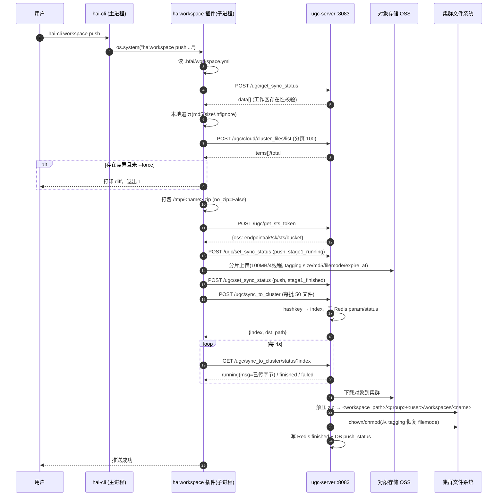
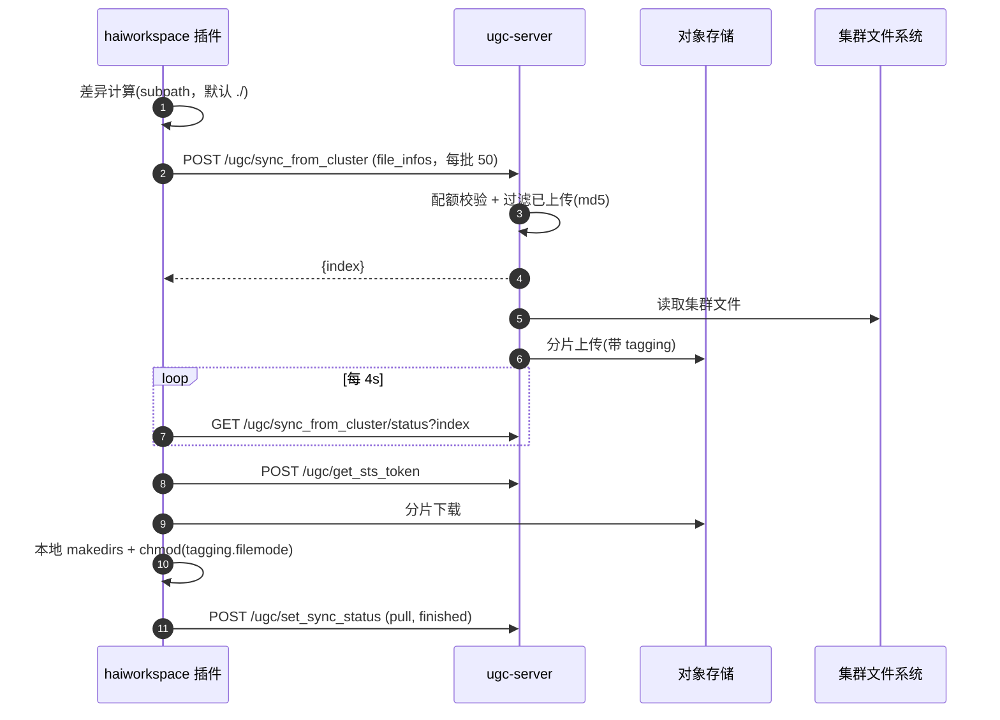
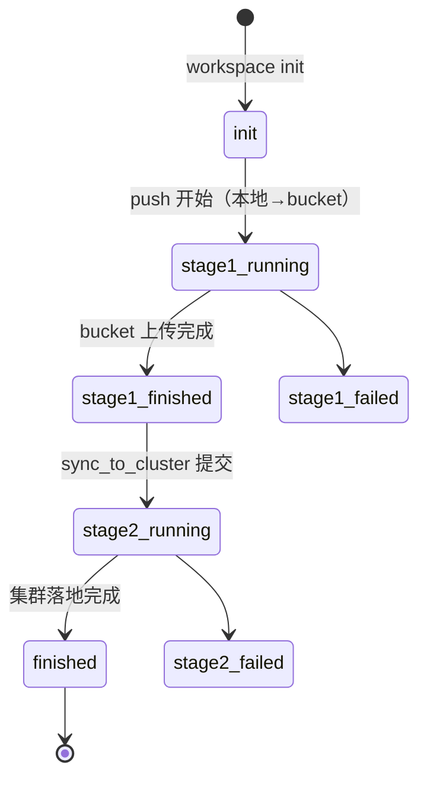

# `hai-cli workspace` 命令实现分析报告

| 项目 | 内容 |
| --- | --- |
| 分析对象 | `hai-cli workspace`（`init` / `push` / `pull` / `download` / `diff` / `list` / `remove`） |
| 代码基线 | `/Users/tongxiaojun/github/opendeepinfra/hai-platform`，`git HEAD = 1a90f87`（最近一次同步提交 `f9119b1 sync code at 2023/10/24`） |
| 分析方法 | 纯静态代码走查（read-only）。本机未安装 `asyncclick` / `oss2` / `fastapi`，**未做运行期验证**；所有结论均给出 `文件:行号` 证据，凡属推断处均已显式标注 |
| 报告文件 | `docs/haiplatform/workspace/hai-cli-workspace-analysis.md` |

---

## 1. 结论速览（TL;DR）

1. **命令归属**：`hai-cli workspace` 并不是内置子命令，而是通过 `PLUGIN_LIST` 机制把独立插件 `haiworkspace` 挂到主 CLI 上的（`client/commands/utils.py:29-32`、`client/hfai_cli.py:72-83`）。真正的实现全部在 `plugins/haiworkspace/` 内，主 CLI 只负责 **fork 一个子进程** 执行同名插件二进制。

2. **客户端实现是完整的**：CLI 层 → API 层 → 同步编排层 → 对象存储 provider 层四层齐全，共 5 个功能文件、约 1 000 行代码；两端（本地 / 集群）文件遍历、`.hfignore`、md5、zip 打包/解包 **共用同一份 `conf/utils.py`**，这是保证 diff 与打包结果一致的关键设计。

3. **服务端在本仓库中是“半开放”的**：客户端调用的 9 个 `/ugc/*` 端点里，本仓库只注册了 1 个（`/ugc/cloud/cluster_files/list`），且指向一个 `return []` 的桩函数；其余 8 个（`get_sts_token` / `set_sync_status` / `get_sync_status` / `delete_files` / `sync_to_cluster(+status)` / `sync_from_cluster(+status)`）在本仓库 **既没有路由注册、也没有实现**。真正被开源出来的是另一个独立服务 `cloud_storage/`（`cloud_storage/api.py`，900 行），它提供的 `/sync_to_cluster`、`/get_sts_token` 等**不带 `/ugc` 前缀**。二者之间需要一个 **部署私有的 `custom.py` 适配层** 来补齐路由、`username/group` 注入、请求体封装。仓库自身也承认“对一些功能进行了裁剪”（`docs/_sources/start/studio.md.txt:184`）。

4. **因此：仅凭本开源仓库无法端到端跑通 `hai-cli workspace push/pull`。** 客户端可运行、可失败退出；服务端需要私有层（路由 + 鉴权注入 + 数据库方法 + `[cloud.storage]` 配置 + `oss://` 工作区解析）才能闭环。

5. **发现 2 个高危契约缺陷**（静态可判定）：
   - `FileType` 是 `(str, Enum)`，客户端把枚举成员直接写进 URL 查询串，实际发出的是 `file_type=FileType.WORKSPACE` 而不是 `file_type=workspace`（`plugins/haiworkspace/haiworkspace/client/workspace_util.py:129,148`、`workspace_api.py:67,101,196,217`）；
   - 客户端请求体是 `{"file_list": {...}}` 包装形式，而 `cloud_storage/api.py` 的 `file_list: FileList = Body(...)` 按 FastAPI 语义要求 **裸 body** `{"files": [...]}`（`cloud_storage/api.py:131,167,583`）。

6. **架构上最有价值的一点**：`push` 完成后，任务提交端把 `spec.workspace` 改写成 **对象存储 URI**（`oss://<group>/<user>/workspaces/<name>`，`client/commands/hfai_python.py:203`），集群侧必须再把它解析/挂载成真实路径——这段逻辑同样是私有层（`server_model/task_impl/code/default.py:5-13` 只是原样透传，`server_model/task_impl/runtime_mounts/default.py` 是空实现，注释里却写好了 `'name': 'workspace-path'` 的挂载示例）。

---

## 2. 命令定位与命令面

### 2.1 命令注册链路

```
$ hai-cli workspace push --force
        │
        ├─ client/hfai_cli.py:46-49        根 group（asyncclick），prog_name = basename(argv[0]) = "hai-cli"
        │
        ├─ client/commands/utils.py:28-41  PLUGIN_LIST = {'haiworkspace': '<prefix>/bin/haiworkspace',
        │                                                  'haienv':       '<prefix>/bin/haienv'}
        │                                  （可由 $HAI_PLUGIN_CONFIG / ~/.hfai/plugins 追加）
        │
        ├─ client/hfai_cli.py:72-83        for plugin in PLUGIN_LIST: subcommand = plugin[3:]  → 'workspace'
        │                                  click.command(...)(exec_func())  → cli.add_command(cmd, 'workspace')
        │
        └─ 回调 = os.system(f"{plugin_path} {' '.join(sys.argv[2:])}")   ← 子进程，非进程内 asyncclick
                 ↓
           plugins/haiworkspace/haiworkspace/haiworkspace:6-9
                 ↓  from haiworkspace.client.cli import cli
           plugins/haiworkspace/haiworkspace/client/cli.py:14-24
                 ↓  group + init/push/pull/download/diff/list/remove
```

要点与坑：

- **跨进程派发**：`exec_func()` 在导入期逐插件立即求值（闭包正确绑定），但执行动作是 `os.system`，命令串由**未加引号的 `sys.argv[2:]`** 直接拼接（`client/hfai_cli.py:75`）；插件非 0 退出会让主 CLI `sys.exit(1)`（`:77-78`）。
- **`-h/--help` 代理**：`HandleHfaiPluginCommandArgs.parse_args` 在无参数或含 `-h/--help` 时，用 `PLUGIN_LIST[ctx.command_path.replace(f'{CLI_NAME} ', 'hai')]` 取出插件路径并 `os.popen()` 执行，再把输出里的 `hai` 朴素替换成 `hai-cli `（`client/commands/utils.py:103-113`）。`'hai-cli workspace'.replace('hai-cli ', 'hai') == 'haiworkspace'`，因此查表成立；但 `str.replace` 不是词边界替换，输出中若已含 `hai-cli` 会被二次改写成 `hai-cli -cli`（纯展示问题）。
- **`is_hai`**：`CLI_NAME = basename(argv[0])`（`client/commands/utils.py:15-18`），`is_hai = 'hai' in CLI_NAME` 只影响帮助文案，不参与任何上传逻辑。
- **构建期裁剪**：`client/install.sh:25` 会执行 `client/patch_client.py`，把安装包内所有 `os.environ.get('external') == 'true': ... else: ...` 分支按构建机上的 `external` 变量**静态改写成单一分支**。所以 `hai python` 的“自动 push”逻辑只存在于 external 构建中（见 §4.7）。

### 2.2 子命令与选项

| 子命令 | 位置参数 | 主要选项 | 说明 |
| --- | --- | --- | --- |
| `init` | `workspace_name` | `-p/--provider`（默认 `oss`） | 初始化本地工作区，生成 `.hfai/workspace.yml`；`command.py:22-33` |
| `push` | — | `--force`、`-n/--no_checksum`、`-i/--no_hfignore`、`-z/--no_zip`、`-d/--no_diff`、`-l/--list_timeout`(5-7200,300)、`-s/--sync_timeout`(5-21600,1800)、`-o/--cloud_connect_timeout`(60-43200,120)、`-t/--token_expires`(900-43200,1800)、`-p/--part_mb_size`(10-10240,100)、`--proxy`，以及 4 个隐藏的 env 选项 | 本地 → 集群；`command.py:36-69` |
| `pull` | — | `--force`、`-n`、`-i`、`-l`、`-s`、`-o`、`-t`、`-p`、`--proxy` | 集群 → 本地；`command.py:72-96` |
| `download` | `remote_path` | 同 `pull` | 只下载远端指定文件（如 `checkpoint/model.pt`）；`command.py:99-128`，内部等价于 `pull(subpath=remote_path)` |
| `diff` | — | `-n/--no_checksum`、`-i/--no_hfignore`、`-l` | 本地/集群差异；`command.py:131-144` |
| `list` | — | — | 列全部工作区与 push/pull 状态；`command.py:147-156` |
| `remove` | `workspace_name` | `-f/--files`（可多次） | 删除集群工作区，或仅删文件；`command.py:159-177` |

小瑕疵：`download` 的 `remote_path` 同时声明 `required=True` 与 `default='checkpoint'`（`command.py:100`），click 下以 `required` 为准，默认值无效；`init` 的 `workspace_name` 也是 `required=True`，使 `workspace_api.init(workspace=None)` 的“取目录名”分支（`workspace_api.py:52-53`）只能由代码调用。

---

## 3. 代码地图

| 文件 | 行数 | 角色 |
| --- | --- | --- |
| `client/hfai_cli.py` | 87 | 主 CLI：注册内置命令 + 插件命令 |
| `client/commands/utils.py` | 187 | `PLUGIN_LIST`、`CLI_NAME`、`get_workspace_conf`、帮助格式化器 |
| `client/commands/hfai_python.py` | 298 | `python`/`bash`/`exec`：提交前自动 `workspace push`，改写 `spec.workspace` |
| `plugins/haiworkspace/haiworkspace/client/cli.py` | 27 | 插件命令组（7 个子命令） |
| `plugins/haiworkspace/haiworkspace/client/command.py` | 177 | 参数声明 + 错误包装 + 用户提示 |
| `plugins/haiworkspace/haiworkspace/client/workspace_api.py` | 226 | 业务编排：`init/push/pull/diff/list/delete`，读写 `.hfai/workspace.yml` |
| `plugins/haiworkspace/haiworkspace/client/workspace_util.py` | 581 | 核心：diff、服务端调用、OSS 收发、重试、进度条 |
| `plugins/haiworkspace/haiworkspace/client/api_config.py` | — | 构建期从 `client/api/api_config.py` 拷入（`~/.hfai/conf.yml`） |
| `plugins/haiworkspace/haiworkspace/client/api_utils.py` | — | 构建期从 `client/api/api_utils.py` 拷入（`async_requests`） |
| `plugins/haiworkspace/haiworkspace/client/utils.py` | — | 构建期从 `conf/utils.py` 拷入（`FileType/FileInfo/hfignore/zip`） |
| `plugins/haiworkspace/haiworkspace/client/provider/` | — | 构建期从 `cloud_storage/provider/` 拷入（`OSSApi`/`MockApi`） |
| `cloud_storage/api.py` | 900 | 服务端“云存储”服务端点（无 `/ugc` 前缀） |
| `cloud_storage/utils.py` | 466 | `get_base_path`、`StatusRecorder`、`WorkerPools`、分页缓存 |
| `cloud_storage/provider/oss.py` | 254 | 阿里云 OSS：STS、分片传输、对象 tagging |
| `api/register/implement.py` | 124 | 各 `SERVER` 角色（operating/ugc/query/monitor）的路由注册 |
| `api/resource/cloud_storage/default.py` | 41 | 9 个 `/ugc` 云存储接口的**桩**（`not implemented`） |
| `api/app.py` | 257 | FastAPI app、日志/限流中间件、`warning_ignore_api` |
| `conf/utils.py` | 406 | 双端共享：`FileType/SyncStatus/FileInfo/calculate_md5/hfignore/zip_dir` |
| `db_schemas/010.table_user_downloaded_files.sql` / `011.table_user_sync_status.sql` | — | 状态持久化表结构 |
| `one/thirdparty_conf/haproxy.cfg` / `one/supervisord.conf` / `uvicorn_server.py` | — | 部署拓扑：`/ugc/` → `127.0.0.1:8083` |

**打包关系**（`plugins/haiworkspace/install.sh:7-10`）：插件 wheel 会把 `client/api/api_utils.py`、`client/api/api_config.py`、`conf/utils.py`、`cloud_storage/provider/` **拷贝进自己的包**。这解释了为什么客户端与服务端对同一文件算出的 md5、同一目录打出的 zip 完全一致——它们跑的是同一份代码。代价是版本漂移风险：客户端内置的副本不会随服务端升级。

---

## 4. 客户端实现

### 4.1 分层与调用关系

```
command.py                     asyncclick 参数解析 / 打印“推送成功/失败”
    └── workspace_api.py       业务编排 + 本地配置(.hfai/workspace.yml) + 服务端状态接口
            └── workspace_util.py   差异计算 / /ugc 调用 / OSS 分片收发 / 进度
                    ├── api_config.py   mars_url() / mars_token()
                    ├── api_utils.py    async_requests()
                    ├── utils.py        FileType/FileInfo/md5/hfignore/zip
                    └── provider/       OSSApi / MockApi
```

### 4.2 本地状态：`.hfai/workspace.yml`

- 路径常量 `workspace_config_file = './.hfai/workspace.yml'`（`workspace_api.py:8`，另有一份在 `client/commands/utils.py:180`）。
- 内容仅 4 个键（`workspace_api.py:60-70`）：

```yaml
workspace: <工作区名>
local:     <本地绝对路径>
remote:    <group>/<user>/workspaces/<name>
provider:  oss
```

- **向上查找**：从 `cwd` 逐级上溯至 `/`，命中即返回 `(配置文件, subs)`，`subs` 是“工作区根 → 起始目录”的中间目录列表（`client/commands/utils.py:174-187`；插件内副本 `workspace_api.py:75-88`，用模块级 `current_hf_run_path` 驱动）。`subs` 在 `hai python` 里被用来修正 entrypoint 相对路径（`hfai_python.py:204`）。
- 不做 Windows 盘符归一（循环条件固定为 `cwd != '/'`），只有 `init` 会把 `C:\` 转成 `/`（`workspace_api.py:47-50`）。

### 4.3 `init`：注册工作区

`workspace_api.py:16-72`：

1. 名字合法性：`. .. / \ ~` 一律拒绝（`:25-28`）；拒绝把 `/`、`/usr`、`/sys`、`/proc`、`/boot`、`/dev`、`/run` 作为工作区（`:29-31`）。
2. 若目录已存在 `.hfai/workspace.yml`：同名则提示“已经创建”，异名则提示“当前目录已经配置为 workspace: X”（`:35-41`）——即 **一个目录不会有两个工作区**。
3. `POST {mars_url()}/query/user/info?token=...` 拿用户信息（`:43-45`），并据 `user_shared_group`、`user_name` 拼出 remote 前缀（`:59`）。服务端该字段来源是 `server_model/user/implement.py:67`（`'user_shared_group': self.shared_group`）。
4. **集群内目录保护**：cwd 命中 `/ceph-jd`、`/weka-jd`、`/opt/hf_venvs`、`/hf_shared` 时直接退出，提示“检测到是在萤火集群的代码…请在集群外使用 workspace 功能”（`:54-57`）。
5. 调 `POST /ugc/set_sync_status` 写入 `INIT` 状态（`:67`），再落盘 YAML（`:68-70`）。

> 注意这里的 4 个排除路径与 `hai python` 里被注释掉的那份（`/ceph-jd`,`/weka-jd`,`/opt/hf_venvs`，`hfai_python.py:175`）**不一致**：后者改由环境变量 `MOUNT_LIST` 提供（`:174`）。

### 4.4 `push`：核心链路

入口：`workspace_api.push()`（`workspace_api.py:108-151`）。默认 `file_type = FileType.WORKSPACE`；worker 是 `workspace_util.push_to_cluster()`（`workspace_util.py:304-439`）。

**阶段 0 —— 前置校验**

`get_wc_with_check()`（`workspace_api.py:91-105`）读 YAML → 调 `get_sync_status(FileType.WORKSPACE, name)` → 结果为空则打印 `没找到工作区 X` 并返回 `False`。这一步把“本地有配置但服务端无记录”的情况挡在开始。

**阶段 1 —— 差异计算**（`workspace_util.py:30-82`）

| 侧 | 方法 | 关键点 |
| --- | --- | --- |
| 本地 | `list_local_files_inner()`（`conf/utils.py:204-273`） | `os.walk`；按 `.hfignore`（缺省用 `default_ignored_patterns`）过滤；跳过 `.hfai/*.zip`（`:238-239`）；`get_file_info` 计算 `path/size/last_modified/md5` |
| 集群 | `POST /ugc/cloud/cluster_files/list`，`page/size` 分页、每页 100（`workspace_util.py:155-185`） | `recursive=True`；`no_checksum`、`no_hfignore` 透传；`total > 10000` 时提示“遍历耗时可能较长” |

比较规则：`path` 相同则比较 **md5 或 size**（二者任一不同即视为变更，`workspace_util.py:75-78`），**不比较 mtime**。`no_diff=True` 时直接短路返回全部本地文件（`:58-59`），其语义就是“跳过集群遍历、强制覆盖同名文件”。

**阶段 2 —— force 门禁**

只对 `changed_files` 生效（`workspace_util.py:343-351`）：存在差异且未加 `--force` 就打印 diff 并返回 `False`。代码注释明确写了 `# 暂时忽略集群侧新文件 or len(cluster_only_files) != 0`——**集群侧独有的文件既不会被删除、也不会阻止 push**。这与函数 docstring “并删除远端孤儿目录…保持本地和远端目录一致”（`:322`）不符，属文档/实现偏差。

**阶段 3 —— 打包**

`no_zip=False`（默认）时把本次待传文件打成一个 zip：`/tmp/<basename(local_path)>.zip`（`workspace_util.py:357-361`），随后 `target_files` 变为单一 `FileInfo(path='<name>.zip')`。zip 使用自定义 `MyZipFile` 保留文件权限位（`conf/utils.py:294-341, 344-383`）。

**阶段 4 —— 取凭证 + 上传**

1. `POST /ugc/get_sts_token?token&name&file_type&ttl_seconds`，取出 `result['oss']` 的 `endpoint / access_key_id / access_key_secret / security_token / bucket`（`workspace_util.py:108-121, 286-301`）。
2. `set_sync_status(PUSH, STAGE1_RUNNING)`（`:371-372`）。
3. 逐文件上传，阈值 `part_mb_size * 1MB`，`num_threads=4`，失败最多重试 3 次（`:568-581`）。上传前先 `get_object_tagging` 比对 md5，命中则跳过（断点续传去重，`:392-402`）。
4. **对象 tagging 是跨端元数据总线**（`:403-406`）：

```
size=<字节数>&source=<client|cluster>&expire_at=<UTC+8 次日>&filemode=<oct 权限>
[&md5=<md5>]        # no_checksum 时不写
```

5. 单文件失败 → `set_sync_status(PUSH, STAGE1_FAILED)` 并清理临时 zip（`:417-424`）；全部完成 → `STAGE1_FINISHED`（`:425-427`）。

**阶段 5 —— 落到集群**

`sync_to_cluster()`（`workspace_util.py:208-243`）：按 50 个文件一批 `POST /ugc/sync_to_cluster`，随后用返回的 `index`（缺失时本地用 `hashkey(token, name, file_type, *paths)` 兜底重算，与服务端算法一致）轮询 `/ugc/sync_to_cluster/status`，每 4 s 一次；`finished` 结束、`failed` 抛错、`running` 时用 `msg` 更新进度条（`:188-205`）。

### 4.5 `pull` / `download`

`workspace_api.pull()`（`workspace_api.py:154-172`）→ `workspace_util.pull_from_cluster()`（`:442-539`）：

1. 差异计算（`subpath` 默认 `./`；`download` 子命令把远端相对路径作为 `subpath` 传入，并剥掉前导 `./`，`:168-169`）。
2. `force` 门禁针对 `changed_files`（`:471-479`）。
3. `cluster_only_files + changed_files` 走 `POST /ugc/sync_from_cluster`（body 为 `file_infos` 列表，含 `path/size/last_modified/md5`），同样 50 个一批 + 轮询（`:246-280`）。
4. `set_sync_status(PULL, STAGE2_RUNNING)` → 从 OSS 分片下载到本地，自动 `makedirs`；下载后从 tagging 恢复 `filemode`（`os.chmod`，`:542-565`）→ `set_sync_status(PULL, FINISHED)`。

语义要点：pull **只补缺失/差异文件**，本地独有文件不会被删除；`changed_files` 以集群侧为准覆盖本地（需 `--force`）。

### 4.6 `diff` / `list` / `remove`

- `diff`（`workspace_api.py:175-186`）：打印“本地未上传 / 集群未下载 / 本地与集群有差异”三组文件（`workspace_util.print_diff`，`:85-102`），用 rich 表格。
- `list`（`:189-204`）：`POST /ugc/get_sync_status`（name 缺省 `*`）后渲染表格，列固定为 `workspace, local_path, cluster_path, push status, last push, pull status, last pull`，当前目录所属工作区加粗。这 7 列与 `db_schemas/011.table_user_sync_status.sql` 的列一一对应。
- `remove`（`:207-226`）：客户端先拒绝含 `..` 的文件名，再查状态确认工作区存在，然后 `POST /ugc/delete_files`（body `{"file_list": {"files": [...]}}`）；未指定 `-f` 时代表删整个工作区，并顺带删除本地的 `.hfai/workspace.yml`（仅当它是当前工作区，否则提示用户手动删）。服务端该接口只删 **集群侧目录**（`cloud_storage/api.py:582-616`），**bucket 中的对象不会被删除**，依赖 tagging 中的 `expire_at` + 私有 audit 任务回收。

### 4.7 与任务提交的衔接（该命令存在的根本原因）

`client/commands/hfai_python.py:153-255`，`hai python/bash/exec` 在提交集群任务前：

```python
workspace_dir = os.getcwd()
wcf, subs = get_workspace_conf(workspace_dir)          # :170
...
workspace_cmd = f"{sys.argv[0]} workspace push --list_timeout {list_timeout} ..."  # :184
os.system(workspace_cmd)                               # :197   ← 回到主 CLI，再走插件派发
workspace_dir = posixpath.join(f'{wc.provider}://', wc.remote)   # :203
experiment_py = posixpath.join(*subs, experiment_py)   # :204
```

随后生成的 v2 任务 YAML：

```yaml
spec:
  workspace: oss://<group>/<user>/workspaces/<name>     # 对象存储 URI，不是本地路径
  entrypoint: <subdir>/train.py
```

即 **push 的产物是“集群路径 + 对象存储双份”**：`sync_to_cluster` 已把代码落到集群文件系统（供同一集群的任务直接 `cd`），而 `spec.workspace` 记录的是 OSS URI（供跨集群/调度端二次拉取）。集群侧把 URI 解析成真实路径的逻辑不在本仓库：`server_model/task_impl/code/default.py:5-13` 只是原样返回 `spec.workspace`，`server_model/task_impl/runtime_mounts/default.py` 是空实现（docstring 里示例了 `'name': 'workspace-path'` 的挂载），`server_model/task_impl/single_task_impl.py:185, 290-291` 会拿它去 `cd` 并写入 `MARSV2_TASK_WORKSPACE`。因此必须有私有 `custom.py` 把它改写成 `<workspace_path>/<group>/<user>/workspaces/<name>`。

另外两条边界条件：

- cwd 命中 `MOUNT_LIST`（集群共享盘，代码本就在服务端可见）时，**跳过 push 且不报错**（`hfai_python.py:174-177`），`spec.workspace` 保持本地路径不变。
- 若既不在挂载盘、又没有 `.hfai/workspace.yml`，直接 `sys.exit(1)`（`:179-180`）。
- 上述整段逻辑只在 external 构建产物中存在（`patch_client.py` 会在 internal 构建里删掉该 `if` 分支，`client/install.sh:25`）。
- `hai run` **完全不涉及** workspace（`client/commands/hfai_experiment.py` 无相关调用），只校验 `version == 2` 后提交。

### 4.8 `env` 类型的复用（haienv / venv）

`workspace_api.push()` 支持 `file_type=env`：不走 `.hfai/workspace.yml`、不查同步状态，直接使用 `--env_provider/--env_local_path/--env_remote_path`，且额外排除 `['activate', 'pip.conf']`（`workspace_api.py:125-127`）。排除项在 diff 与 zip 两处同时生效（`workspace_util.py:67-68`、`conf/utils.py:365,371-372`）。

上游调用方 `client/api/venv_api.py:10-46` 会先 `POST /ugc/update_cluster_venv` 换取集群侧路径，再 `os.system("... workspace push --file_type env ...")`。但在本仓库中：

- `push_venv` **没有任何调用方**（全仓 grep 只有定义）；
- `hai venv` 命令不存在（插件 `haienv` 只有 `create/list/remove/config`）；
- `/ugc/update_cluster_venv` 未注册，服务端只有桩（`api/resource/storage/default.py:9-10`）。

所以这条链路目前是“半成品/预留”。

### 4.9 网络与鉴权层

`client/api/api_utils.py:48`：

```python
async def async_requests(method, url, assert_success=None, retries=1,
                         allow_unsuccess=False, **kwargs)
```

- 默认 `retries=1`、`timeout=60s`、`assert_success=[1]`；workspace 的所有调用显式传 `retries=3, timeout=60`。
- **不检查 HTTP 状态码**，直接 `json.loads(await response.text())`；成功与否只看响应体里的 `success` 字段（`:100-111`）。非 JSON 的错误页会抛 `JSONDecodeError`。
- `ClientConnectorError` 立即抛出；其它异常打印后 `sleep(2)` 重试，最终包成 `Exception('请求失败: ...')` 抛出。
- 配置来自 `~/.hfai/conf.yml`（`HFAI_CLIENT_CONFIG` 可覆盖），键为 `url`(=`MARSV2_SERVER`)、`token`(=`MARSV2_USER_TOKEN`)、`bff_url`(=`MARSV2_BFF_URL`)；缺键直接 `sys.exit(1)`（`client/api/api_config.py:39-71`）。
- **所有 `/ugc/*` 请求都把 token 放在查询串**（如 `?token=xxx`）；`external == 'true'` 时改为 POST 到 BFF，body 内仍带原始 URL（token 在内），并额外带 `Token` 请求头（`api_utils.py:63-87`）。服务端对日志里的 `token=`/`access_token=` 做了掩码（`api/app.py:104-107`），但 `aiohttp` 客户端异常/调试输出仍可能泄漏，建议后续改为 Header 鉴权。

---

## 5. 服务端实现

### 5.1 服务拓扑与路由

`one/supervisord.conf` + `one/entrypoint.sh:99` + `one/thirdparty_conf/haproxy.cfg`：

| 角色 | 环境变量 | 端口 | 模块 |
| --- | --- | --- | --- |
| query-server | `SERVER=query` | 8081 | `api.register:app` |
| operating (server) | `SERVER=operating` | 8082 | `api.register:app` |
| **ugc-server** | `SERVER=ugc`, `MODULE_NAME=ugc-server` | **8083** | `api.register:app` |
| monitor-server | `SERVER=monitor` | 8084 | `api.register:app` |
| cloud-storage（可选部署模式） | `SERVER=cloud-storage` | — | `cloud_storage:app` |

```
frontend http-in (haproxy.cfg:21-32)
  acl is_ugc path_beg -i /ugc/     → backend ugc_server → 127.0.0.1:8083
```

haproxy **不做前缀剥离**，所以 ugc-server 进程内的路由必须自带 `/ugc` 前缀。`uvicorn_server.py:20-31` 决定加载哪个 ASGI app；`REG_SERVERS = set(os.environ['SERVER'].split(','))` 决定注册哪些路由（`api/register/default.py:12`）。

### 5.2 路由注册现状（关键缺口）

客户端一共调用 9 个 `/ugc/*` 接口。本仓库 `api/register/implement.py:67-73` 在 `'ugc' in REG_SERVERS` 分支下只注册了：

```python
app.post('/ugc/user/nodeport/create')(at_port.node_port_svc)
app.post('/ugc/user/nodeport/delete')(at_port.delete_node_port_svc)
app.post('/ugc/user/nodeport/bind')(at_port.bind_node_port_svc)
app.post('/ugc/user/train_image/list')(aq_optimized_resource.get_train_images)
app.post('/ugc/cloud/cluster_files/list')(ar_cloud_storage.list_cluster_files)
```

对照表：

| 客户端调用点 | 客户端传参 | 本仓库 ugc-server 是否注册 | 最近的实现/桩 |
| --- | --- | --- | --- |
| `POST /ugc/get_sts_token`（`workspace_util.py:114`） | `token,name,file_type,ttl_seconds` | ❌ | 桩 `api/resource/cloud_storage/default.py:4-5`；真实逻辑形态见 `cloud_storage/api.py:72-91`（`GET`，且需 `username/group`） |
| `POST /ugc/set_sync_status`（`:129`） | `token,file_type,name,direction,status,local_path,cluster_path` | ❌ | 桩 `default.py:12-13`；对应 DB 表 `user_sync_status` |
| `POST /ugc/get_sync_status`（`:137`） | `token,file_type,name` | ❌ | 桩 `default.py:16-17`（返回 `{'data': []}`） |
| `POST /ugc/delete_files`（`:148`） | `token,name,file_type` + body `{"file_list":{...}}` | ❌ | 桩 `default.py:20-21`；实现见 `cloud_storage/api.py:582-616` |
| `POST /ugc/cloud/cluster_files/list`（`:168`） | `token,name,file_type,no_checksum,no_hfignore,recursive,page,size` + body | ✅ | 但指向的 `default.py:24-25` 直接 `return []`（**无参数、无鉴权**） |
| `POST /ugc/sync_to_cluster`（`:228`） | `token,name,file_type,no_zip` + body | ❌ | 实现见 `cloud_storage/api.py:157-179` |
| `GET /ugc/sync_to_cluster/status`（`:240`） | `token,index` | ❌ | `cloud_storage/api.py:812-837` |
| `POST /ugc/sync_from_cluster`（`:264`） | `token,name,file_type` + body `{"file_infos":{...}}` | ❌ | `cloud_storage/api.py:358-377` |
| `GET /ugc/sync_from_cluster/status`（`:277`） | `token,index` | ❌ | `cloud_storage/api.py:840-861` |

**旁证**：`api/app.py:87-91` 的 `warning_ignore_api`（“耗时接口不告警”名单）里赫然写着

```python
'/ugc/list_cluster_files', '/ugc/sync_to_cluster', '/ugc/sync_from_cluster', '/ugc/delete_files',
'/ugc/cloud/cluster_files/list'
```

说明生产环境的 ugc-server **确实**对外提供这些路径；而 `api/app.py` 是 ugc-server 与 operating-server 共用的，名单却包含只有 ugc-server 才会命中的路径——这只能解释为：真实部署用私有的 `api/register/custom.py` 补注册了这些 `/ugc/*` 路由，而 `api/register/implement.py:4` 的 `from .custom import *` 正是官方扩展点。同理，`api/resource/cloud_storage/default.py` 里 9 个函数名与客户端 9 个接口一一对应、全部返回 `not implemented`，也印证了“私有 `custom.py` 实现真身、开源仓只放桩”的发布策略。

### 5.3 `cloud_storage` 服务端点

`cloud_storage/api.py`（`cloud_storage/__init__.py` → `from .api import *`）是这套能力真正被开源出来的部分，端点**不带** `/ugc` 前缀：

| 方法 | 路径 | 行 | 要点 |
| --- | --- | --- | --- |
| GET | `/get_sts_token` | 72-91 | 申请 STS；返回 `{'success':1, '<provider>': {...}}` |
| POST | `/list_bucket_files` | 94-118 | 列 bucket 对象（同步调用，会阻塞事件循环） |
| POST | `/list_cluster_files` | 121-154 | 列集群文件，`response_model=Page[FileInfo]`，走 `paginate` 分页缓存 |
| POST | `/sync_to_cluster` | 157-179 | → `_sync_to_cluster_impl`：bucket → 集群 |
| POST | `/sync_from_cluster` | 358-377 | → `_sync_from_cluster_impl`：集群 → bucket |
| POST | `/delete_files` | 582-616 | 删集群目录/文件（`rmtree`/`remove`），路径穿越校验 |
| GET | `/sync_to_cluster/status` | 812-837 | Redis 阶段查询，`status ∈ {init,running,finished,failed,none}` |
| GET | `/sync_from_cluster/status` | 840-861 | 同上（上传方向） |
| POST | `/token` / GET `/dump` | 864-892 | 内部 JWT 登录 / 调试 |

其中“方向”命名容易误读：`SyncDirection.PUSH` 对应 `sync_to_cluster`（**下载** bucket→集群），`SyncDirection.PULL` 对应 `sync_from_cluster`（**上传** 集群→bucket）；指标标签也沿用这套说法（`cloud_storage/api.py:323` 用 `labels('push')` 记下载）——阅读代码与看板时必须注意（`conf/utils.py:67-69` 的定义，`cloud_storage/api.py:207/435` 的用法）。

### 5.4 路径与索引规则

`cloud_storage/utils.py:397-466` 的 `get_base_path()` 是所有文件类型的唯一入口：

| FileType | cluster_base_path | cloud_base_path |
| --- | --- | --- |
| **workspace** | `{CONF.cloud.storage.service.workspace_path}/{group}/{username}/workspaces/{name}` | `{group}/{username}/workspaces/{name}` |
| env | `{env_path}/{group}/shared/hfai_envs/{username}/{name}` | `{group}/shared/hfai_envs/{username}/{name}` |
| dataset | `{private_dataset_path}/{group}[/{username}]/{dataset_type}/{name}` / public 变体 | `datasets/...` |
| doc / pypi / website | 各自根目录 | `''` / `simple` / `examples/{name}` |

该校验链条完整：`name` 不得含 `/`（`:409`）、禁止 `..`（`:464`）、public 上传有白名单（`:403-405`）、`check_is_subpath` 用 `Path.resolve().parents` 防穿越（`:387-394`，调用点 `api.py:287,498,596`）。

**客户端与服务端的路径一致性**依赖两处独立计算相等：

```
客户端 workspace_api.py:59   remote = f'{user_info["user_shared_group"]}/{user_info["user_name"]}/workspaces/{workspace}'
服务端 cloud_storage/utils.py:420  cloud_base_path = f'{group}/{username}/workspaces/{name}'
```

但服务端 **从不读取客户端传来的 remote 路径**——`sync_to_cluster` 用 `username/group/name` 重新推导。若用户改组、改名或换了 provider/bucket，客户端就会把对象传到服务端读不到的前缀，表现为“push 显示成功、任务却拿不到代码”。这是设计上的隐式耦合，值得在 `init` 时把服务端推导结果回写给客户端（或让服务端直接采用并校验 `remote`）。

**任务索引**：`index = sha256(token + name + file_type + *files)`（服务端 `cloud_storage/api.py:233-234, 398-399`；客户端兜底重算 `workspace_util.py:237, 273-274`），用于把 Redis 状态、worker pool、数据库记录关联起来。两端算法一致，因此即使服务端不回传 `index` 也能对齐——这是刻意设计，但也意味着 **token 变化会导致 index 变化**（同一批文件在续传/重试时无法复用进度）。

### 5.5 同步任务执行模型

以 `_sync_to_cluster_impl`（`cloud_storage/api.py:182-331`）为例：

1. 取 `file_list`（或 dataset 场景自行 list bucket 并做 mtime diff，`:219-231`）。
2. 幂等：`status == RUNNING` 且非 force 时直接返回“上一次同步正在进行中”（`:242-245`）。
3. 落 Redis `param:{pod_id}` 快照，供进程重启后恢复（`:247-261`；启动恢复见 `:31-69`，只恢复本 pod 重启前的任务）。
4. 写 DB `STAGE2_RUNNING`（`:263-265`），`os.makedirs(cluster_base_path)` 并 `chown` 给用户（`:269-272`）。
5. 逐文件 `pool.submit(resumable_download_with_retry, ...)`，`retries=10`，`part_size=100MB`，`num_threads=4`；**zip 特判**：`fname.endswith('.zip')` 时先下到 `cluster_base_path/.hfai/` 再解压到工作区根目录，随后删除 zip，并对解压出的每个文件 `chown`（`:281-285, 669-688`）。
6. 起独立线程 `wait_sync_to_cluster` 阻塞等待全部 future，汇总异常、`worker_pools.finish(index)`、清理 Redis（finish 结果保留 300 s TTL）、写 DB 终态（`:334-355`）。

`WorkerPools`（`cloud_storage/utils.py:49-79`）为每个 index 建一个 `ProcessPoolExecutor(max_workers=$WORKERS|4)`，并发 pool 超过 10 个后统一走 4 倍线程的 `'shared'` pool；由于用 `spawn`，每个 worker 会重新 import 模块并各自建立 `OSSApi` 连接池。上传方向（`_sync_from_cluster_impl`，`:379-538`）额外有：**配额校验**（超过 1 GiB 才过滤已上传文件 `:459-463`；`user.quota.cloud_storage_quota.download` 限额 `:467-475`，超限返回 403）、`insert_downloaded_file` 记账、以及 doc/pypi 场景的 bucket GC（`:551-565`）。

### 5.6 状态机与持久化

**Redis（过程状态，`SyncPhase`）**：`init → running → finished | failed`，键格式 `{PROVIDER}:{sync_from_cluster|sync_to_cluster}:{index}:{status|progress|param:{pod_id}}`（`cloud_storage/utils.py:231-233`），`progress` 为 hash，value 是分片已传字节数；状态接口把 hash 求和作为 `msg` 返回（`api.py:822-823`）。`StatusRecorder` 的所有读写都包了 3 次重试 + 随机退避，并计入 `cloud_storage_db_failure_total`（`utils.py:95-149, 152-228`）。

**PostgreSQL（长期状态）**：

- `user_sync_status`（`db_schemas/011...sql`）：主键 `(user_name, file_type, name)`，字段 `pull_status/push_status/last_pull/last_push/local_path/cluster_path`（后两者 `NOT NULL`）。恰好对应 `hai workspace list` 的 7 列表头。
- `user_downloaded_files`（`db_schemas/010...sql`）：`(file_path, file_md5)` 主键，记录每次 pull 出去的文件、大小、mtime、md5 与状态，用于配额统计（`get_usage_in_mb`）。

**客户端可见的同步状态枚举**（`conf/utils.py:48-64`）与**服务端 Redis 阶段**是两套：

```
client 侧 SyncStatus（写库）:  init → stage1_running → stage1_finished → stage2_running → finished
                                          └→ stage1_failed                     └→ stage2_failed
server 侧 SyncPhase（Redis）:  init → running → finished | failed
```

`push` 的 stage1 = 本地→bucket（客户端做），stage2 = bucket→集群（服务端做）；`pull` 的 stage1 = 集群→bucket（服务端做），stage2 = bucket→本地（客户端做）。两端各写一半，因此 `list` 里的 push/pull 状态只有在双方都正常上报时才完整。

### 5.7 对象存储 provider 层

`cloud_storage/provider/interface.py` 定义 8 个抽象方法（`list_bucket`、`resumable_download`、`resumable_upload`、`get/set_object_tagging`、`batch_delete_objects`、`get_access_token`）。两个实现：

- **`OSSApi`（`oss.py`）**：构造要求 `endpoint/access_key_id/access_key_secret`（`:22-44`），`security_token` 非空走 `oss2.StsAuth`，否则走长期 `oss2.Auth`——服务端从不传 `security_token`（`utils.py:38-44`），**STS 路径实际只给客户端用**。断点续传依赖 `oss2.ResumableStore/ResumableDownloadStore(root=breakpoint_info_path)`（`:101,113`）。`get_access_token`（`:176-254`）用 `AssumeRoleRequest` 申请 STS，**region 硬编码 `cn-hangzhou`**，TTL 夹在 `[900, 43200]` 秒，并内联 policy 把权限限制在 `<bucket>/<prefix>/*`（同时允许带 `oss:Prefix` 条件的 ListObjects）——即 **客户端拿到的临时凭证只能读写自己那一段前缀**，这是该设计最重要的安全边界。
- **`MockApi`（`mock.py`）**：全部空实现。注意它的签名比接口窄（`get_access_token(self, bucket_name, **kwargs)`），而调用点是 3 个位置参数（`api.py:86`）、7 个（`:650-651`）、8 个（`:747-748`），**会直接 `TypeError`**；`config.cloud.storage.provider != 'oss'` 时这套“静默降级 + 运行期报错”的组合会让接口先返回“提交同步任务成功”、随后每个文件在重试 10 次后失败。

### 5.8 配置依赖：`[cloud.storage]` 完全不在开源仓

全仓只有 `one/one_etc/{core,scheduler,extension}.toml`，其中 **没有任何 `cloud` 相关段**。而下列键是运行必需（缺任一项，`cloud_storage/utils.py:36` 的 `CONF.cloud.storage.provider` 就会在 import 期抛错）：

`provider`、`endpoint`、`access_key_id`、`access_key_secret`、`uid`、`role_arn`、`public_bucket`、`private_bucket`、`doc_bucket`、`pypi_bucket`、`official_website_bucket`、`service.{workspace_path, env_path, public_dataset_path, private_dataset_path, doc_path, pypi_path, official_website_path, breakpoint_info_path, proxy_endpoint, public_bucket_allowed_users}`。

配置装载机制（`conf/proj_conf/default.py:10-85`）：从 `$MARSV2_MANAGER_CONFIG_DIR`（默认 `/etc/config`）按 `core.toml → scheduler.toml → extension.toml → override.toml` 顺序合并，敏感项可用 `/high-flyer/marsv2_private_key` 做 RSA 解密。**因此 `workspace_path` 等具体路径只能从部署环境推断**（`one/one_etc/core.toml:80` 出现 `/nfs_shared/workspace/log/{user_name}`，`one/release.sh:16` 出现 `HAIENV_PATH=/hf_shared/hfai_envs/platform`），本报告不臆测其确切取值。

扩展机制本身是清晰且值得一提的（`base_model/utils.py:15-61`）：`CustomFinder` 是一个 `MetaPathFinder`，当某个包目录同时含 `implement.py` 与 `default.py`、且请求的子模块名为 `custom` 时，就去**平台代码目录**（`$SERVER_CODE_DIR`，默认 `/high-flyer/code/multi_gpu_runner_server`）找同名文件，找不到就注入一个**空模块**。所以 `from .custom import *` 在开源仓、私有仓都能通过：私有实现通过定义同名 `XxxExtras` 基类或同名函数来“覆盖” `default.py` 的桩（典型如 `class AioUserDb(AioUserDbExtras)`，`server_model/user_impl/aio_user_db/implement.py:14`）。

据此可确认：`set_sync_status` / `get_sync_status` / `downloaded_files.get_usage_in_mb` / `insert_downloaded_file` / `update_downloaded_file_status` / `quota.cloud_storage_quota` 这些被 `cloud_storage/api.py` 调用的方法**在本仓库中全部不存在**，只能由 `server_model/user_impl/**/custom.py` 提供。

---

## 6. 端到端流程

### 6.1 `push` 时序



### 6.2 `pull` 时序



### 6.3 状态机（数据库视角）



---

## 7. 客户端 / 服务端协议契约表

| # | 客户端调用 | 请求形态 | 服务端期望（本仓库中可考的实现） | 一致性 |
| --- | --- | --- | --- | --- |
| 1 | `POST /ugc/get_sts_token`（`workspace_util.py:114`） | 查询串 `token,name,file_type,ttl_seconds`；读 `result['oss']` | `GET /get_sts_token`（`cloud_storage/api.py:72`）需要 `username,group,name,file_type[,file_privacy,dataset_type,ttl_seconds]` | ⚠ 方法、前缀、必填参数均不同，必须由私有适配层补齐 |
| 2 | `POST /ugc/set_sync_status`（`:129`） | `token,file_type,name,direction,status,local_path,cluster_path` | 无（桩 `default.py:12`）→ `user_sync_status` 表 upsert | ⚠ 依赖私有实现 |
| 3 | `POST /ugc/get_sync_status`（`:137`） | `token,file_type,name`；读 `result['data']` | 无（桩 `default.py:16`）→ 期望返回 7 字段列表 | ⚠ 依赖私有实现 |
| 4 | `POST /ugc/delete_files`（`:148`） | `token,name,file_type` + body `{"file_list":{"files":[…]}}` | `cloud_storage/api.py:583` 签名 `file_list: FileList = Body(default=None)` → 期望裸 body `{"files":[…]}` | ❌ 请求体封装不一致 |
| 5 | `POST /ugc/cloud/cluster_files/list`（`:168`） | `token,name,file_type,no_checksum,no_hfignore,recursive,page,size` + body `{"file_list":{...}}`；读 `items/total` | 本仓库注册的是 `default.py:24` 的 `return []`（无参数）；形态相同者为 `cloud_storage/api.py:121`（同样是 `Body` 裸体、`Page[FileInfo]` 返回 `items/total`） | ⚠ 桩返回空列表 → 会被当成“集群目录为空”，导致全量上传；body 封装同样不一致 |
| 6 | `POST /ugc/sync_to_cluster`（`:228`） | `token,name,file_type,no_zip` + body `{"file_list":{...}}`；读 `index` | `cloud_storage/api.py:167` 需 `username,userid,group,…`；`Body` 裸体 | ⚠ 同上 |
| 7 | `GET /ugc/sync_to_cluster/status`（`:240`） | `token,index`；读 `status/msg` | `cloud_storage/api.py:812` 返回 `{'status','msg'}`（或 dataset 场景 `progress/total`） | ✅ 除前缀外一致（dataset 场景返回键不同，会被当 KeyError） |
| 8 | `POST /ugc/sync_from_cluster`（`:264`） | `token,name,file_type` + body `{"file_infos":{"files":[{path,size,last_modified,md5}]}}` | `cloud_storage/api.py:364` `file_infos: FileInfoList`（裸体） | ⚠ 同上 |
| 9 | `GET /ugc/sync_from_cluster/status`（`:277`） | `token,index` | `cloud_storage/api.py:840` | ✅（除前缀） |
| 附 | `POST /query/user/info`（`workspace_api.py:44`） | `token` | `api/query/optimized/user.py:15-19`（`/query/user/info` 于 `api/register/implement.py:96` 注册） | ✅ 完全一致，返回 `user_shared_group/user_name` |

关于第 4/5/6/8 行“请求体封装”的判断依据：本仓库 `/operating/task/create` 的签名是裸 Pydantic 参数 `task_schema: TaskSchema`（`api/task/experiment/implement.py:34-39`），而客户端提交时直接 `json=config.__dict__`（`client/api/experiment_api.py:483-484`）——即 FastAPI 把“唯一非标量参数”当作**整个 body**。因此 `file_list: FileList = Body(...)` 按同一语义要求裸体 `{"files": [...]}`，而客户端发的是包了一层的 `{"file_list": {...}}`。这进一步反证：生产环境服务这些路径的并非本仓库的 `cloud_storage/api.py` 签名，而是私有适配层（其签名与客户端对齐）。

---

## 8. 关键发现与风险

### F1【阻断 · 架构】服务端 `/ugc/*` 路由、DB 方法与配置均在私有层

- 事实：客户端 9 个接口中 8 个在 ugc-server 无注册、无实现；唯一注册的指向 `return []` 桩。`set_sync_status`/`get_sync_status`/`downloaded_files`/`cloud_storage_quota` 在仓库中不存在。
- 影响：仅用本仓库部署，`workspace init` 可成功（首次写本地 YAML），但 `push/pull/diff/list/remove` 会在 `get_wc_with_check()` 处失败（`没找到工作区` 或请求异常）。
- 缓解：`/ugc/cloud/cluster_files/list` 的桩返回 `[]` 尤其危险——若只补这一条路由就上线，客户端会把集群目录视为空，**全量重传**而非增量。

### F2【高危 · 类型序列化】`FileType` 枚举被 f-string 插值成 `FileType.WORKSPACE`

```python
# plugins/haiworkspace/haiworkspace/client/workspace_util.py:129
url = f'{mars_url()}/ugc/set_sync_status?token={token}&file_type={file_type}&name=...'
# plugins/haiworkspace/haiworkspace/client/workspace_util.py:148
url = f'{mars_url()}/ugc/delete_files?token={token}&name={workspace_name}&file_type={FileType.WORKSPACE}'
```

调用方 `workspace_api.py:67,101,196,217` 传入的都是枚举成员。实测（本机 CPython 3.14，源码定义见 `conf/utils.py:22`，无 `__str__` 覆写）：

```
str(FileType.WORKSPACE)      → 'FileType.WORKSPACE'
f'{FileType.WORKSPACE}'      → 'FileType.WORKSPACE'
FileType.WORKSPACE == 'workspace'            → True
FileType.WORKSPACE == 'FileType.WORKSPACE'   → False
```

即实际发出的是 `file_type=FileType.WORKSPACE`。若服务端按 pydantic 枚举校验会 422；若按字符串查库则查不到记录（表现为“没找到工作区”）；`workspace_util.py:125-130` 的 `file_type == FileType.ENV` 分支判断同理永远为假（对比 `Venv` 场景会把 `--file_type FileType.ENV` 当字符串传入，`client/api/venv_api.py:25`）。**修复方式**：统一改为 `file_type.value`（或给 `FileType` 加 `__str__ = str.__str__`）。注意 `push/pull` 主流程经 CLI 传入的是字符串 `'workspace'`（`command.py:48` 默认值），所以下游 OSS/sync 调用不受影响，受影响的只是 `get_sync_status`/`set_sync_status`/`delete_files` 这三类调用。

### F3【高危 · 契约】请求体封装与 `Body(FileList)` 语义不一致

见 §7 第 4/5/6/8 行。客户端统一发 `{"file_list": {...}}` / `{"file_infos": {...}}`，本仓库对应函数声明为裸模型。若直接把二者对接会 422；生产必须存在一层适配。

### F4【中 · 一致性】客户端 `remote` 路径不被服务端采用

客户端把 `remote` 持久化进 `workspace.yml` 并用它作为 OSS key 前缀（`workspace_util.py:390`），服务端却按 `username/group/name` 重新推导（`cloud_storage/utils.py:420`）。组名/用户名/provider 变化会导致“上传成功、服务端读不到”。建议在 `init` 时以服务端返回值回填，或在 `sync_to_cluster` 中校验 `remote` 与推导值是否一致并显式报错。

### F5【中 · 健壮性】非 oss provider 静默降级且 `MockApi` 签名不兼容

`cloud_storage/utils.py:36-46` 在 `provider != 'oss'` 时切到 `MockApi`；`MockApi.get_access_token/resumable_download/resumable_upload` 的位置参数不足，调用即 `TypeError`（`mock.py:25,34,71` vs `api.py:86,650,747`）。届时接口先返回 `success=1`“提交同步任务成功”，再在 10 次重试后全部失败。建议启动自检：`provider != 'oss'` 直接拒绝启动或明确返回“不支持”。

### F6【中 · 语义】push 不清理集群侧孤儿文件

docstring 写“并删除远端孤儿目录，保持本地和远端目录一致”（`workspace_util.py:322`），实现只上传 `local_only + changed`，`cluster_only` 既不删也不拦（`:343` 注释明确“暂时忽略”）。`diff` 会展示这些文件，但用户只能手工 `workspace remove -f`。同时 `remove` 只删集群侧目录，**不删 bucket 对象**（`cloud_storage/api.py:582-616`），云端回收依赖 tagging `expire_at` + 私有 audit（`cloud_storage/audit/default.py:4-11` 在开源仓是 no-op）。

### F7【中 · 死代码】`env` 上传链路不可用

`push_venv` 无调用方、`hai venv` 命令不存在、`/ugc/update_cluster_venv` 未注册，且 `--file_type FileType.ENV` 的字符串化问题（F2）使该分支无法命中（`workspace_api.py:125-130`）。当前只有 `file_type=workspace` 是真实可用的。

### F8【中 · 安全边界】`get_sts_token` 的 bucket 选择绕过 `get_bucket_name`

`cloud_storage/api.py:84` 只区分 public/private，而数据面用 `get_bucket_name()` 为 doc/pypi/dataset/website 选择专属 bucket（`utils.py:236-256`）。对这些类型签发 STS 时，policy 里的 Resource ARN 指向的 bucket 与实际写入的 bucket 不一致（要么权限不足、要么授权范围错位）。workspace 走 private bucket，不受影响，但同一函数被其他类型复用，建议统一走 `get_bucket_name()`。

### F9【低 · 可观测性/清理】

- `RUNNING_TASKS_GAUGE` 在提交循环内 `.inc()`、在 future 回调里 `.dec()`，中间无 `try/finally`（`api.py:306-323,511-528`）：提交阶段抛异常会永久抬高 gauge。
- `cloud_storage_bucket_usage_size` 全仓无写入点（`metrics.py:42-46`），唯一合理归属地 `run_audit` 是桩。
- `/list_bucket_files` 直接同步调用 `list_bucket_files_inner`，会阻塞事件循环（`api.py:113`），而 dataset 路径用了 `asyncwrap` 版本（`api.py:221`）。
- `get_sts_token` 的 STS region 硬编码 `cn-hangzhou`，跨 region 部署需改代码（`oss.py:189`）。

### F10【低 · 用法/文档】

- `download` 的 `remote_path` 同时 `required=True` 且有 `default`（`command.py:100`），默认值不生效。
- `push` 与 `init` 都占用 `-p` 短选项但语义不同（`part_mb_size` vs `provider`）。
- 插件帮助代理用朴素 `str.replace('hai', 'hai-cli ')`（`client/commands/utils.py:107`），输出里若已有 `hai-cli` 会被二次替换。
- token 走查询串（所有 `/ugc/*` 调用），虽有日志掩码（`api/app.py:104-107`），仍建议改 Header。

---

## 9. 文档与上游偏差

| 偏差 | 证据 |
| --- | --- |
| workspace 命令的文档未生成 | `docs/_sources/cli/ugc.rst.txt:5-7` 引用 `hfai.client.commands.custom.hfai_workspace:workspace`，该模块在本仓库不存在（命令已迁到 `haiworkspace` 插件），且该 `.. click::` 指令被注释为 `.. .. click::` |
| 客户端配置路径写错 | 文档称生成 `~/.hai/conf.yaml`（`docs/_sources/guide/tutorial.md.txt:55`），代码实际是 `~/.hfai/conf.yml`（`client/api/api_config.py:9-10`） |
| 官方声明功能被裁剪 | `docs/_sources/start/studio.md.txt:184`：“在当前地开源的版本中，出于去除敏感信息考虑，我们对一些功能进行了裁剪” |
| 上游发布形态 | git 历史中的 `sync code at …` 提交由 `hai_sync_bot` 打出（如 `f9119b1`, `2aabec5`, `c53c883`），说明本仓是周期性快照；`custom.py` 从不入库是有意为之 |

---

## 10. 结论与建议

**结论**：`hai-cli workspace` 是一个“**客户端全开源、服务端半开源 + 私有适配**”的特性。

- 客户端（`plugins/haiworkspace`，约 1 000 行）设计完整、职责清晰：`command`（交互）→ `workspace_api`（编排/本地状态）→ `workspace_util`（diff/传输/协议）→ `provider`（对象存储），并通过“构建期拷贝 `conf/utils.py` + `cloud_storage/provider`”与集群侧强制共享同一套 md5/hfignore/zip 实现，这是该特性能够做到精确增量同步的根本原因。
- 服务端真正的业务逻辑集中在 `cloud_storage/`（约 1 900 行），包含 STS 最小权限签发、Redis 阶段状态机、进程池并发、断点续传、tagging 元数据（`filemode`/`expire_at`/`md5`/`source`）、配额与路径穿越防护，工程质量较高；同时以 `default.py`/`implement.py`/`custom.py` 三件套把私有实现干净地隔离在外。
- 但端到端链路仍缺 4 块拼图：**`/ugc` 路由注册与 username/group 注入**、**`user_sync_status`/`user_downloaded_files` 的 DB 方法**、**`[cloud.storage]` 配置**、**任务启动时 `oss://` 工作区解析/挂载**。缺任一块，命令都无法从“本地推送”走到“任务里能读到代码”。

**落地建议**（按优先级）：

1. 修 F2（`file_type` 用 `.value`）与 F3（统一请求体封装），这两条是纯客户端/契约问题，改动小、收益直接。
2. 若要在开源栈上自建该能力，最小闭环是：在 `api/register/custom.py` 注册 9 个 `/ugc/*` 路由（从 token 注入 `username/group`，方法/参数对齐客户端），在 `api/resource/cloud_storage/custom.py` 复用 `cloud_storage/api.py` 的实现，并补齐 `server_model/user_impl/**/custom.py` 中的 `set_sync_status` 等方法；配置侧只需补一个 `[cloud.storage]` 段。
3. 服务端增加启动自检：`provider != 'oss'`、缺 `[cloud.storage]`、缺对应路由时直接 fail-fast，避免出现“提交成功、文件全丢”的假成功。
4. `push` 的孤儿文件语义要么实现（删除 cluster-only）要么修正文档；`get_sts_token` 的 bucket 选择统一走 `get_bucket_name()`。
5. 中长期：把 token 从查询串迁到 Header；对 `workspace.yml` 增加版本号与 remote 一致性校验；对客户端内置的 `conf/utils.py`/`provider` 副本加版本标记，避免与服务端漂移。

---

## 附录 A：核心证据索引

**客户端**

| 主题 | 位置 |
| --- | --- |
| 插件注册与子进程派发 | `client/hfai_cli.py:72-83`；`client/commands/utils.py:28-41,103-113` |
| 命令与选项定义 | `plugins/haiworkspace/haiworkspace/client/command.py:22-177` |
| 本地配置读写与上溯 | `plugins/haiworkspace/haiworkspace/client/workspace_api.py:8,16-88`；`client/commands/utils.py:174-187` |
| push/pull/diff/list/delete 编排 | `plugins/haiworkspace/haiworkspace/client/workspace_api.py:108-226` |
| diff 算法 | `plugins/haiworkspace/haiworkspace/client/workspace_util.py:30-82` |
| 服务端调用（9 个端点） | `plugins/haiworkspace/haiworkspace/client/workspace_util.py:105-281` |
| OSS 上传/下载与 tagging | `plugins/haiworkspace/haiworkspace/client/workspace_util.py:286-301,363-439,485-565` |
| 任务提交衔接 | `client/commands/hfai_python.py:161-219` |
| env 复用 | `plugins/haiworkspace/haiworkspace/client/workspace_api.py:119-130`；`client/api/venv_api.py:10-46` |
| 网络层 | `client/api/api_utils.py:48-119`；`client/api/api_config.py:9-71` |
| 共享工具 | `conf/utils.py:17-125,139-186,290-394` |

**服务端**

| 主题 | 位置 |
| --- | --- |
| 部署拓扑 | `one/thirdparty_conf/haproxy.cfg:21-44`；`one/supervisord.conf:124-142`；`one/entrypoint.sh:99`；`uvicorn_server.py:20-31` |
| 路由注册 | `api/register/implement.py:67-73`；`api/register/default.py:12`；`api/app.py:84-91` |
| 桩与扩展点 | `api/resource/cloud_storage/default.py:4-41`；`api/resource/cloud_storage/implement.py:3`；`base_model/utils.py:15-61` |
| 云存储端点 | `cloud_storage/api.py:72-91,121-154,157-331,358-538,582-616,812-861` |
| 路径推导 | `cloud_storage/utils.py:397-466` |
| 状态与并发 | `cloud_storage/utils.py:49-79,85-92,152-233,315-394` |
| OSS/STS | `cloud_storage/provider/oss.py:22-44,64-174,176-254`；`provider/mock.py:25,34,71` |
| 数据库表 | `db_schemas/010.table_user_downloaded_files.sql`；`db_schemas/011.table_user_sync_status.sql` |
| 配置装配 | `conf/proj_conf/default.py:10-85`；`one/one_etc/core.toml` |
| 任务侧 workspace 透传/挂载 | `server_model/task_impl/code/default.py:5-13`；`server_model/task_impl/runtime_mounts/default.py:1-25`；`server_model/task_impl/single_task_impl.py:185,287-291` |

## 附录 B：本仓库中“不存在/仅桩”的清单

1. `/ugc/{get_sts_token,set_sync_status,get_sync_status,delete_files,sync_to_cluster,sync_to_cluster/status,sync_from_cluster,sync_from_cluster/status}` 的路由注册与实现。
2. `/ugc/cloud/cluster_files/list` 的真实实现（现为 `return []`）。
3. `/ugc/update_cluster_venv`、`/ugc/swap_memory` 的实现（同样是桩：`api/resource/storage/default.py:9-10`、`api/task/swap/default.py:3-4`）。
4. `user.aio_db.set_sync_status` / `user.db.set_sync_status` / `user.db.get_sync_status` / `user.downloaded_files.*` / `user.quota.cloud_storage_quota`。
5. 任何 `custom.py`（`**/custom.py` 全仓为 0 个文件）。
6. `[cloud.storage]` 全部配置项。
7. `run_audit` 的真实实现（含 bucket 用量统计与 `expire_at` 回收）；`cloud_storage_bucket_usage_size` 无写入点。
8. `spec.workspace` 为 `oss://...` 时的解析逻辑，以及 workspace 路径到容器内的挂载逻辑。
9. `hai venv` 命令与 `push_venv` 的调用方。
10. workspace 命令的自动生成文档（Sphinx 引用已失效并被注释）。

---

*报告结束。本报告基于 `1a90f87` 静态走查，未做运行期验证；涉及私有部署层的结论均标注为推断。*
